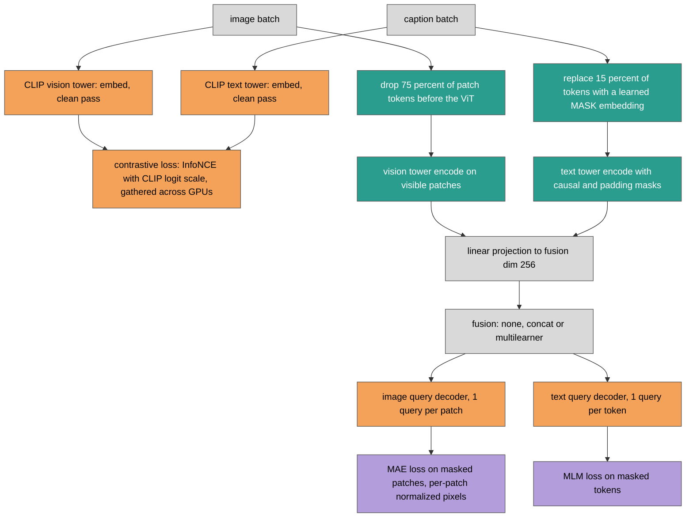

# MultiMAE v1: a rewrite of the fusion masked autoencoder, checked against zero-shot CLIP

Date: 2026-10-01. Branch `refactor`. Design: [refactor spec](../../../superpowers/specs/2026-10-01-mmae-refactor-design.md). Plan: [implementation plan](../../../superpowers/plans/2026-10-01-mmae-refactor.md).

## Summary

We rewrote the MultiMAE research code (v0, package `src`) into the package `mmae` (v1). v0 trained a fusion masked autoencoder (MAE) on CLIP towers, but reading and running it showed that neither modality was masked on the input, the CLIP towers never received gradients, and the contrastive embeddings came from a randomly initialized projection head. We fixed these in a new codebase with one model class and five config variants, and tested it with 136 tests. The end-to-end known-answer check is zero-shot OpenAI CLIP ViT-B/32 on the COCO 5k Karpathy test split: our pipeline gives i2t R@1 50.14 and t2i R@1 30.44, against the published 50.1 and 30.4. Beyond smoke runs we trained v1 only briefly (section 6): two epochs on 4096 training pairs raised rsum on a 1000-image test subset from 479.78 (zero-shot) to 494.96, about as much as a contrastive-only control (495.56), so the training loop works but we have no evidence yet that the MAE and MLM losses help retrieval. A final review of the whole branch found two Important and five Minor issues, which we fixed (section 5).

Terms used throughout. **MAE**: masked autoencoder, reconstruct the pixels of hidden image patches. **MLM**: masked language modeling, predict hidden caption tokens. **i2t / t2i**: image-to-text and text-to-image retrieval; **R@k** is the percentage of queries whose correct item is in the top k; **rsum** is the sum of the six recalls (i2t and t2i at k = 1, 5, 10). **Karpathy split**: the standard 5k-image COCO test split. **Zero-shot**: the pretrained CLIP checkpoint evaluated without any training of ours.

## 1. What we started from

We read v0 and ran it on 2026-10-01. The problems below were found by inspection of the code and by running the entry points.

| # | v0 problem | Evidence | Effect |
|---|---|---|---|
| 1 | No input masking | The fusion models called `encode_*_clean`; the MAE loss picked random patch indices after decoding; the MLM mask covered every non-pad token | Both reconstruction losses could see their targets |
| 2 | CLIP towers never trained | The clean encodes ran under `torch.no_grad()` | Only the heads learned |
| 3 | Random contrastive projection | Embeddings came from a randomly initialized `ProjectionHead` plus mean pooling | Retrieval started near chance instead of from CLIP's pretrained alignment |
| 4 | Hard-coded patch size | The image target was a fixed 14x14 grid of 16 px patches on a ViT-B/32 backbone (32 px patches) | The reconstruction target did not match the backbone |
| 5 | Pad equals EOS bug | The text attention mask was rebuilt as `token != pad_id`; CLIP's pad token equals EOS | The real EOS token, the one CLIP pools from, was masked out |
| 6 | Wrong preprocessing | Images were squashed to 224x224 and normalized with mean and std 0.5 | Inputs differed from what CLIP was trained on |
| 7 | Warmup never finished | Warmup was per epoch, 10 epochs, in a 10-epoch run | Warmup never finished |
| 8 | Broken entry points | `from src.hook import train_mae` bound the submodule; calling it raised `TypeError: 'module' object is not callable` (`main_mae.py`, `main_mlm.py`, `main_mmae.py`) | Three of four trainers could not start |
| 9 | Multi-GPU crashes | Hooks called custom methods on the DDP-wrapped model (`AttributeError`); `evalrank` used per-process index maps and `.cuda()` | No multi-GPU run |
| 10 | Checkpoint path | `save_dir: None` in YAML is the string "None" | Checkpoints went to `./None/` |
| 11 | Heavy dependencies | timm, datasets, einops, scikit-learn, pandas, seaborn, jupyter | Unpinned and mostly unused |

Problem 9 was patched in v0 itself (commit `1b6603e`, tag `legacy-v0`) before the rewrite; see the [pilot logs](../v0/pilots/) under `docs/reports/auto/v0/pilots/`. The patch made v0 runnable on several GPUs but did not touch problems 1 to 7, which are method-level and set the scope of the rewrite. We also checked v0's own retrieval numbers: its `CLIP_Retrieval_Metrics` of 58.4 (i2t R@1) and 37.8 (t2i R@1) are CLIP ViT-L/14@336 numbers, not B/32, so they are not a baseline for this backbone.

## 2. What we changed

### 2.1 Architecture

v1 has one model class, `MultiMAE`, and five config variants: `fusion_concat`, `fusion_multilearner`, `fusion_none` (all with both modalities), and `image_mae`, `text_mlm` (one modality). One forward pass computes three losses.

Legend: grey = same as v0 (inputs, projections and the three fusion structures, which we kept from v0's `MultiModalFusionMAE_CLIP` and its multi-learner variant); orange = replaced (contrastive embeddings now come from CLIP's native pooling and pretrained projections instead of a random head; decoders now take padding masks; decoder sizes follow the backbone); teal = new (input masking on both modalities, masked-input encoding, a learned MASK embedding); purple = unchanged (the MAE and MLM loss terms themselves; only the positions they are computed on changed, and that change comes from the new masking).

### 2.2 Changes against the v0 problems

| v0 problem | v1 change |
|---|---|
| 1 No input masking | Image: MAE-style token dropping before the ViT, ratio 0.75 (`random_patch_mask`). Text: a learned `[MASK]` embedding at the input, ratio 0.15, never on BOS, EOS or padding (`random_token_mask`). MAE and MLM losses count masked positions only. |
| 2 Frozen towers | Both towers are fine-tuned by default (`model.freeze_backbones: false`); two learning rates, 1e-5 for towers and 1e-4 for new modules (untested placeholders). |
| 3 Random projection | The contrastive loss uses CLIP's CLS and EOS pooling, its pretrained projections and its learnable logit scale (`model.pooling: native`); the trainer clamps the logit scale parameter to [0, ln 100] after each optimizer step (section 5.3). `pooling: mean` keeps the old mean-pool-plus-new-projection for comparison. |
| 4 16 px patches | Patch size, grid and dimensions are read from the backbone config. |
| 5 Pad equals EOS | The tokenizer's `attention_mask` is used as is; padding masks reach every attention layer that reads the memory. |
| 6 Preprocessing | OpenAI CLIP's own torchvision pipeline (bicubic resize of the short side to 224, center crop, CLIP mean and std). HF's `CLIPImageProcessor` differs from it on some images (mean absolute difference 0.03, single pixels up to 2.9), and the published zero-shot numbers use OpenAI's pipeline. |
| 7 Warmup | Warmup and cosine decay are per optimizer step (500 warmup steps by default). |
| 8 Entry points | Two entry points, `train.py` and `evaluate.py`, plus `scripts/run_local.sh` and `scripts/run_cluster.sh`. |
| 9 Multi-GPU | All losses are computed inside `forward`, so DDP needs no unwrapping; eval loaders are prepared and retrieval gathers per batch; contrastive negatives come from the global batch. |
| 10 Checkpoints | `train.save: best \| none`; checkpoints go to the run folder. |
| 11 Dependencies | torch, torchvision, transformers, accelerate, hydra-core, omegaconf, wandb, pillow, tqdm, matplotlib, numpy, all pinned; pytest for development. |

Other changes. Training uses Accelerate with a hand-written loop, early stopping on `val/retrieval/rsum` (`val/loss` for the single-modality variants) and restores the best weights before the test. Each run writes one folder under `res/<project>/<group>/<time>_<name>/` with `config.yaml`, `run.json`, `metrics.jsonl`, `train.log`, `checkpoints/` and `plots/`. The retrieval metrics are v0's, except that `rsum` now sums all six recalls (v0's `r_sum` summed R@1 and R@5 only), so v0 and v1 rsum values are not comparable. Val and test loss pairs are flattened caption-major, so no eval batch repeats an image (section 5.2), and the tokenizer and image preprocessing follow `model.backbone.pretrained` (section 5.5).

## 3. How we verified it

The suite has 136 tests, and all pass at the final run: 126 fast (`pytest`, 101 s measured, CPU only, tiny random CLIP and a fake COCO) and 10 slow (`pytest -m slow`: real B/32, real COCO, GPU). Counts per file:

| File | Tests | What it pins |
|---|---|---|
| `test_masking.py` | 10 | Exact mask counts, never BOS, EOS or padding, per-sample variation, reproducibility from a generator seed |
| `test_backbones.py` | 7 | Tower `embed` equals HF `get_*_features`; unmasked `encode` equals HF `last_hidden_state`; tiny and real B/32, padded and unpadded captions |
| `test_fusion_decoders.py` | 13 | Fusion shapes, one-modality inputs, separate memories in multilearner, unknown fusion type, padded text positions change no output, query decoder shapes |
| `test_losses.py` | 11 | Contrastive loss against a direct reference with the unclamped scale, a non-zero logit scale gradient at CLIP's pretrained value, 2-process gather, MAE and MLM count masked positions only, fp32 contrastive logits under bf16 |
| `test_model.py` | 41 | Finite losses, gradients reaching every trainable parameter (native and mean pooling), masking invariance in all five configs, MAE and MLM losses equal to a recomputation from the decoder outputs over the recorded masks, text padding invariance (memory and query padding) in the four configs with text, tiny-batch overfit |
| `test_configs.py` | 6 | Each of the five model configs composes; the processor follows `pretrained` |
| `test_data.py` | 12 | Truncation keeps EOS, 5 caption-major pairs per val or test image, distinct images in every unshuffled eval batch, `limit_*` selecting the same images for pairs and retrieval, short caption lists rejected, grayscale, CMYK and truncated images, preprocessing, real COCO sizes |
| `test_retrieval.py` | 4 | Metrics equal v0's `evalrank` on the same embeddings; 1 and 2 processes identical |
| `test_run.py` | 9 | Run folder layout and lifecycle, disabled runs write nothing, distinct folders in the same second, crash marks the run failed, `run.json` merging and its note, `list_runs` filters, safe metric logging |
| `test_trainer.py` | 6 | Warmup and cosine schedule, early stopper, best-weight restore before test, evaluation reports losses and retrieval, the logit scale clamp after each optimizer step, a clear error for a too-small training set |
| `test_train_smoke.py` | 8 | `train.py train=debug` per config on CPU, a 2-process CPU DDP run, GPU runs with real B/32 and real COCO |
| `test_evaluate.py` | 4 | `evaluate.py` modes and the zero-shot known-answer check |
| `test_scripts.py` | 4 | Both launch scripts pass a note with quotes, commas, colons and `${...}` to the config verbatim |
| `test_package.py` | 1 | The `mmae` package imports |

We confirmed that each key guard fails when the guarded code is broken on purpose:

- HF equivalence: removing `is_causal=True` from the text tower fails the unpadded-caption test.
- Masking invariance at model level: changing masked pixels or tokens leaves the decoder outputs bit-identical in all five configs, and changing visible content moves them. The test fails if the vision encoder ignores the mask or the token mask is sampled twice. It also recomputes the MAE and MLM losses from the captured decoder outputs over the recorded masks, and fails if either loss scores the visible positions (section 5.1).
- Padding at model level: random token ids at padded text positions reach the fused memory there but change no decoder output at a real position and no loss, and shifting the text decoder's queries at positions padded in every caption leaves its real-position outputs bit-identical. The test fails if either decoder loses its memory padding mask, if the text decoder loses its query padding mask, or if the fusion receives no text padding (section 5.1).
- Contrastive gather: two CPU processes (gloo) give the single-process loss and world_size times the single-process gradient. Under bf16 autocast, contrastive logits stay fp32; without that, the loss drifted by 7.8e-3 and the logits by up to 0.16.
- DDP: every trainable parameter receives a gradient in every config.
- Retrieval: metrics equal v0's `evalrank` on the same embeddings, and 1 versus 2 processes agree on a set of 43 items, which is not divisible by world size times batch size.
- Trainer: the best-validation weights are restored before the test (hash check), the eval masks are reseeded so repeated evaluations match, and a logit scale set to 6.0 ends at or below ln 100 after a training epoch.
- Data: every window of B consecutive val or test pairs, with B up to the number of images, holds B distinct images.
- Smoke runs: `train.py train=debug` ran for all five configs on CPU, once with 2 CPU DDP processes, and on the GPU with real B/32 and real COCO for `fusion_concat` and `fusion_multilearner`. We also ran `scripts/run_local.sh smoke train=debug` on the GPU: it finished with a completed run folder (val rsum 574.8 and test rsum 563.2 on the 80-item debug subsets, which says nothing about quality). After the fixes of section 5, `scripts/run_local.sh "Wangyuan's try: a=1, b" train=debug` completed on the GPU with that note intact in `config.yaml` and `run.json`.

The slow set took 269 s (4 min 29 s) including the zero-shot check.

Process. The refactor was 12 tasks, each implemented by a subagent and reviewed. Five tasks needed one fix round each: Task 3 (tower tests), Task 5 (contrastive autocast precision), Task 6 (DDP unused parameters, the masking invariance test and the overfit test), Task 9 (`run.json` and logging robustness) and Task 12 (a broken link in this report). A final review of the whole branch then found two Important and five Minor issues, which one fix wave closed (section 5). All Critical and Important findings were closed.

## 4. The known-answer result

Baseline: the published OpenAI CLIP ViT-B/32 zero-shot numbers on the same split. Our run evaluated the pretrained checkpoint through `evaluate.py` (our preprocessing, tokenization, pooling and metric code), with no training.

| COCO 5k test, zero-shot CLIP ViT-B/32 | ours | published |
|---|---|---|
| i2t R@1 | 50.14 | 50.1 |
| t2i R@1 | 30.44 | 30.4 |
| i2t R@5 / R@10 | 75.06 / 83.52 | not compared |
| t2i R@5 / R@10 | 55.96 / 66.87 | not compared |
| rsum | 361.98 | not compared |

The two R@1 values match the published ones to the published precision (differences of 0.04 in both). The match matters because a wrong image pipeline, tokenizer truncation, pooling position or metric would each move these numbers. For the preprocessing in particular, HF's image processor and OpenAI's pipeline differ per pixel, and we chose OpenAI's, which this match supports. The published R@5 and R@10 values were not on hand, so we do not claim a comparison for them.

This result checks the zero-shot path only. It says nothing about the masked pass, the fusion or the decoders, which the unit tests above cover but which have no end-to-end quality number yet.

## 5. Final review and fixes

After the 12 tasks, a final review of the whole branch re-derived this report's load-bearing numbers from the code and data (both test suites, the zero-shot check, the masking by an independent gradient probe on real B/32, 2-process CPU DDP in 6 configs, a short GPU training run) and found them true. It also found two Important and five Minor issues. We fixed all of them in one wave and confirmed, for every new or changed test, that it fails when its fix is reverted.

| # | Finding | Fix | Evidence |
|---|---|---|---|
| I1 | The model-level wiring of masks and padding into the losses and decoders was untested | Loss recomputation and a text padding test in `test_model.py` | 8 wiring mutants of `model.py` now fail; the reviewer's mutants had passed all 112 fast tests |
| I2 | Val and test pairs were image-major, so every eval batch held each image 5 times | Caption-major pairs | Zero-shot val contrastive loss 2.601 before, 0.632 after; retrieval unchanged |
| M1 | The logit scale was clamped inside the loss, which zeroed its gradient | Clamp the parameter after each optimizer step | Gradient 0.0 before, 39.7 after on fixed embeddings |
| M2 | A note with an apostrophe crashed the launch scripts | Pass the note through `MMAE_NOTE` | A GPU run with the note `Wangyuan's try: a=1, b` kept it intact |
| M3 | `model.backbone.processor` ignored `pretrained` | Default it to `${.pretrained}` | Config test |
| M4 | This report claimed model-level padding invariance before a test pinned it, and counted four fix rounds instead of five | Corrected | Sections 3 and 5 |
| M5 | `limit_val` and `limit_test` counted pairs for the losses and images for retrieval | Resolved by I2 | Data test |

### 5.1 Loss and padding wiring

The masking test of section 3 pinned what the decoders see, but nothing pinned what the losses score or which padding masks reach the decoders. The reviewer found that scoring MAE on the visible patches, scoring MLM on the unmasked tokens, or dropping the decoders' memory padding or the text decoder's query padding each survived the fast suite; the first three together passed all 112 fast tests. We extended the masking test to recompute `mae_loss` and `mlm_loss` from the captured decoder outputs over the recorded masks, and to require bit-identical results. We also added `test_text_padding_reaches_no_real_position` for the four configs with text. It puts random token ids at padded positions, checks that they do reach the fused memory there, and requires every decoder output at a real position and every loss to stay bit-identical. Random ids alone did not catch a text decoder without its query padding mask: padded queries carry no input content, so no change to the input reaches real positions through them. The test therefore also shifts the text decoder's learned queries at the positions padded in every caption, and requires its real-position outputs to stay bit-identical.

| Mutant of `model.py` | Tests that fail |
|---|---|
| MAE scored on `~patch_mask` | masking test, 4 configs with images |
| MLM scored on `~token_mask` | masking test and padding test, 4 configs with text each |
| MLM scored on the real, unmasked tokens | masking test, 4 configs with text |
| no memory padding for either decoder | padding test, 4 configs |
| no memory padding for the image decoder | padding test, `fusion_concat` and `fusion_multilearner` |
| no memory padding for the text decoder | padding test, 4 configs |
| no query padding for the text decoder | padding test (query part), 4 configs |
| no text padding passed to the fusion | padding test, 4 configs |

### 5.2 Validation and test pairs

Baseline: the shipped image-major order. Each val and test image has five captions, and `CocoPairs` listed an image's five captions in a row. Eval loaders are not shuffled, so a batch of 128 pairs held about 26 images five times each. For an image, its four other captions counted as negatives, and for a caption, the four other copies of its image did, which puts a floor of ln 5 = 1.61 under the val and test contrastive loss even for a perfect model. We now flatten caption-major: every image with its first caption, then every image with its second caption, and so on. A batch of at most as many pairs as there are images (5000) then never repeats an image. Through `Trainer.evaluate`, zero-shot `fusion_concat` on the first 1000 val pairs at batch 128 gave a val contrastive loss of 2.601 with the old order and 0.632 with the new one (26 and 128 distinct images in the first batch). Retrieval uses `CocoRetrieval` and did not change (val rsum 485.06 both times).

The old order also misled training curves. In the final review's training run (section 6), the val contrastive loss rose from 2.35 to 2.39 between epochs 1 and 2 while val rsum rose by 18.00; after the fix, the same run's val contrastive loss fell from 0.64 to 0.54. The fix also aligns the limits: `data.limit_val=N` now selects the same first N images for the loss pairs (first caption each) as for retrieval (five captions each).

### 5.3 Logit scale

The spec says the logit scale is "exponentiated and clamped at 100 as in CLIP", and the first implementation clamped exp(logit_scale) inside the loss. CLIP B/32's pretrained `logit_scale` is 4.605170249938965, the float32 value nearest ln 100, and on the CPU it exponentiates to 100.0000076, so the clamp was active from the first step and passed no gradient. On fixed random embeddings the parameter's gradient was 0.0 with the clamp and 39.7 without it. Above ln 100 the parameter got no gradient, so it could not come back down, and `train/logit_scale` logged a scale the loss did not use: in the final review's GPU run it logged 100.0065 to 100.0234 while the loss used 100. We now do what open_clip does. The loss uses exp(logit_scale) unclamped, and the trainer clamps the parameter to [0, ln 100] after each optimizer step. In the same GPU run after the fix, the logged scale went from 99.99 down to 99.57 and ended at 99.60. This keeps the spec's bound of 100 by a different mechanism than its wording, which we left unchanged.

### 5.4 Run notes

The launch scripts quoted the note for Hydra as `wandb.notes='...'`, so a note with an apostrophe, such as `Wangyuan's try`, stopped them with Hydra's `OverrideParseException`. Escaping it would not be robust: Hydra treats a backslash specially only before a quote, and a `${...}` in a note would be interpolated. The scripts now export the note as `MMAE_NOTE` and pass `wandb.notes=${oc.env:MMAE_NOTE}`, so the text never meets the override parser. We checked 14 notes through Hydra's composition and resolution, including quotes, backslashes, `${foo}`, commas, colons, equals signs, `null` and a newline, and `test_scripts.py` runs both scripts with a stub `accelerate`. On the GPU, `scripts/run_local.sh "Wangyuan's try: a=1, b" train=debug` completed and the note reached `config.yaml` and `run.json` unchanged. `run.json` now records the note, because its `command` field shows only the interpolation.

### 5.5 Processor

`model.backbone.processor`, which picks the tokenizer and the image preprocessing, was fixed to B/32's, so setting `model.backbone.pretrained` to another CLIP would have kept B/32's tokenizer and preprocessing without a warning. It now defaults to `${.pretrained}`. The helper `processor_name()` maps `tiny-random-clip`, which has no processor of its own, to B/32's, and an explicit `processor` still wins.

### 5.6 A limitation that remains

Val and test losses still depend on the number of GPUs. With several processes, Accelerate pads the last eval batch with duplicate pairs (`even_batches`), each rank draws its own eval masks (seed plus rank), and the contrastive negatives come from the global batch, which grows with the GPU count. Losses are therefore comparable only between runs on the same number of GPUs. Retrieval metrics do not depend on it, because the padded duplicates are dropped before the metrics, and neither does model selection for the two-modality configs, which monitor `val/retrieval/rsum`. The single-modality configs monitor `val/loss`, which does.

## 6. A short training check

Baseline: zero-shot CLIP ViT-B/32 through the same pipeline on the same subsets.

To check that the full model learns on real data, the final review trained `fusion_concat` for 2 epochs on the first 4096 training pairs at batch size 32 (256 optimizer steps, 20 warmup steps, default learning rates and loss weights) and evaluated it on the first 1000 images of the Karpathy val and test splits. A control run set the MAE and MLM loss weights to 0, which leaves the contrastive loss alone. These runs predate the fixes of section 5, so we repeated both with the fixes in place. The 1000-image subsets are not the standard 5k test set. Retrieval among 1000 images is easier, so these numbers compare only with each other, not with section 4. Each configuration ran once per code version.

| 1000-image subsets | val rsum, epoch 1 | val rsum, epoch 2 | test rsum | test i2t R@1 | test t2i R@1 |
|---|---|---|---|---|---|
| zero-shot CLIP B/32 (no training) | 485.06 | 485.06 | 479.78 | 70.10 | 50.70 |
| `fusion_concat`, before the fixes | 475.92 | 493.92 | 494.56 | 71.30 | 56.62 |
| contrastive only, before the fixes | 480.70 | 499.06 | 496.78 | 72.10 | 57.02 |
| `fusion_concat`, after the fixes | 475.82 | 495.80 | 494.96 | 71.10 | 56.70 |
| contrastive only, after the fixes | 481.30 | 498.50 | 495.56 | 71.50 | 57.08 |

Two epochs of fine-tuning raised test rsum over zero-shot in all four runs, by 14.78 to 17.00. At R@1 the gain came mostly from text-to-image retrieval: t2i R@1 rose by 5.92 to 6.38 points, i2t R@1 by 1.0 to 2.0. After the first epoch the full model was about 9 rsum below zero-shot on val (475.92 and 475.82 against 485.06) and the control about 4 below (480.70 and 481.30); both passed zero-shot in the second epoch. We did not investigate this dip. On test, the control finished ahead of the full model both times, by 2.22 before the fixes and 0.60 after. With one run per configuration we cannot tell whether a gap this small is real, so this check shows that the training loop improves retrieval but gives no evidence yet that the MAE and MLM losses help it.

## 7. What is not done

- No full training run yet. The only v1 training is the 2-epoch check of section 6, so there are no v1 numbers on the 5k test split to put beside the zero-shot 361.98 rsum. The first question for a real run is whether fine-tuning with the three losses beats both zero-shot CLIP and a contrastive-only run on val rsum.
- Val and test losses depend on the number of GPUs (section 5.6).
- Learning-rate tuning: 1e-4 and 1e-5 are untested placeholders.
- Data augmentation and loss-weight schedules (all weights are 1.0).
- Resuming from checkpoints.
- Backbones other than CLIP (the `BACKBONES` registry is the hook).
- Multi-node training and integration with the cluster CLI. `scripts/run_cluster.sh` keeps v0's arguments (batch size, epochs, note) and uses `data=coco_cluster`.
