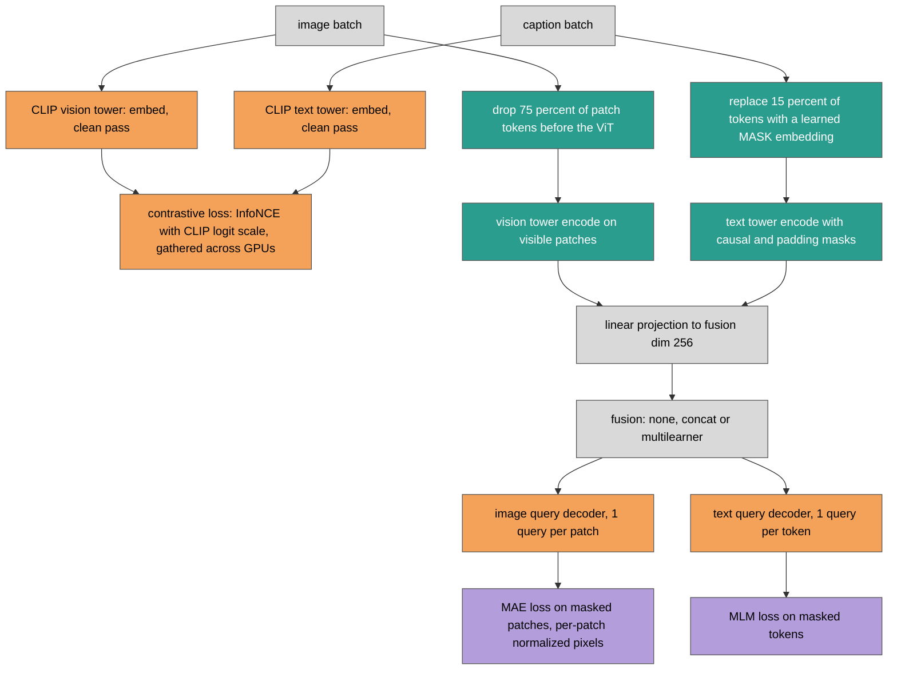

# MultiMAE v1: a rewrite of the fusion masked autoencoder, checked against zero-shot CLIP

Date: 2026-10-01. Branch `refactor`. Design: [refactor spec](../../../superpowers/specs/2026-10-01-mmae-refactor-design.md). Plan: [implementation plan](../../../superpowers/plans/2026-10-01-mmae-refactor.md).

## Summary

We rewrote the MultiMAE research code (v0, package `src`) into the package `mmae` (v1). v0 trained a fusion masked autoencoder (MAE) on CLIP towers, but reading and running it showed that neither modality was masked on the input, the CLIP towers never received gradients, and the contrastive embeddings came from a randomly initialized projection head. We fixed these in a new codebase with one model class and five config variants, and tested it with 122 tests. The end-to-end known-answer check is zero-shot OpenAI CLIP ViT-B/32 on the COCO 5k Karpathy test split: our pipeline gives i2t R@1 50.14 and t2i R@1 30.44, against the published 50.1 and 30.4. We have not trained v1 beyond smoke runs, so this report contains no v1 training results.

Terms used throughout. **MAE**: masked autoencoder, reconstruct the pixels of hidden image patches. **MLM**: masked language modeling, predict hidden caption tokens. **i2t / t2i**: image-to-text and text-to-image retrieval; **R@k** is the percentage of queries whose correct item is in the top k; **rsum** is the sum of the six recalls (i2t and t2i at k = 1, 5, 10). **Karpathy split**: the standard 5k-image COCO test split. **Zero-shot**: the pretrained CLIP checkpoint evaluated without any training of ours.

## 1. What we started from

We read v0 and ran it on 2026-10-01. The problems below were found by inspection of the code and by running the entry points.

| # | v0 problem | Evidence | Effect |
|---|---|---|---|
| 1 | No input masking | The fusion models called `encode_*_clean`; the MAE loss picked random patch indices after decoding; the MLM mask covered every non-pad token | Both reconstruction losses could see their targets |
| 2 | CLIP towers never trained | The clean encodes ran under `torch.no_grad()` | Only the heads learned |
| 3 | Random contrastive projection | Embeddings came from a randomly initialized `ProjectionHead` plus mean pooling | Retrieval started near chance instead of from CLIP's pretrained alignment |
| 4 | Hard-coded patch size | The image target was a fixed 14x14 grid of 16 px patches on a ViT-B/32 backbone (32 px patches) | The reconstruction target did not match the backbone |
| 5 | Pad equals EOS bug | The text attention mask was rebuilt as `token != pad_id`; CLIP's pad token equals EOS | The real EOS token, the one CLIP pools from, was masked out |
| 6 | Wrong preprocessing | Images were squashed to 224x224 and normalized with mean and std 0.5 | Inputs differed from what CLIP was trained on |
| 7 | Warmup never finished | Warmup was per epoch, 10 epochs, in a 10-epoch run | Warmup never finished |
| 8 | Broken entry points | `from src.hook import train_mae` bound the submodule; calling it raised `TypeError: 'module' object is not callable` (`main_mae.py`, `main_mlm.py`, `main_mmae.py`) | Three of four trainers could not start |
| 9 | Multi-GPU crashes | Hooks called custom methods on the DDP-wrapped model (`AttributeError`); `evalrank` used per-process index maps and `.cuda()` | No multi-GPU run |
| 10 | Checkpoint path | `save_dir: None` in YAML is the string "None" | Checkpoints went to `./None/` |
| 11 | Heavy dependencies | timm, datasets, einops, scikit-learn, pandas, seaborn, jupyter | Unpinned and mostly unused |

Problem 9 was patched in v0 itself (commit `1b6603e`, tag `legacy-v0`) before the rewrite; see the [pilot logs](pilots/) under `docs/reports/auto/v0/pilots/`. The patch made v0 runnable on several GPUs but did not touch problems 1 to 7, which are method-level and set the scope of the rewrite. We also checked v0's own retrieval numbers: its `CLIP_Retrieval_Metrics` of 58.4 (i2t R@1) and 37.8 (t2i R@1) are CLIP ViT-L/14@336 numbers, not B/32, so they are not a baseline for this backbone.

## 2. What we changed

### 2.1 Architecture

v1 has one model class, `MultiMAE`, and five config variants: `fusion_concat`, `fusion_multilearner`, `fusion_none` (all with both modalities), and `image_mae`, `text_mlm` (one modality). One forward pass computes three losses.

Legend: grey = same as v0 (inputs, projections and the three fusion structures, which we kept from v0's `MultiModalFusionMAE_CLIP` and its multi-learner variant); orange = replaced (contrastive embeddings now come from CLIP's native pooling and pretrained projections instead of a random head; decoders now take padding masks; decoder sizes follow the backbone); teal = new (input masking on both modalities, masked-input encoding, a learned MASK embedding); purple = unchanged (the MAE and MLM loss terms themselves; only the positions they are computed on changed, and that change comes from the new masking).

### 2.2 Changes against the v0 problems

| v0 problem | v1 change |
|---|---|
| 1 No input masking | Image: MAE-style token dropping before the ViT, ratio 0.75 (`random_patch_mask`). Text: a learned `[MASK]` embedding at the input, ratio 0.15, never on BOS, EOS or padding (`random_token_mask`). MAE and MLM losses count masked positions only. |
| 2 Frozen towers | Both towers are fine-tuned by default (`model.freeze_backbones: false`); two learning rates, 1e-5 for towers and 1e-4 for new modules (untested placeholders). |
| 3 Random projection | The contrastive loss uses CLIP's CLS and EOS pooling, its pretrained projections and its learnable logit scale (`model.pooling: native`). `pooling: mean` keeps the old mean-pool-plus-new-projection for comparison. |
| 4 16 px patches | Patch size, grid and dimensions are read from the backbone config. |
| 5 Pad equals EOS | The tokenizer's `attention_mask` is used as is; padding masks reach every attention layer that reads the memory. |
| 6 Preprocessing | OpenAI CLIP's own torchvision pipeline (bicubic resize of the short side to 224, center crop, CLIP mean and std). HF's `CLIPImageProcessor` differs from it on some images (mean absolute difference 0.03, single pixels up to 2.9), and the published zero-shot numbers use OpenAI's pipeline. |
| 7 Warmup | Warmup and cosine decay are per optimizer step (500 warmup steps by default). |
| 8 Entry points | Two entry points, `train.py` and `evaluate.py`, plus `scripts/run_local.sh` and `scripts/run_cluster.sh`. |
| 9 Multi-GPU | All losses are computed inside `forward`, so DDP needs no unwrapping; eval loaders are prepared and retrieval gathers per batch; contrastive negatives come from the global batch. |
| 10 Checkpoints | `train.save: best \| none`; checkpoints go to the run folder. |
| 11 Dependencies | torch, torchvision, transformers, accelerate, hydra-core, omegaconf, wandb, pillow, tqdm, matplotlib, numpy, all pinned; pytest for development. |

Other changes. Training uses Accelerate with a hand-written loop, early stopping on `val/retrieval/rsum` (`val/loss` for the single-modality variants) and restores the best weights before the test. Each run writes one folder under `res/<project>/<group>/<time>_<name>/` with `config.yaml`, `run.json`, `metrics.jsonl`, `train.log`, `checkpoints/` and `plots/`. The retrieval metrics are v0's, except that `rsum` now sums all six recalls (v0's `r_sum` summed R@1 and R@5 only), so v0 and v1 rsum values are not comparable.

## 3. How we verified it

The suite has 122 tests, and all pass at the final run: 112 fast (`pytest`, 97 s measured, CPU only, tiny random CLIP and a fake COCO) and 10 slow (`pytest -m slow`: real B/32, real COCO, GPU). Counts per file:

| File | Tests | What it pins |
|---|---|---|
| `test_masking.py` | 10 | Exact mask counts, never BOS, EOS or padding, per-sample variation, reproducibility from a generator seed |
| `test_backbones.py` | 7 | Tower `embed` equals HF `get_*_features`; unmasked `encode` equals HF `last_hidden_state`; tiny and real B/32, padded and unpadded captions |
| `test_fusion_decoders.py` | 13 | Fusion shapes, one-modality inputs, separate memories in multilearner, unknown fusion type, padded text positions change no output, query decoder shapes |
| `test_losses.py` | 10 | Contrastive loss against a direct reference, 2-process gather, MAE and MLM count masked positions only, fp32 contrastive logits under bf16 |
| `test_model.py` | 37 | Finite losses, gradients reaching every trainable parameter (native and mean pooling), masking invariance and padding invariance in all five configs, tiny-batch overfit |
| `test_configs.py` | 5 | Each of the five model configs composes |
| `test_data.py` | 9 | Truncation keeps EOS, 5 pairs per val or test image, `limit_*`, grayscale, CMYK and truncated images, preprocessing, real COCO sizes |
| `test_retrieval.py` | 4 | Metrics equal v0's `evalrank` on the same embeddings; 1 and 2 processes identical |
| `test_run.py` | 9 | Run folder layout and lifecycle, disabled runs write nothing, distinct folders in the same second, crash marks the run failed, `run.json` merging, `list_runs` filters, safe metric logging |
| `test_trainer.py` | 5 | Warmup and cosine schedule, early stopper, best-weight restore before test, evaluation reports losses and retrieval, a clear error for a too-small training set |
| `test_train_smoke.py` | 8 | `train.py train=debug` per config on CPU, a 2-process CPU DDP run, GPU runs with real B/32 and real COCO |
| `test_evaluate.py` | 4 | `evaluate.py` modes and the zero-shot known-answer check |
| `test_package.py` | 1 | The `mmae` package imports |

We confirmed that each key guard fails when the guarded code is broken on purpose:

- HF equivalence: removing `is_causal=True` from the text tower fails the unpadded-caption test.
- Masking invariance at model level: changing masked pixels or tokens leaves the decoder outputs bit-identical in all five configs, and changing visible content moves them. The test fails if the vision encoder ignores the mask or the token mask is sampled twice.
- Padding: garbage at padded text positions changes no decoder output.
- Contrastive gather: two CPU processes (gloo) give the single-process loss and world_size times the single-process gradient. Under bf16 autocast, contrastive logits stay fp32; without that, the loss drifted by 7.8e-3 and the logits by up to 0.16.
- DDP: every trainable parameter receives a gradient in every config.
- Retrieval: metrics equal v0's `evalrank` on the same embeddings, and 1 versus 2 processes agree on a set of 43 items, which is not divisible by world size times batch size.
- Trainer: the best-validation weights are restored before the test (hash check), and the eval masks are reseeded so repeated evaluations match.
- Smoke runs: `train.py train=debug` ran for all five configs on CPU, once with 2 CPU DDP processes, and on the GPU with real B/32 and real COCO for `fusion_concat` and `fusion_multilearner`. We also ran `scripts/run_local.sh smoke train=debug` on the GPU: it finished with a completed run folder (val rsum 574.8 and test rsum 563.2 on the 80-item debug subsets, which says nothing about quality).

The slow set took 267 s (4 min 27 s) including the zero-shot check.

Process. The refactor was 12 tasks, each implemented by a subagent and reviewed. Four tasks needed one fix round each: Task 3 (tower tests), Task 5 (contrastive autocast precision), Task 6 (DDP unused parameters, the masking invariance test and the overfit test) and Task 9 (`run.json` and logging robustness). All Critical and Important findings were closed.

## 4. The known-answer result

Baseline: the published OpenAI CLIP ViT-B/32 zero-shot numbers on the same split. Our run evaluated the pretrained checkpoint through `evaluate.py` (our preprocessing, tokenization, pooling and metric code), with no training.

| COCO 5k test, zero-shot CLIP ViT-B/32 | ours | published |
|---|---|---|
| i2t R@1 | 50.14 | 50.1 |
| t2i R@1 | 30.44 | 30.4 |
| i2t R@5 / R@10 | 75.06 / 83.52 | not compared |
| t2i R@5 / R@10 | 55.96 / 66.87 | not compared |
| rsum | 361.98 | not compared |

The two R@1 values match the published ones to the published precision (differences of 0.04 in both). The match matters because a wrong image pipeline, tokenizer truncation, pooling position or metric would each move these numbers. For the preprocessing in particular, HF's image processor and OpenAI's pipeline differ per pixel, and we chose OpenAI's, which this match supports. The published R@5 and R@10 values were not on hand, so we do not claim a comparison for them.

This result checks the zero-shot path only. It says nothing about the masked pass, the fusion or the decoders, which the unit tests above cover but which have no end-to-end quality number yet.

## 5. What is not done

- No v1 training run beyond smoke tests, so there are no v1 retrieval numbers to put beside the zero-shot 361.98 rsum. The first question for a real run is whether fine-tuning with the three losses beats zero-shot CLIP on val rsum.
- Learning-rate tuning: 1e-4 and 1e-5 are untested placeholders.
- Data augmentation and loss-weight schedules (all weights are 1.0).
- Resuming from checkpoints.
- Backbones other than CLIP (the `BACKBONES` registry is the hook).
- Multi-node training and integration with the cluster CLI. `scripts/run_cluster.sh` keeps v0's arguments (batch size, epochs, note) and uses `data=coco_cluster`.
