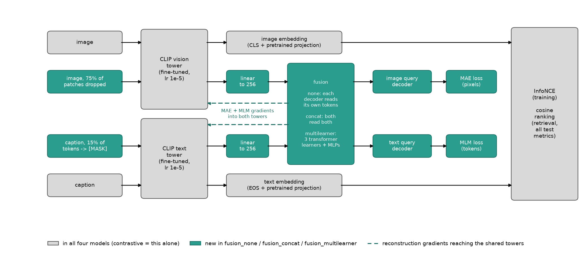
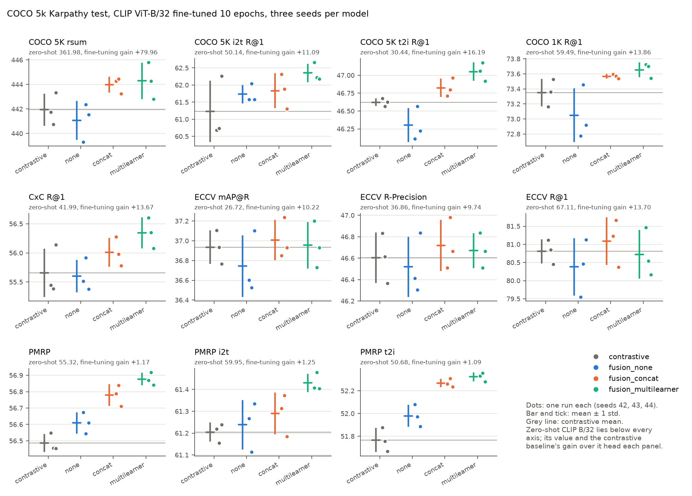
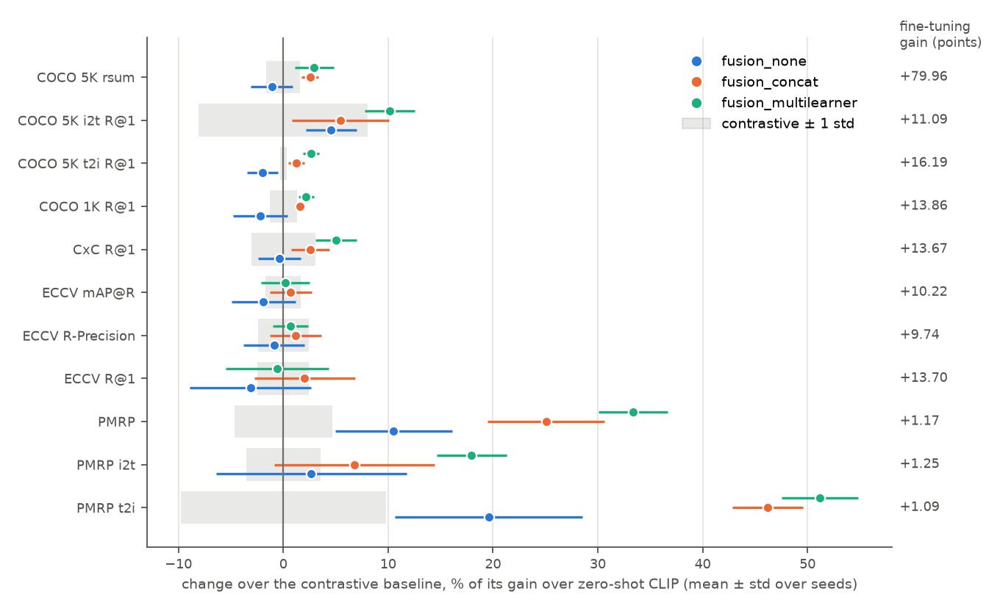
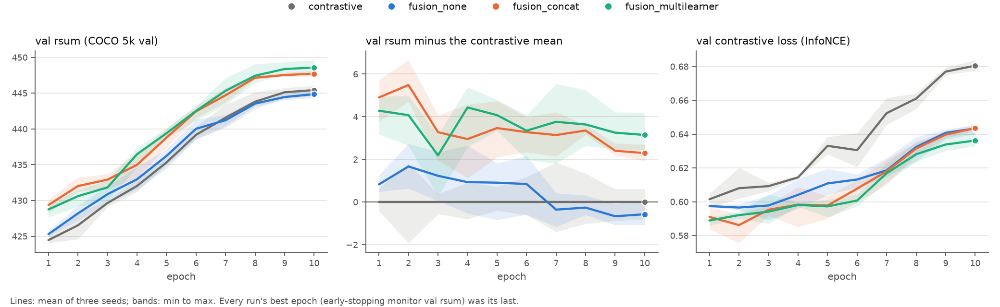

# MultiMAE v1 on full COCO: a contrastive baseline, polysemy-aware test metrics and three seeds per model

Date: 2026-10-03. Branch `eval-baselines` (commits `735216a` and `88e2663` on top of main at `2056ea5`). Previous report: [the v1 refactor](2026-10-01_refactor.md). Figures and the per-run table are rebuilt from the run folders by [`build_2026-10-03_baselines.py`](../../assets/build_2026-10-03_baselines.py).

## Summary

We trained the three two-modality MultiMAE v1 models (`fusion_none`, `fusion_concat`, `fusion_multilearner`) and a new contrastive-only baseline (`contrastive`) on the full COCO Karpathy training split, three seeds each (42, 43, 44), and scored all twelve runs on the COCO 5k test split with the usual recalls and with four test protocols that count more than one item as correct: ECCV Caption, CxC, COCO 1K and PMRP. Before trusting those protocols we checked our metric code against the ECCV Caption paper: zero-shot CLIP ViT-B/32 reproduced the paper's Table 4 on all seven of its means to within 0.05 points.

Against the contrastive baseline (the same CLIP fine-tune with InfoNCE alone), the clearest change was in PMRP, a class-level measure: `fusion_multilearner` reached 56.88 ± 0.04 against 56.49 ± 0.05 (+0.39, Welch t = 10.1, p = 0.0009, the only one of 33 tests that survives a Holm correction), and `fusion_concat` 56.78 ± 0.07 (+0.29, p = 0.004). Contrastive fine-tuning itself had moved PMRP by only 1.17 points over zero-shot CLIP (55.32), so fusion added a quarter to a third of that gain again. On the instance-level recalls the picture was weaker. Test rsum rose by 2.05 (`fusion_concat`, 443.99 against 441.94, p = 0.09) and 2.36 (`fusion_multilearner`, p = 0.11), about 3% of the 79.96-point fine-tuning gain, and only t2i R@1 for `fusion_multilearner` passed p < 0.05 uncorrected (47.05 against 46.62, p = 0.017). On the validation split the rsum gains were similar and nominally significant (+2.30, p = 0.016; +3.15, p = 0.011). ECCV Caption mAP@R, the human-verified multi-positive metric, did not move at all (36.94 for the baseline, 36.74 to 37.01 for the others, every p > 0.4). Reconstruction without cross-modal fusion (`fusion_none`) gave nothing over the baseline on any recall metric (rsum 441.07, −0.88, p = 0.50) and less than half of the fusion models' PMRP gain (+0.12, p = 0.07, against +0.29 and +0.39).

So with three seeds, masked reconstruction through a fusion module changed which items sit near a query at the level of COCO object classes, slightly but consistently, and did not change the ranking of human-verified matches. That is not yet evidence for the project's question, whether fusion-masked models help polysemic retrieval: COCO is only weakly polysemic, PMRP's positives are defined by object-class overlap, and the retrieval embeddings never pass through the fusion module. Section 6 lists what this shows and what it does not, and section 7 lists options for the next step.

**Terms.** **i2t / t2i**: image-to-text and text-to-image retrieval. **R@k**: percentage of queries with a correct item in the top k. **rsum**: sum of the six COCO 5K recalls (i2t and t2i at k = 1, 5, 10). **Zero-shot**: the pretrained OpenAI CLIP ViT-B/32 checkpoint with no training of ours. **Fine-tuning gain**: the contrastive baseline's mean minus the zero-shot value, on the same metric. **MAE / MLM**: reconstructing hidden image patches / predicting hidden caption tokens (section 2.1). **R-Precision**: the fraction of a query's top R retrieved items that are positives, where R is the query's number of positives. **mAP@R**: average precision computed over the top R ranks only. The four extended protocols are defined in section 2.3. **std**: sample standard deviation over the three seeds.

## 1. How we got here

### 1.1 From the v1 rewrite to the first full runs (1 to 2 October)

The [refactor report](2026-10-01_refactor.md) ended with a rewritten codebase (`mmae`) and no full training run. Its only training check, 2 epochs on 4,096 pairs evaluated on 1,000-image subsets, had a contrastive-only control finish 0.60 rsum ahead of `fusion_concat`, so we had no evidence that the MAE and MLM losses help retrieval.

On 2 October we ran the three two-modality models on the full Karpathy training split on DAS6 node403, one RTX A6000 per run, 10 epochs at batch 128, seed 42, at commit `2056ea5`. Test rsum was 439.29 for `fusion_none`, 444.29 for `fusion_concat` and 445.80 for `fusion_multilearner`, so the two fusion models led the no-fusion model by 5.00 and 6.50. Against zero-shot CLIP (361.98) all three had gained about 80 points. That comparison could not answer the obvious question: how much of the 80 points came from the contrastive loss alone, and do the reconstruction losses add anything to it? We had no contrastive-only run on the full data.

### 1.2 A literature scan and the project's question

Whether masked reconstruction helps contrastive image-text models has been studied. Weers et al. found that adding MAE to CLIP-style training helped at small data scale and stopped helping at 1.4B image-text pairs. MaskCLIP and MaskVLM combine contrastive learning with masked modelling and report gains on retrieval benchmarks, and MAMO adds masked modelling to a fusion encoder. Our scan on 2 October did not find work that evaluates fusion plus masked reconstruction on polysemous, one-to-many retrieval, where a caption can fit many images and an image many captions. The closest work we found models that one-to-many structure with uncertainty or probabilistic embeddings (MAP; ProLIP). The project's question is therefore whether multimodal fusion masked models help polysemic retrieval, and COCO R@K is a sanity check on the way there, not the target.

COCO R@K cannot see polysemy, because it counts only the annotated pair as correct: a model that ranks an equally valid image first is penalised. We therefore added four protocols that count more items as correct (section 2.3). Their positives still come from COCO, and COCO captions describe one photo each, so these benchmarks are only weakly polysemic. We use COCO to get the pipeline working before moving to other datasets.

### 1.3 What we added (2 October, commits `735216a` and `88e2663`)

- A contrastive baseline, `model=contrastive` (`reconstruction: false`): the same CLIP fine-tune, data, schedule and learning rates, with InfoNCE alone. No masked pass, projections, fusion or decoders are built.
- Extended test metrics (`mmae/engine/eccv.py`): ECCV Caption mAP@R, R-Precision and R@1, CxC R@k, COCO 1K R@k and PMRP, computed with the `eccv_caption` package on the full 5k test split, in `train.py`'s final test and in `evaluate.py`.
- A fix to PMRP (`88e2663`, section 2.4).
- Three seeds per model. The contrastive runs and the seed-43 fusion runs started on 2 October; a detached queue launched the seed-44 fusion runs as GPUs freed up overnight (session log `tests/20261003_baseline_queue/20261003_baseline_queue_log.md`). The seed-42 fusion runs predate the extended metrics, so we re-evaluated their `checkpoints/best.pt` with `evaluate.py` at `88e2663`. The re-evaluation reproduced their training-time test recalls exactly (rsum 444.288, 445.796 and 439.292 both times).

*Sources: Weers et al., "Masked Autoencoding Does Not Help Natural Language Supervision at Scale", CVPR 2023, arXiv 2301.07836; Dong et al., "MaskCLIP", CVPR 2023, arXiv 2208.12262; Kwon et al., "Masked Vision and Language Modeling for Multi-modal Representation Learning" (MaskVLM), ICLR 2023, arXiv 2208.02131; Zhao et al., "MAMO", SIGIR 2023, arXiv 2210.04183; Ji et al., "MAP", CVPR 2023, arXiv 2210.05335; Chun et al., "Probabilistic Language-Image Pre-Training" (ProLIP), ICLR 2025, arXiv 2410.18857. Seed-42 numbers from the three `20261002_0*` run folders; commits from `git log`.*

## 2. Setup

### 2.1 The four models, and which path each loss takes



*Figure 1. The training graph of the four models. Grey: present in all four; the contrastive baseline is this part alone. Teal: added by the three reconstruction models, which differ only in the fusion box. Dashed: the MAE and MLM gradients reach the same CLIP towers that produce the retrieval embeddings. At test time every metric in this report ranks by the cosine similarity of the two grey embeddings, so the fusion module and the decoders are never used for retrieval.*

Every model fine-tunes both CLIP towers with InfoNCE on clean image-caption pairs, using CLIP's own pooling (CLS for images, EOS for text), its pretrained projections and its learnable logit scale. The three reconstruction models add a masked pass through the same towers: 75% of image patches are dropped before the vision transformer and 15% of caption tokens are replaced by a learned mask embedding. The visible tokens are projected to 256 dimensions, fused, and read by two query decoders that reconstruct the hidden patches (MAE loss on per-patch normalised pixels) and the hidden tokens (MLM loss). The fusion types differ only in what the decoders read:

| Model | Fusion | What each decoder reads | Losses |
|---|---|---|---|
| `contrastive` | none built | (no decoders) | InfoNCE |
| `fusion_none` | none | its own modality only | InfoNCE + MAE + MLM |
| `fusion_concat` | concatenation with modality-type embeddings, 0 extra layers | both decoders read the joint image + text sequence | InfoNCE + MAE + MLM |
| `fusion_multilearner` | concatenation, then an image, a text and a joint transformer learner (2 layers each), and one MLP per decoder | own learner + joint learner | InfoNCE + MAE + MLM |

Reconstruction and fusion can therefore change retrieval only through the tower weights they help train.

### 2.2 Training

All twelve runs used the same settings, from `configs/train/default.yaml`, `configs/model/base.yaml` and each run's `config.yaml`:

| Setting | Value |
|---|---|
| Backbone | OpenAI CLIP ViT-B/32 (`openai/clip-vit-base-patch32`), both towers fine-tuned |
| Training data | COCO Karpathy train, 566,747 image-caption pairs over 113,287 images |
| Batch, steps | 128 pairs, 4,427 steps per epoch, 10 epochs (44,270 steps) |
| Optimiser | AdamW, weight decay 0.05, gradient clipping 1.0, fp32 |
| Learning rates | 1e-5 for the CLIP towers, 1e-4 for new modules; both are untested placeholders |
| Schedule | linear warmup over 500 steps, then cosine decay to 0 at step 44,270 |
| Masking, fusion, decoders | 75% image patches, 15% text tokens; fusion width 256; decoders 4 layers, 8 heads; loss weights 1, 1, 1 |
| Text length | 32 tokens |
| Model selection | early stopping on val rsum (patience 5); best weights restored before the test |
| Hardware | one RTX A6000 per run on node403 (`num_processes` 1) |

Every run's best epoch was its last (epoch 10). Wall time was 4.20 to 4.23 h for `contrastive`, 6.84 to 6.91 h for `fusion_none`, 6.86 to 6.91 h for `fusion_concat` and 7.15 to 7.23 h for `fusion_multilearner`, so a reconstruction run cost 1.6 to 1.7 times a contrastive one.

The seed-42 fusion runs were trained at `2056ea5` and the other nine at `88e2663`. The code between the two commits adds the `reconstruction: false` branch, the extended test metrics after training, and a W&B tag. Models with `reconstruction: true` build the same modules in the same order at both commits, and their training loop is unchanged.

Seeds do not pair runs across models. `train.py` seeds the global torch generator once, and the model is built before the training loader draws its shuffle from that generator. Each model type initialises a different set of new modules (none for `contrastive` apart from the frozen mask embedding, decoders and projections for `fusion_none`, plus a type embedding for `fusion_concat`, plus three learners for `fusion_multilearner`), so the same seed gives each model type a different data order and different masks. We therefore treat the three runs of a model as independent samples, and the seed-to-seed spread includes data-order noise.

### 2.3 Test metrics

All metrics are computed on the COCO 5k Karpathy test split (5,000 images, 25,000 captions), each ranked by cosine similarity of the pooled embeddings. They differ in what counts as a correct item.

| Protocol | Positives of a query | Queries | Metrics we report |
|---|---|---|---|
| COCO 5K | the annotated pair only (5 captions per image) | 5,000 images, 25,000 captions | R@1/5/10, rsum |
| COCO 1K | as COCO 5K, within 5 folds of 1,000 images, averaged | same | R@1 (mean of i2t and t2i) |
| CxC (Parekh et al.) | COCO pairs plus pairs rated as matching by human annotators | 5,000 images (7.1 positives on average), 24,972 captions (1.4) | R@1 (mean of i2t and t2i) |
| ECCV Caption (Chun et al. 2022) | COCO pairs plus extra pairs proposed by retrieval models and verified by humans | 1,261 images (17.9 positives on average, at most 48), 1,332 captions (8.5, at most 19) | mAP@R, R-Precision, R@1 (means of i2t and t2i) |
| PMRP (Chun et al. 2021) | the own pair plus every item whose image's set of COCO object classes differs from the query image's in at most two classes | 4,952 images, 24,760 captions | R-Precision with R capped at 50, per direction and mean |

PMRP's positive sets are large: among the queries with a released list, 91% of the 4,726 image queries and 73% of the 24,760 caption queries have at least 50 positives, so for most queries PMRP is the fraction of the top 50 results that lie within two classes of the query's object-class set. It is a class-level measure of the neighbourhood around a query, and it cannot tell "a dog asleep on a couch" from "a dog jumping off a couch". ECCV Caption's positives are fewer and were checked by people, so it is closer to an instance-level judgement of which captions really fit an image.

Correction (2026-10-03): an earlier draft described the released PM lists as exact class-set matches (zeta = 0). We checked them against `instances_val2014.json` over all 4,952 squared test image pairs: an image is in another's list exactly when their 80-class multi-hot vectors differ in at most two positions (100% agreement; 2,363,524 listed pairs, against 93,030 for zeta = 0 and 266,856 for zeta <= 1). That is why the lists are symmetric but not transitive.

### 2.4 Checking the metric code against the ECCV Caption paper

Baseline: the published zero-shot CLIP ViT-B/32 row of the ECCV Caption paper's Table 4. We evaluated the same checkpoint with `evaluate.py` (our preprocessing, tokenisation, pooling and the `eccv_caption` metric functions on our rankings).

| Zero-shot CLIP ViT-B/32, COCO 5k test | ours | paper, Table 4 | difference |
|---|---|---|---|
| ECCV mAP@R | 26.72 | 26.75 | −0.03 |
| ECCV R-Precision | 36.86 | 36.91 | −0.05 |
| ECCV R@1 | 67.11 | 67.08 | +0.03 |
| CxC R@1 | 41.99 | 41.97 | +0.02 |
| COCO 1K R@1 | 59.49 | 59.47 | +0.02 |
| COCO 5K R@1 | 40.28 | 40.28 | 0.00 |
| PMRP | 55.32 | 55.32 | 0.00 |

All seven means agree to within 0.05 points. The paper's run differs from ours in small ways (OpenAI's `clip` package rather than HF weights, probably fp16, 77 text tokens rather than 32), and one flipped ECCV query moves a per-direction ECCV score by about 0.08, so this is as close as we expected. The same run gives i2t R@1 50.14 and t2i R@1 30.44 against OpenAI's published 50.1 and 30.4 (refactor report, section 4).

PMRP needed one fix to get there. The plausible-match files released with ECCV Caption leave out each query's own pair (they were made with `omit_orig=True`), so 1,130 captions whose image has no other test image within two classes had empty lists. Scoring the released lists as they are, with the empty ones dropped, gave 51.11. The paper's Table 4 scores with the own pairs included, which is the default of the authors' own function; adding them back (`pmrp_ground_truth` in `eccv.py`) gave 55.32. Two smaller points: our COCO 1K R@5 and R@10 rank each fold in full, while the paper reads them from 5K top-50 lists, which undercounts, so only COCO 1K R@1 is comparable with the paper; and the README quotes zero-shot PMRP as 55.31, while the result file this report reads gives 55.3165.

### 2.5 Statistics

For each metric and each reconstruction model we compared the three runs with the three contrastive runs by a two-sided Welch t-test (unequal variances, 2 to 4 degrees of freedom). Three runs per arm give little power: an 80% chance of detecting a difference at p < 0.05 needs an effect of about 3.1 pooled standard deviations. For rsum (pooled std about 1.4) that is about 4.3 points, and the observed rsum differences of about 2 points had a power of only 0.35 to 0.46. A non-significant result here therefore says little about whether an effect exists. We ran 33 such tests (11 metrics × 3 models); at p < 0.05 we would expect about 1.6 false positives if no model differed from the baseline, so we also give Holm-adjusted p-values over the 33.

*Sources: Parekh et al., "Crisscrossed Captions", EACL 2021, arXiv 2004.15020; Chun et al., "ECCV Caption", ECCV 2022, arXiv 2204.03359 (Table 4; the `eccv_caption` package); Chun et al., "Probabilistic Embeddings for Cross-Modal Retrieval" (PCME, which introduced PMRP), CVPR 2021, arXiv 2101.05068. Zero-shot values from `res/coco/zeroshot/clip_b32_test.json`; paper values as pinned in `tests/test_evaluate.py`; the PMRP fix and the 51.11 from commit `88e2663`; positive counts from the package's ground-truth files and the PM files in `/data/SSD/coco/annotations/eccv_caption`.*

## 3. Results

Baseline throughout: the contrastive model, three seeds, same data, schedule and evaluation. Zero-shot CLIP is the second reference.

### 3.1 The full table

*Table 1. COCO 5k test, mean ± std over seeds 42, 43, 44.*

| Model | rsum | i2t R@1 | t2i R@1 | COCO 1K R@1 | CxC R@1 | ECCV mAP@R | ECCV R-P | ECCV R@1 | PMRP | PMRP i2t | PMRP t2i |
|---|---|---|---|---|---|---|---|---|---|---|---|
| zero-shot | 361.98 | 50.14 | 30.44 | 59.49 | 41.99 | 26.72 | 36.86 | 67.11 | 55.32 | 59.95 | 50.68 |
| `contrastive` | 441.94 ± 1.30 | 61.23 ± 0.90 | 46.62 ± 0.05 | 73.35 ± 0.18 | 55.66 ± 0.42 | 36.94 ± 0.17 | 46.60 ± 0.23 | 80.81 ± 0.34 | 56.49 ± 0.05 | 61.20 ± 0.04 | 51.77 ± 0.11 |
| `fusion_none` | 441.07 ± 1.59 | 61.73 ± 0.27 | 46.30 ± 0.24 | 73.05 ± 0.36 | 55.60 ± 0.28 | 36.74 ± 0.31 | 46.52 ± 0.28 | 80.38 ± 0.79 | 56.61 ± 0.07 | 61.24 ± 0.11 | 51.98 ± 0.10 |
| `fusion_concat` | 443.99 ± 0.65 | 61.83 ± 0.51 | 46.83 ± 0.13 | 73.57 ± 0.03 | 56.01 ± 0.25 | 37.01 ± 0.20 | 46.72 ± 0.24 | 81.08 ± 0.66 | 56.78 ± 0.07 | 61.29 ± 0.10 | 52.27 ± 0.04 |
| `fusion_multilearner` | 444.30 ± 1.49 | 62.35 ± 0.27 | 47.05 ± 0.13 | 73.65 ± 0.10 | 56.34 ± 0.27 | 36.95 ± 0.24 | 46.67 ± 0.16 | 80.72 ± 0.67 | 56.88 ± 0.04 | 61.43 ± 0.04 | 52.32 ± 0.04 |



*Figure 2. Every run on every metric of Table 1. Dots are single runs, the bar and tick the mean ± 1 std, the grey line the contrastive mean. Zero-shot CLIP lies below every axis; each panel's subtitle gives its value and the contrastive fine-tuning gain over it.*

Fine-tuning did most of the work on the instance-level metrics. The contrastive baseline gained 79.96 rsum, 16.19 t2i R@1 and 10.22 ECCV mAP@R over zero-shot CLIP. On PMRP it gained only 1.17 (55.32 to 56.49). The differences between the four fine-tuned models are small next to those gains on every metric except PMRP.

### 3.2 Differences to the contrastive baseline

*Table 2. Mean difference to `contrastive` (Welch p in brackets). Bold: p < 0.05. The only Holm-adjusted p below 0.05 is PMRP for `fusion_multilearner` (0.030); the next are PMRP i2t for `fusion_multilearner` (0.099) and PMRP for `fusion_concat` (0.135).*

| Metric | `fusion_none` | `fusion_concat` | `fusion_multilearner` |
|---|---|---|---|
| rsum | −0.88 (0.50) | +2.05 (0.094) | +2.36 (0.11) |
| i2t R@1 | +0.51 (0.43) | +0.61 (0.38) | +1.13 (0.15) |
| t2i R@1 | −0.32 (0.14) | +0.20 (0.095) | **+0.43 (0.017)** |
| COCO 1K R@1 | −0.30 (0.29) | +0.22 (0.17) | +0.30 (0.083) |
| CxC R@1 | −0.05 (0.86) | +0.35 (0.29) | +0.69 (0.085) |
| ECCV mAP@R | −0.19 (0.42) | +0.07 (0.67) | +0.02 (0.92) |
| ECCV R-Precision | −0.09 (0.71) | +0.11 (0.59) | +0.07 (0.71) |
| ECCV R@1 | −0.43 (0.46) | +0.28 (0.56) | −0.08 (0.86) |
| PMRP | +0.12 (0.069) | **+0.29 (0.0044)** | **+0.39 (0.0009)** |
| PMRP i2t | +0.03 (0.67) | +0.09 (0.26) | **+0.23 (0.0031)** |
| PMRP t2i | +0.21 (0.063) | **+0.50 (0.0087)** | **+0.56 (0.0062)** |

Six of the 33 tests reached p < 0.05, against about 1.6 expected by chance, and five of the six are PMRP. The PMRP differences are large relative to their noise: the contrastive runs' PMRP std is 0.05, so `fusion_concat` sat 5.4 and `fusion_multilearner` 7.1 baseline standard deviations above the baseline mean, and every `fusion_concat` and `fusion_multilearner` run scored above every contrastive run (lowest of those six 56.71, highest contrastive run 56.55). For t2i R@1 the `fusion_multilearner` difference (+0.43, t = 5.35) also looks large because the contrastive runs agreed unusually closely (46.57 to 46.68). The rsum differences of +2.05 and +2.36 are 1.6 and 1.8 baseline standard deviations, which three seeds cannot resolve (section 2.5).

The two fusion models also beat `fusion_none` on the metrics that moved: rsum +2.93 (p = 0.070) and +3.23 (p = 0.062), t2i R@1 +0.52 (p = 0.042) and +0.75 (p = 0.016), PMRP +0.17 (p = 0.033) and +0.27 (p = 0.007). The seed-42 picture of section 1.1 overstated the first of these: there the fusion models led `fusion_none` by 5.00 and 6.50 rsum, about twice the three-seed gap, because seed 42 gave the lowest of the three `fusion_none` runs (439.29, against 442.37 and 441.54).

### 3.3 The fusion gain as a share of the fine-tuning gain



*Figure 3. Each reconstruction model's change over the contrastive baseline, as a percentage of the baseline's own gain over zero-shot CLIP (right column, in points). Dots and bars: mean ± std over seeds of the per-run share; grey band: the baseline's own ± 1 std on the same scale.*

On the recall metrics and on ECCV Caption, the fusion models added −0.6% to +10% of what contrastive fine-tuning had already gained (rsum +2.6% and +2.9%). On PMRP they added 25% (`fusion_concat`) and 33% (`fusion_multilearner`), and on PMRP t2i 46% and 51%. `fusion_none` added 10% on PMRP and 20% on PMRP t2i. The scale exaggerates PMRP somewhat, because its denominator is small (1.17 points), but the ordering of metrics does not depend on that: PMRP is the only metric where the fusion models' difference is large compared with the seed spread (Table 2).

### 3.4 Does the ordering contrastive < none < concat < multilearner hold?

On the three PMRP numbers (overall, i2t and t2i) the four means fall in exactly this order, and the steps follow the amount of cross-modal reading in the decoders: none, then a shared sequence, then learned joint layers. The same order holds on i2t R@1 and on CxC i2t R@1.

On rsum, t2i R@1, COCO 1K R@1 and CxC R@1 it holds except for `fusion_none`, which falls below the baseline: none < contrastive < concat < multilearner. On these metrics, adding reconstruction without fusion gave nothing, and the two fusion models finished above the baseline in the same order.

On ECCV mAP@R and R-Precision there is no order: `fusion_concat` had the highest mean, `fusion_multilearner` was level with the baseline on mAP@R (36.95 against 36.94), `fusion_none` was lowest, and every difference to the baseline is within 0.2 points with p > 0.4. ECCV R@1 is also unordered (none 80.38 < multilearner 80.72 < contrastive 80.81 < concat 81.08).

### 3.5 Validation curves and the best epoch



*Figure 4. COCO 5k validation split per epoch: rsum (left), rsum minus the contrastive mean (middle), and the contrastive loss on validation pairs (right). Lines are means of three seeds, bands min to max.*

Validation repeated the test result on a different set of 5,000 images. At epoch 10, val rsum was 445.43 ± 0.73 for the baseline, 444.86 ± 0.61 for `fusion_none` (−0.57, p = 0.36), 447.73 ± 0.38 for `fusion_concat` (+2.30, p = 0.016) and 448.58 ± 0.93 for `fusion_multilearner` (+3.15, p = 0.011). Because every run picked its last epoch, selection on val rsum did not favour any model, and the val numbers are not biased upwards by it.

The fusion models' lead was largest early. At epoch 1, `fusion_concat` led the baseline by 4.90 val rsum and `fusion_multilearner` by 4.28; by epoch 10 the leads were 2.29 and 3.15. `fusion_none` led by 0.83 to 1.67 for the first six epochs and fell slightly behind from epoch 7.

Every run's best epoch was its last. That is partly built into the schedule: the cosine decay brings the learning rate to 0 at the end of epoch 10, and val rsum was still rising, by 0.19 to 0.40 between epochs 9 and 10. Whether a longer schedule would raise all models, and whether the fusion lead would keep shrinking, is untested.

Validation InfoNCE (Figure 4, right) rose during training for every model, while val rsum also rose, which is common when the model grows more confident on the training pairs (train InfoNCE fell to 0.048 for the baseline in epoch 10). All three reconstruction models ended with a lower val InfoNCE than the baseline (0.643, 0.644 and 0.636 against 0.680, p ≤ 0.0004) and a slightly higher train InfoNCE (0.054 to 0.056 against 0.048). Their logit scales ended higher (99.1 to 99.96 against 98.4 to 98.6), so a softer temperature does not explain the lower validation loss. The reconstruction losses acted as a regulariser on the contrastive objective, and `fusion_none` received as much of that as the fusion models did.

*Sources for section 3: `res/coco/multimae/default/*/` (`run.json`, `metrics.jsonl`, `config.yaml`); per-run values in [`runs.csv`](../../assets/2026-10-03_baselines/runs.csv); all tables printed by `docs/reports/assets/build_2026-10-03_baselines.py`, which also reproduces `tests/20261003_baseline_queue/summary.md`.*

## 4. Why the numbers moved

Sections 4.1 and 4.2 follow from the metric definitions and the measurements above. Sections 4.3 and 4.4 are hypotheses; we have not tested them.

### 4.1 Why contrastive fine-tuning barely moved PMRP

InfoNCE treats every other image in the batch as a negative for a caption, including images with the same objects. Fine-tuning on COCO therefore sharpens instance discrimination (t2i R@1 +16.19) without being rewarded for keeping same-class items close, and PMRP rewards exactly that: it scores how many of the top 50 results share the query's object classes. The two numbers moved accordingly: +16.19 on t2i R@1, +1.09 on PMRP t2i. PCME was built to address this, and introduced PMRP to measure it.

### 4.2 Why PMRP moved and ECCV Caption did not

The two protocols measure different things (section 2.3). PMRP asks whether the neighbourhood of a query is populated by items with the same COCO object classes, at a depth of 50. ECCV Caption asks whether the items people judged correct are ranked at the top, at a depth of 8 to 18 on average. Fusion improved the first and left the second unchanged. That pattern says the fusion models placed same-class items slightly closer together without ranking the verified matches any better.

Lower noise in PMRP does not explain the pattern. ECCV mAP@R also had a small seed spread (std 0.17 for the baseline). If fusion had added the same share of the fine-tuning gain there as on PMRP (25% to 33%), mAP@R would have risen by 2.6 to 3.4 points, which three seeds would detect easily. It rose by 0.02 and 0.07.

### 4.3 Hypothesis: cross-modal reconstruction supplies an object-presence signal

In `fusion_concat` and `fusion_multilearner` the text decoder can read the visible image patches when it predicts a masked word, and the image decoder can read the caption when it reconstructs hidden patches. The measured losses say which direction is used. At epoch 10, the validation MLM loss was 1.623 for `fusion_none` (text only), 1.516 for `fusion_concat` and 1.557 for `fusion_multilearner`, so the text decoder does use the image to fill in words. The validation MAE loss went the other way: 0.658 for `fusion_none`, 0.715 for `fusion_concat` and 0.710 for `fusion_multilearner`, so the image decoder gained nothing from the caption and lost a little.

Image-conditioned MLM asks the vision tower's patch features to carry information that predicts caption words, and in COCO captions many content words name objects. Its gradients reach the vision tower, whose CLS embedding is the image side of retrieval (Figure 1), and the text tower, whose features the decoder combines with the image's. A training signal that rewards encoding which objects are present, and that does not push same-class images apart the way InfoNCE does, would raise PMRP and leave ECCV's fine-grained matching alone, which is what we saw. Two observations support it: the PMRP ordering follows the amount of cross-modal reading (none +0.12, concat +0.29, multilearner +0.39), and `fusion_none`, which has the same MAE and MLM losses without the cross-modal path, got less than half of it. One observation does not fit simply: `fusion_multilearner` had a higher MLM loss than `fusion_concat` but the larger PMRP gain, so the MLM loss level alone does not predict the gain. We have not checked which tower carries the change, or how many of the masked tokens are object nouns.

The PMRP gain was larger for text-to-image queries (+0.50 and +0.56) than for image-to-text queries (+0.09 and +0.23). In t2i, a caption's top 50 images are ranked by their image embeddings, so this would fit a change mainly in how images cluster by object class, but the direction split alone cannot locate it.

### 4.4 Hypothesis: why `fusion_none` added nothing on the recalls

Without fusion, the image decoder reconstructs pixels from image patches and the text decoder fills in words from the caption. Neither task needs the other modality, so neither carries information about how images and captions correspond, which is what retrieval measures. Pixel reconstruction of normalised patches also asks the vision tower for low-level appearance detail that the contrastive objective does not use. The regularising effect of section 3.5 was as strong in `fusion_none` as in the fusion models (val InfoNCE 0.643 against 0.680), yet its rsum was 0.88 below the baseline. So the lower validation loss did not translate into better rankings, and the fusion models' small recall gains need something beyond regularisation, which the cross-modal path would provide. This also fits Weers et al.'s finding that MAE adds little on top of a strong contrastive signal, although their setting (training from scratch at up to 1.4B pairs) differs from ours (fine-tuning a pretrained CLIP on 567k pairs).

## 5. Caveats

- Retrieval never uses the fusion module. All metrics rank by CLIP's pooled embeddings (`embed_image`, `embed_text`). Fusion can act only through the gradients it sends into the shared towers. A model that uses the fused representation at test time might behave quite differently.
- The learning rates are untested placeholders (1e-5 towers, 1e-4 new modules). Different rates could change the size and even the sign of every difference here, and only the reconstruction models have new modules trained at the 1e-4 rate.
- The best epoch was the last in all 12 runs, with the learning rate decaying to 0 at epoch 10 and val rsum still rising. Longer training is untested, and the fusion models' val lead shrank from about 4 to 5 rsum at epoch 1 to 2.3 to 3.2 at epoch 10.
- Seeds do not pair runs across models (section 2.2), so the spread includes data order, and paired tests are not available.
- Three seeds give low power (section 2.5). Of 33 tests, one survives a Holm correction.
- Compute is not matched. The reconstruction models run a second, masked forward pass and train decoders: 6.8 to 7.2 h against 4.2 h per run. We did not give the baseline the extra time.
- COCO is weakly polysemic, and PMRP's positives are object-class matches, which include scenes a person would not call a match. A PMRP gain shows class-level structure; on its own it says nothing about polysemic retrieval.
- Two code versions were used. The seed-42 fusion runs were trained at `2056ea5`; the change to `88e2663` does not touch models with reconstruction (section 2.2), and their re-evaluation reproduced the training-time recalls exactly.

## 6. What this does and does not show

It shows that:

- The test pipeline reproduces published numbers: zero-shot CLIP ViT-B/32 matches the ECCV Caption paper's Table 4 on all seven means to within 0.05 points, and OpenAI's published R@1 to 0.04.
- With three seeds, masked reconstruction through a fusion module raised PMRP over the contrastive baseline (+0.29 and +0.39, p = 0.004 and 0.0009, each of their six runs above every baseline run), and reconstruction without fusion did so by less than half as much (+0.12, p = 0.07).
- The fusion models' recall gains were small and in the same direction on test and validation (test rsum +2.05 and +2.36, p ≈ 0.1; val +2.30 and +3.15, p ≈ 0.01), next to an 80-point gain from contrastive fine-tuning alone.
- Reconstruction without fusion did not help retrieval on any recall metric.

It does not show:

- That fusion-masked models help polysemic retrieval. ECCV Caption's human-verified matches did not move, PMRP measures object-class overlap, and COCO is a weak test of polysemy.
- That the effects survive tuned learning rates, longer training, matched compute or another backbone.
- Which tower, or which loss (MLM from images or MAE from captions), carries the PMRP change; section 4.3 is a hypothesis.
- What a model that uses the fused representation at retrieval time would do.

## 7. Options for the next step

These are options for discussion; we have not chosen among them.

1. Polysemic data beyond COCO: benchmarks where one query has several valid matches by design, for example SemEval-2023 visual word sense disambiguation for lexical polysemy, so the research question is tested where it applies.
2. Letting retrieval use the fusion branch: set-valued or probabilistic embeddings (as in PCME and ProLIP), or re-ranking the top K retrieved items with the fusion module. Today the fusion module is discarded at test time.
3. More seeds for the recall question. At the observed rsum effect (about 1.7 to 2.0 pooled std), 5 runs per arm would give a power of about 0.65 to 0.8 and 10 runs 0.95 or more, if the effect is real and the seed spread stays as measured. About 7 h of one A6000 per fusion run, 4.2 h per baseline run.
4. A learning-rate and epoch sweep, starting with the new-module rate and a longer cosine schedule, on all four models so the baseline is tuned as well.
5. Feature-target MAE: reconstruct teacher or CLIP features of the hidden patches instead of normalised pixels, as MaskCLIP does with distillation targets, to make the image side of reconstruction semantic.
6. Cheap diagnostics on the existing checkpoints (evaluation only, one GPU): class-set purity of image-to-image and caption-to-caption neighbours per tower, to locate the PMRP change; a fusion vision tower with the baseline text tower (and the reverse); and the share of masked caption tokens that are object nouns.

## 8. Reproducing this report

```bash
# tables (stdout), runs.csv and Figures 1 to 4 from the run folders
/root/miniconda3/envs/MultiMAE/bin/python docs/reports/assets/build_2026-10-03_baselines.py
# the queue's own summary (same numbers, Table 1)
/root/miniconda3/envs/MultiMAE/bin/python tests/20261003_baseline_queue/summarize.py
# extended metrics for a run trained before 735216a (how the seed-42 fusion runs were re-evaluated)
python evaluate.py eval.run_dir=res/coco/multimae/default/<run folder>
# zero-shot CLIP B/32 with the extended metrics
python evaluate.py model=fusion_concat eval.output=res/coco/zeroshot/clip_b32_test.json
```

The run folders live in `res/coco/multimae/default/` (gitignored); [`runs.csv`](../../assets/2026-10-03_baselines/runs.csv) keeps every run's test metrics in the repository. The training runs were launched on DAS6 with `cluster launch -- python train.py model=<model> data=coco_cluster seed=<seed>`.
