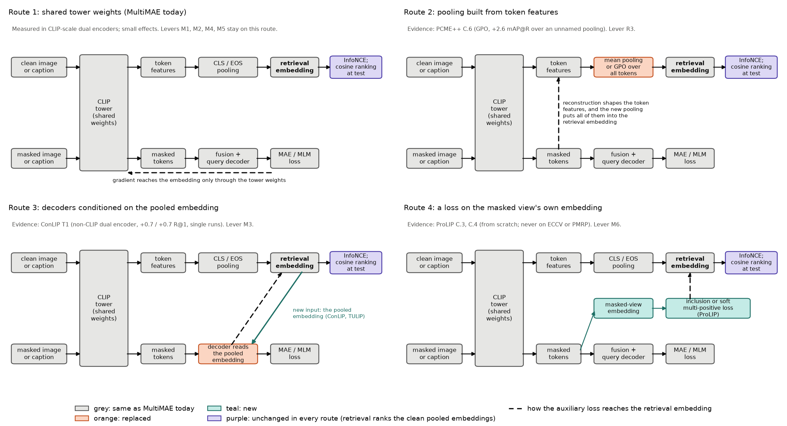
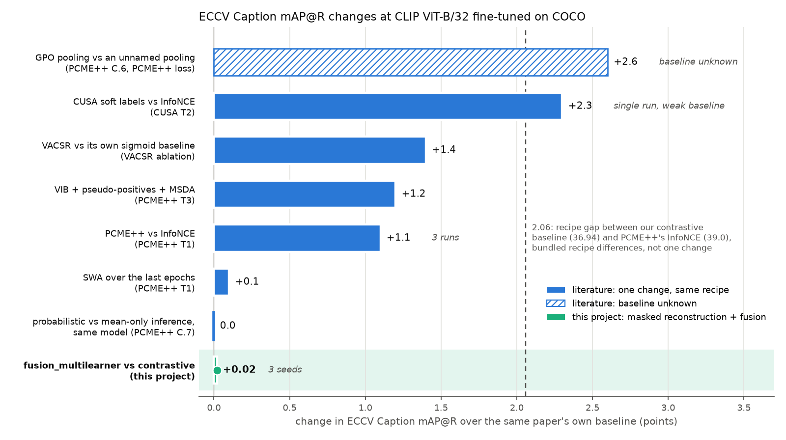

# Masked objectives, one-to-many retrieval and polysemy: an integrative review of levers for MultiMAE

Date: 2026-10-03. Branch `eval-baselines`. Previous report: [the v1 baselines](2026-10-03_baselines.md). Figures are built by [`build_2026-10-03_lever_review.py`](../../assets/build_2026-10-03_lever_review.py); the bibliographies, verification records and synthesis behind the review are in [`assets/2026-10-03_lever_review/`](../../assets/2026-10-03_lever_review/).

## Summary

The 3-seed baselines left one clear result and one null. Against the contrastive baseline, `fusion_multilearner` raised PMRP from 56.49 to 56.88 (+0.39, p = 0.0009) and rsum by 2.36 (p = 0.11), and left ECCV Caption mAP@R unchanged (36.95 against 36.94). The author's broad question, whether masked models can improve polysemy understanding in image-text retrieval, is not yet a paper topic, and about 250 A6000 GPU-hours remain. Before spending them we ran an integrative literature review on four themes, had every load-bearing number re-checked against its primary source, and synthesized the result.

Image-conditioned MLM carried most of the masked-objective gain wherever objectives were separated (77% and 70% of MAMO's COCO gain), and pixel MIM added little or hurt once MLM was present (up to −6.28 IR R@1 in METER). No searched source isolates a masked objective by ablation on ECCV mAP@R, PMRP, CxC or VWSD; our 3-seed contrast appears to be the only such measurement, and on mAP@R it is a null. What did move ECCV mAP@R at CLIP ViT-B/32 fine-tuned on COCO were loss-side one-to-many changes, +0.1 to +2.3 over each paper's own baseline (PCME++ +1.1 over InfoNCE across 3 runs; CUSA +2.3 in one run over a weaker baseline). Our contrastive baseline sits 2.06 mAP@R below PCME++'s InfoNCE fine-tune (36.94 against 39.0) at a similar 5K rsum (441.94 against 444.1), more than PCME++'s own method gain. PMRP is a weak instrument: its pseudo-positives are 65.3% and 56.6% precise against human labels, its model ranking agrees with mAP@R's only at Kendall τ 0.20, and its source paper contradicts itself in 11 of 25 rows.

For the next experiments, this points to levers that route the masked signal into the retrieval embedding (Figure 1), to checking the masked effect over a stronger baseline, and to crossing it with a one-to-many-aware loss. Section 8 lists 13 candidate levers; one set that fits the budget costs 175.5 GPU-hours at 3 seeds. **No lever has been chosen.** The primary metric, the success bar and the stage plan are being settled with the author.

**Terms.** The **contrastive baseline** is CLIP ViT-B/32 fine-tuned on COCO with InfoNCE (the in-batch contrastive loss) alone; **`fusion_none`, `fusion_concat` and `fusion_multilearner`** add a masked pass and reconstruction decoders that read each modality alone, a joint sequence, or image, text and joint learners. All four retrieve by cosine similarity of CLIP's clean pooled embeddings (a dual encoder). **MAE** or MIM reconstructs hidden image patches; **MLM** predicts hidden caption tokens, and image-conditioned MLM also reads image tokens. **ITM** is a matching head that re-ranks a dual encoder's top k. **rsum** sums the six COCO 5K recalls (some papers report a non-comparable 1K RSUM). **ECCV mAP@R** is average precision over the top R ranks, R being the number of human-verified positives in ECCV Caption's re-annotation of COCO 5K test; **R-Precision** is the share of positives in the top R. **PMRP** counts as positive every item whose image has the same COCO object classes, with R capped at 50. **CxC** adds human-rated matches to COCO. **VWSD** is visual word sense disambiguation (SemEval-2023 Task 1), scored by Hit@1. A **same-recipe baseline** is the citing paper's own comparison. **Evidence strength** is strong (several sources, repeated runs, our setting), moderate (several sources or repeated runs, a nearby setting) or weak (single runs, distant settings or an unknown baseline).

## 1. How we got here

The [baselines report](2026-10-03_baselines.md) trained the four models on full COCO, three seeds each. Against the contrastive baseline, `fusion_multilearner` gained +0.39 PMRP (56.88 ± 0.04 against 56.49 ± 0.05, p = 0.0009, the only one of 33 tests to survive a Holm correction), +2.36 rsum (444.30 against 441.94, p = 0.11) and +0.02 mAP@R (p = 0.92). Contrastive fine-tuning itself had gained 79.96 rsum and 10.22 mAP@R over zero-shot CLIP B/32 but only 1.17 PMRP (55.32 to 56.49), so fusion added a third of the fine-tuning gain on PMRP and nothing on mAP@R. Without cross-modal reading (`fusion_none`) the PMRP gain was +0.12 (p = 0.07). The validation losses showed the direction of use: MLM loss fell from 1.623 without fusion to 1.516 and 1.557 with it, while MAE loss rose from 0.658 to 0.715 and 0.710. The text decoder used the image; the image decoder gained nothing from the caption.

A quick scan on 2 October had found that MAE helped CLIP-style training at small scale and stopped helping at 1.4B pairs (Weers et al.), that MaskCLIP, MaskVLM and MAMO combine contrastive and masked objectives, and that the one-to-many line (PCME, PCME++, MAP, ProLIP, ECCV Caption) models multiplicity with probabilistic embeddings. It found no work scoring fusion plus masked reconstruction on polysemy-aware retrieval. On 3 October the author asked whether masked models can improve polysemy understanding, where polysemy covers one-to-many matching (an image fits many captions, a caption many images) and lexical ambiguity (a query word with several senses). The question is not yet a paper topic, and the review was meant to help find one.

More runs alone could not tell us whether anyone had measured a masked objective on these metrics, what had moved ECCV mAP@R in our setting, or why PMRP might move without mAP@R. At about 7.2 GPU-hours per multilearner run, the budget buys about eleven 3-seed multilearner arms (computed), so we wanted the evidence first.

*Sources: the [baselines report](2026-10-03_baselines.md), Summary and sections 1 to 4; the review brief (`00_brief.md`); Weers et al. 2023; Dong et al. 2023; Kwon et al. 2023 (MaskVLM); Zhao et al. 2023; Ji et al. 2023; Chun et al. 2025.*

## 2. Method

The author chose an integrative review (ARS deep-research, lit-review mode): a structured search and critical synthesis across study designs, without meta-analysis, because the evidence mixes from-scratch pretraining, ITM models and fine-tunes. One agent per theme searched on 2026-10-03 under a shared brief: read numbers from the paper's own tables with a locator, never fill in a number, venue or arXiv id, and search actively for 2024 to 2026 work.

*Table 1. Search per theme (counts as each bibliography reports them; "about" marks approximate counts).*

| Theme | Main sources | Queries | Identified | Screened | Full text | Included |
|---|---|---|---|---|---|---|
| B1 masked-objective design | web search, arXiv full texts | 14 + 12 named papers | about 132 | about 45 | 22 | 18 |
| B2 retrieval representation and one-to-many | arXiv HTML, Semantic Scholar, web search, snowballing | 9 + venue checks | about 90 | 35 | 26 | 20 |
| B3 fine-tuning recipe and ECCV/PMRP leaderboard | citations of ECCV Caption (58) and PCME (321), web search, arXiv LaTeX | 6 + citation screens | about 360 | about 360 | 44 grepped, 16 read | 15 entries |
| B4 masking and polysemy novelty sweep | web search (arXiv, CVF, OpenReview, ACL Anthology) | 29 | about 270 | about 75 | 30 + 8 abstracts | 16 core, 9 short, 6 benchmarks |

Two separate verification agents re-read each load-bearing claim at its locator, mostly in the arXiv LaTeX source, and checked metadata against the arXiv API, Semantic Scholar, Crossref and venue pages. Their corrections override the bibliographies throughout.

*Table 2. Verification outcomes, in claim rows (a row can bundle several numbers).*

| Pass | Sources | Rows | Confirmed | Corrected | Locator wrong | Not found | Other |
|---|---|---|---|---|---|---|---|
| V1 (B1, B4) | 52 | 96 | 78 | 13 | 2 | 2 | 1 resolved |
| V2 (B2, B3) | 48 | 121 | 109 | 6 | 1 | 3 | 2 rows on excluded sources not fully checked |

Neither pass found a fabricated source. V1 found no unverifiable source (one venue claim on an excluded paper stayed unconfirmed); V2 rated one link plausible but unproven (a TMLR paper as the published version of Sun's preprint). The corrections that changed conclusions: two absence claims failed as worded (METER and TULIP add masked objectives to CLIP-family encoders and report retrieval; ECCV Caption's Table 4 and Kwon et al.'s FLAVA run score masked-pretrained models on ECCV, PMRP and VWSD, without ablating the objective); ProLIP does isolate its masked-inclusion term; FILIP's late-interaction gain is +5.5 / +3.8 R@1; ECCV Caption's appendix contradicts its Table 4 PMRP in 11 of 25 rows; and PCME++ never names the pooling of its "no GPO" row. V1 added METER, ConLIP and Kwon et al. as missed sources. V1 corrected six venues and V2 two, among them those of VFE-TPS, MACCO, LongProLIP, AAHR and CLIP4Clip (see References).

A synthesis agent then wrote the thematic synthesis, tables, gaps and ranked levers, marking its own arithmetic and inferences, without re-reading sources. Its effect ranges for untested levers are extrapolations from other settings and are labelled so below.

Supporting files, each with one added header line: bibliographies [B1](../../assets/2026-10-03_lever_review/B1_masked_objectives.md), [B2](../../assets/2026-10-03_lever_review/B2_retrieval_representation.md), [B3](../../assets/2026-10-03_lever_review/B3_recipes_and_leaderboard.md), [B4](../../assets/2026-10-03_lever_review/B4_novelty_polysemy.md); verification [V1](../../assets/2026-10-03_lever_review/V1_verification_B1_B4.md), [V2](../../assets/2026-10-03_lever_review/V2_verification_B2_B3.md); [synthesis](../../assets/2026-10-03_lever_review/S_synthesis.md).

## 3. Findings by theme

MultiMAE retrieves with CLIP's clean pooled embedding, which the masked losses reach only through the shared tower weights. Figure 1 sets this route beside three others in the literature (our framing). Only route 1 has been measured in CLIP-scale dual encoders, with small effects.

*Figure 1. Four routes by which an auxiliary loss can reach the retrieval embedding. Grey: the same as MultiMAE today. Orange: replaced. Teal: new. Purple: unchanged in every route, retrieval by cosine similarity of the clean pooled embeddings. Dashed: how the auxiliary loss shapes the retrieval embedding. Levers R3, M3 and M6 (section 8) test routes 2, 3 and 4.*

### 3.1 Masked-objective design (B1)

Where objectives were separated, image-conditioned MLM carried most of the gain. MLM alone gave 77% and 70% of MAMO's full COCO TR/IR gain over ITC+ITM, and in MaskVLM it added +1.2 / +2.0 zero-shot R@1 where MIM alone added −0.2 / +0.5. On top of MLM, MIM hurt: it cost METER 3.96 to 6.28 Flickr IR R@1 and BiLMa 0.52 Rank-1, and MACCO, on our backbone and data, found MLM and MIM not additive (contrastive fine-tune 66.1; +MLM 68.2; +MIM 68.5; both 68.2 on compositional benchmarks). Our validation losses agree (section 1).

Feature targets beat pixels wherever both were compared, by under one point in fine-tuning (MAMO COCO 75.8/59.1 to 76.6/59.2). Every sweep with a retrieval readout found 15% text masking too low (Verma et al. +3.00 / +4.11 COCO R@1 at 60%; MaskVLM +1.0 / +1.6 Flickr R@1 at 30%). Bitton et al. give a reason: on captions of about 20 tokens, 36% of sentences get no mask and 45% to 50% of masked tokens are stop words or punctuation, while content words are the ones that need the image. Image ratios between 0.5 and 0.75 barely mattered (MaskVLM 81.26 to 81.82 Flickr IR R@1 at 0.5 to 0.7; TIPS Table 11B).

The sources split on pixel MIM, which helped as the only auxiliary (VFE-TPS) or with caption-relevant masks (SyCoCa), and on the MLM weight (section 6). Our MLM decoder reads the masked pass and so sees only 25% of the patches, whereas IRRA, MaskVLM and MACCO condition MLM on the full image; MaskVLM found masking one modality per pass better than masking both (COCO R@1 59.5/76.0 to 60.1/76.3). Most of this evidence comes from ITM or from-scratch models, and its transfer to a fine-tuned CLIP dual encoder is untested.

Evidence strength: moderate for MLM over MIM (five sources, single runs, mostly ITM or from scratch); weak for weights, ratios and targets in our setting.

*Sources: MAMO T6, T9; MaskVLM T5, T7, App. T6; METER T7; BiLMa App. T5; MACCO T9; MaskCLIP T6f; Verma et al. T4; Bitton et al. Sec 2.2; TIPS T11B; VFE-TPS T6; SyCoCa T5; IRRA T4. V1 rows 13, 20, 42 and its METER finding.*

### 3.2 Retrieval representation and one-to-many matching (B2)

At CLIP B/32 on COCO, loss changes that relax the one-positive assumption gained +0.1 to +2.3 mAP@R over their own baselines (section 4). The representation itself added little: probabilistic and mean-only retrieval scored the same on one PCME++ model (40.2 both), PCME's probabilistic head moved its PMRP by 0.1, and post-hoc distributions on frozen CLIP left rankings unchanged (ProbVLM) or worse (GroVE, COCO i2t R@1 0.512 against 0.715 deterministic).

Other results depend on the setting. Multiple embeddings gave pre-CLIP PVSE +6.28 mAP@R but about +1 on strong backbones (DivE 42.4 to 43.5; Sun 35.5 to 36.3), and PVSE had helped build ECCV Caption's candidate pool. Text-conditioned pooling added about 4 to 5 COCO R@1 from scratch (Llip over MetaCLIP, I2T 59.4 to 63.4, baseline copied from the MetaCLIP paper; FLAIR over a reproduced SigLIP, T2I 46.6 to 51.2), with no ECCV or PMRP numbers. Re-ranking raised R@K (LoopITR 5K rsum 471.9 to 494.7), yet re-ranked BLIP scored 40.5 mAP@R against 42.2 for the PCME++ dual encoder at B/16 despite a 5K R@1 of 73.1 against 61.3, and no paper compares one model's dual-encoder ranking with its own ITM re-ranking on these metrics.

ALBEF's same-image multi-positive target would be close to a no-op for us: at batch 128 over 567k pairs from 113k images, a same-image pair occurs about 0.06 times per batch (computed). Soft targets would need semantic similarity, as in CUSA.

Evidence strength: moderate to strong for PCME++'s +1.1 (3 runs, shared hyperparameters); moderate for the +0.1 to +2.3 band; weak for re-ranking and multiple embeddings at CLIP scale.

*Sources: PCME++ T1, T3, C.1, C.7; CUSA T2; VACSR ablation; PCME T3; ProbVLM Sec 4.1; GroVE App. C; ECCV Caption T4; DivE T A1; Sun app. table; Llip T2; FLAIR T1; LoopITR T7, T9; ALBEF Sec 5. V1 rows 65, 67; V2 sections 3.1 to 3.6.*

### 3.3 Fine-tuning recipe (B3)

Our contrastive fine-tune reached rsum 441.94 and mAP@R 36.94; PCME++'s InfoNCE baseline at B/32 reached rsum 444.1 (3-run mean, computed from its appendix) and mAP@R 39.0. The recalls are close, but the 2.06 mAP@R gap exceeds PCME++'s own method gain. CUSA's InfoNCE baseline is lower on both (422.6, 35.1). The PCME++ recipe differs from ours in at least five ways: GPO pooling with new 1024-d heads; visual learning rate 5e-6 with layer-wise decay 0.7 and text rate 5e-5; the visual tower frozen for 2 epochs; 25 epochs (about 111k steps against our 44k); and InfoNCE temperature initialized at 1.0. Only the pooling is ablated, against a pooling the paper never names. VACSR's fixed-temperature collapse (mAP@R 15.7) is set against a row copied from PCME++, so it shows only that a logit scale of 1 fails.

Evidence on batch and schedule is thin. One ResNet-50 documentation page (ITRA) found batch 128 to 512 worth about +16.3 5K rsum with the learning rate scaled, 10 to 15 epochs worth +0.45 mean recall, and learning rates 1e-5 and 2e-5 best; CLIP4Clip found batch 128 and 256 comparable on video. Neither measured ECCV or PMRP. Tower learning rates span 5e-7 (MACCO) to 5e-5 (PCME++ text), and nobody ablates PCME++'s 10:1 text-to-visual ratio.

Evidence strength: weak to moderate. We infer that a masked-objective gain over our baseline may shrink over one as strong as PCME++'s.

*Sources: PCME++ T1, App. B.2, C.6; CUSA T1, T2; VACSR loss table; ITRA documentation; CLIP4Clip Sec 4.4; MACCO Sec 4. V2 section 3.7 and issues 3, 4.*

### 3.4 Masking and polysemy (B4)

Masked inputs have served as less specific views only at pretraining scale. ProLIP's masked-inclusion loss alone moved the DataComp retrieval average from 53.6 to 53.2 and HierarCaps recall from 44.8 to 47.9 (as corrected by V1). In COSMOS a masked-text view lost to sentence crops (COCO I2T/T2I R@1 46.0/32.8 against 52.6/38.9), and in A-CLIP one random 50% image view fell below full-image CLIP (zero-shot ImageNet 35.0 against 37.6) while an attention-selected view rose above it (39.5). Pretrained CLIP already orders captions by generality (HierarCaps), and MERU and HyCoCLIP encode generality with crops and phrases. No study measures masked views on ECCV or PMRP.

On lexical ambiguity, VWSD gains came from adding context to the query. LLM definitions raised CLIP's accuracy from 63.28 to 68.07 (Kritharoula et al.), and definitions plus translation raised English Hit@1 from 60.5 to 69.1 (UAlberta); Bhattacharya et al.'s prompting result (Hit@1 0.6250) is not attainable on the 463 English test items. Image augmentation did not help, no VWSD system in the search used MLM, and the only masked-pretrained model scored on VWSD is FLAVA, zero-shot and unablated (Kwon et al.). CLIP's text encoder superposes the senses of a polysemous word (White and Cotterell, abstract only). On 463 items a Hit@1 near 60% has a standard error of about 2.3 points (computed), so VWSD separates only large effects.

Masking removes context, while VWSD rewards adding it (our interpretation). A masked model's plausible route to sense resolution is image-conditioned MLM supplying the word the image implies. Two hypotheses fit "PMRP up, mAP@R flat", and existing checkpoints can test both (lever E0):
- H1, object grounding: the MLM learns object words from pixels. Content words need the image most (Bitton et al.), and PMRP rewards object-class overlap.
- H2, softer similarity: the auxiliary losses lower hard-negative pressure, which ECCV Caption's Table 4 ties to higher PMRP (its App. D.3 reverses the trend).

Evidence strength: weak; no direct test exists.

*Sources: ProLIP T C.3, C.4; COSMOS Supp. T17; A-CLIP T2a; HierarCaps T1; Kritharoula et al. T3, T8; UAlberta Sec 3, T3; Bhattacharya et al. T IV, V; Kwon et al. (ACL 2023); White and Cotterell; SemEval-2023 overview. V1 rows 55, 69, 71 to 78 and its absence-claim log.*

## 4. What has moved ECCV mAP@R at CLIP B/32 on COCO, and where we sit

*Table 3. Same-recipe changes in ECCV mAP@R at CLIP ViT-B/32 fine-tuned on COCO (synthesis section 1.4, as corrected by V2).*

| Change | Baseline → new | Δ | Caveat | Source |
|---|---|---|---|---|
| GPO pooling | 37.4 → 40.0 | +2.6 | baseline pooling unnamed; PCME++ loss | PCME++ C.6 |
| CUSA soft labels | 35.1 → 37.4 | +2.3 | single run; weak baseline | CUSA T2 |
| VACSR adapter | 39.3 → 40.7 | +1.4 | own sigmoid baseline | VACSR ablation |
| VIB + pseudo-positives + mixed-sample augmentation | 38.9 → 40.1 | +1.2 | | PCME++ T3 |
| PCME++ loss vs InfoNCE | 39.0 → 40.1 | +1.1 | 3 runs | PCME++ T1 |
| SWA | 40.1 → 40.2 | +0.1 | | PCME++ T1 |
| Probabilistic vs mean-only inference | 40.2 → 40.2 | 0.0 | same model | PCME++ C.7 |
| `fusion_multilearner` vs contrastive (ours) | 36.94 → 36.95 | +0.02 | 3 seeds; unrounded means | baselines report |

*Figure 2. The changes of Table 3, each over its own paper's baseline. Hatched: GPO, whose baseline pooling is unknown. Shaded row: our `fusion_multilearner` against the contrastive baseline. Dashed line: the 2.06 gap between our contrastive baseline (36.94) and PCME++'s InfoNCE fine-tune (39.0), which bundles several recipe differences.*

The best-supported effects are loss-side and about one point (PCME++ +1.1, per-direction spreads of 0.1 to 0.5 over 3 runs). Our contrast is the only within-recipe masked measurement in the searched literature, and on mAP@R it is a null. The recipe gap to PCME++'s InfoNCE (2.06) exceeds every change except the two caveated ones, and moving from B/32 to B/16 under InfoNCE adds +2.1. Larger pre-CLIP effects (two PVSE embeddings +6.28, semi-hard mining +3.3, CutMix pretraining +4.6) did not recur at CLIP scale where tested. LongProLIP (B/16 zero-shot, 34.1 to 35.7), AAHR (region features plus frozen CLIP B/32, 41.5 to 41.95) and ECCV Caption's MLM-pretrained ITM models (ViLT fine-tuned 34.58 mAP@R, 57.63 PMRP; VinVL 40.81, 54.72) report mAP@R outside this setting, and none ablates a masked objective.

PMRP is the weakest of the instruments:
- Its pseudo-positives are 65.3% (i2t) and 56.6% (t2i) precise against human labels, and its model ranking agrees with mAP@R's at Kendall τ 0.20.
- It records object presence only, so "a dog asleep on a couch" and "a dog jumping off a couch" count alike.
- Two definitions are in use (Pishdad et al. average over thresholds ζ = 0, 1, 2; PCME-paper values of about 30 to 46 sit on a different scale from ECCV Caption's 47 to 58), so we never compare across them. No later paper in the search reports ECCV-style PMRP.
- ECCV Caption's Table 4 and App. D.3 disagree in 11 of 25 rows: zero-shot CLIP B/32 averages 52.55 in D.3 against 55.32 in Table 4, and PVSE with no, semi-hard and hardest mining falls in Table 4 (56.67, 55.15, 54.37) but rises in D.3 (44.84 to 47.17). Our zero-shot 55.32 supports Table 4 for the CLIP B/32 row.

Fine-tuning raised our PMRP by 1.17 and `fusion_multilearner` added a third of that (0.39), still 0.82 below zero-shot CLIP L/14 (57.70) and inside the 10.75-point band of ECCV Caption's 25 models (46.95 to 57.70). At a seed standard deviation of about 0.05 the gain is detectable, but small on this scale.

Evidence strength: moderate for the B/32 ranking; weak for every PMRP contrast.

*Sources: PCME++ T1, T3, C.6, C.7, C.10, C.11; CUSA T2; VACSR; ECCV Caption T2, T4, T5, Sec 4.2, App. D.3; Pishdad et al.; LongProLIP; AAHR; baselines report Table 1. V2 section 3 and issue 2.*

## 5. Evidence table

*Table 4. Findings that bear on a lever (synthesis section 2). FT: fine-tuned; ZS: zero-shot.*

| # | Change | Effect (baseline → new) | Setting | Source | Strength |
|---|---|---|---|---|---|
| 1 | Image-conditioned MLM | CUHK Rank-1 68.19 → 71.23 over InfoNCE; 70.52 → 73.38 over SDM+ID; BiLMa rerun 73.01 → 73.16 | CLIP B/16 FT, person retrieval, dual encoder | IRRA T4, BiLMa T2 | moderate: sign agrees, size conflicts |
| 2 | Pixel MIM on top of MLM | Flickr ZS IR/TR R@1 66.08/78.10 → 62.12/76.90; COCO FT −0.8/+0.2 | CLIP-ViT + RoBERTa, ITM; VLP, ITM | METER T7, MAMO T6 | moderate |
| 3 | Text-guided pixel MIM alone | Rank-1 70.61 → 72.16 | CLIP B/16 FT, person | VFE-TPS T6 | weak: one run |
| 4 | MIM target pixels → features | Flickr ZS 57.3/41.1 → 62.3/41.4; COCO FT 75.8/59.1 → 76.6/59.2 | from scratch; VLP, ITM | MaskCLIP T9, MAMO T9 | moderate: small in FT |
| 5 | MLM weight 1 → 0.05 | Flickr ZS 51.7/32.1 → 70.1/45.6 (CLIP 52.9/32.8) | from scratch, text-only MLM | MaskCLIP T6f | weak for FT |
| 6 | Text mask rate 15% → 30-60% | COCO FT R@1 +3.00/+4.11; Flickr FT +1.0/+1.6 | ITM models | Verma T4, MaskVLM T7 | moderate direction, weak transfer |
| 7 | MLM sees the full image | COCO FT R@1 59.5/76.0 → 60.1/76.3 | VLP, ITM | MaskVLM App. T6 | weak: one pair |
| 8 | Decoders read the [CLS] embedding | COCO FT T2I/I2T R@1 46.8/62.7 (contrastive), 46.3/62.3 (vanilla) → 47.5/63.4 | non-CLIP dual encoder, 5.3M pairs | ConLIP T1 | weak: single runs |
| 9 | Attentive MIM, top 50% caption-similar patches | COCO ZS mTR/mIR 14.4/15.2 → 18.3/18.4 | CoCa from scratch | SyCoCa T5 | weak |
| 10 | Inclusion loss on 75%-masked inputs | DataComp retrieval 53.6 → 53.2; HierarCaps 44.8 → 47.9 | from scratch | ProLIP C.3, C.4 | weak |
| 11 | Unimodal-teacher soft targets | mAP@R 35.1 → 37.4; 5K rsum 422.6 → 429.7 | CLIP B/32 FT on COCO | CUSA T1, T2 | moderate: weak baseline, one run |
| 12 | PCME++ loss vs InfoNCE | mAP@R 39.0 → 40.1; 5K rsum 444.1 → 452.1 | CLIP B/32 FT, 3 runs | PCME++ T1 | moderate to strong |
| 13 | GPO vs unnamed pooling | mAP@R 37.4 → 40.0 | CLIP B/32 FT, PCME++ loss | PCME++ C.6 | weak: baseline unknown |
| 14 | PCME++ recipe vs ours | mAP@R 36.94 (ours) vs 39.0 | CLIP B/32 FT | PCME++ T B.1 | weak for attribution |
| 15 | Batch 128 → 512; 10 → 15 epochs | mean recall 72.14 → 74.85; 73.98 → 74.43 | ResNet-50 CLIP FT | ITRA docs | weak: grey literature |
| 16 | Re-ranking; token max-similarity | COCO 5K rsum 471.9 → 494.7; ZS R@1 25.0/14.7 → 30.5/18.5 | ALBEF-scale; from scratch | LoopITR T7, T9; FILIP T4 | moderate for R@K, no ECCV/PMRP |
| 17 | Multiple embeddings, K = 1 → 2 | mAP@R 33.98 → 40.26 (PVSE); 42.4 → 43.5 (DivE) | pre-CLIP | ECCV Caption T4, DivE | weak: annotator bias |
| 18 | LLM definitions in the VWSD query | accuracy 63.28 → 68.07 | zero-shot CLIP | Kritharoula T3 | moderate; no masking |

## 6. Contradictions and how we resolved them

*Table 5. Contradictions from a scoped scan (10 candidate pairs, 9 listed), not an exhaustive pairwise search.*

| # | Claim A | Claim B | Resolution |
|---|---|---|---|
| 1 | IRRA: image-conditioned MLM +2.86 Rank-1 over SDM+ID | BiLMa: +0.15 over its own SDM+ID run | Unresolved on size; sign agrees. The labs' SDM+ID runs differ by 2.49 (computed), about IRRA's gain. Likely small, positive and baseline-dependent, like our +2.36 rsum (p = 0.11). |
| 2 | ECCV Caption T4: PMRP falls with harder mining (56.67 → 54.37) | App. D.3: the means rise (44.84 → 47.17) | Partly unresolved. 11 of 25 rows conflict; our reproduction matches T4. We use T4 for CLIP rows and not the mining trend. |
| 3 | MaskCLIP: MLM at weight 1 falls below CLIP | IRRA, MaskVLM, MAMO: unit-weight MLM helps | Resolved (conditional): MaskCLIP's MLM is text-only on a from-scratch encoder; the others are image-conditioned, as ours is. |
| 4 | VFE-TPS: pixel MIM +1.55 Rank-1 | BiLMa, METER, random-mask SyCoCa: it hurts | Resolved (conditional): it helps alone or with caption-relevant masks, and is useless on top of MLM with random masks (MACCO). |
| 5 | METER: MIM hurts | VL-BEiT: MIM +1.0/+1.6 FT R@1 | Resolved (conditional): VL-BEiT's unimodal MIM brings its own ImageNet-22K data and targets, a confound. |
| 6 | CUSA: soft targets +2.3 mAP@R | PCME++: pseudo-positives +0.1 | Resolved (conditional): CUSA uses external teachers and a baseline 3.9 weaker (computed), in one run. |
| 7 | Geigle, LoopITR: re-ranking +9.7 to +22.8 rsum | ECCV Caption: re-ranked BLIP trails dual encoders on mAP@R | Unresolved: no same-model comparison exists. |
| 8 | ECCV Caption: PVSE K = 2 +6.28 mAP@R | PCME: K = 2 lowers CUB R-P (22.34 → 19.67) | Resolved (conditional): CUB positives are class-level, PVSE helped build ECCV Caption, and strong backbones gain about +1. |
| 9 | PCME++ C.6: GPO +2.6 mAP@R | The no-GPO pooling is never named | Unresolved: no evidence for a CLIP-pooled InfoNCE fine-tune; lever R3 tests it. |

## 7. Gaps

Tags: research (a candidate contribution on the broad question), engineering (recipe), evaluation (measurement).

1. Research: why does a masked objective move PMRP (+0.39) but not mAP@R (+0.02), object grounding (H1) or softer similarity (H2)? No source tests either.
2. Research: does the effect grow with how much the MLM depends on the image (25% against 100% of patches; random against content-word masks)? Sweeps exist only for ITM or from-scratch models.
3. Research: does routing reconstruction through the retrieval embedding (routes 2 and 3) yield one-to-many gains? The only test, ConLIP, is not CLIP and reports R@1 only.
4. Research: can masked inputs used as under-specified views teach one-to-many structure in a fine-tune? ProLIP tried it only from scratch, never on ECCV or PMRP.
5. Research: does a masked objective add anything on top of a one-to-many-aware loss? No 2×2 design exists.
6. Research (lexical): does masked COCO fine-tuning change VWSD Hit@1 or MRR? No data exist.
7. Evaluation: do PMRP differences of 0.1 to 0.5 mean anything, given the Table 4 and D.3 conflict and object-only positives?
8. Engineering: which recipe element explains the 2.06 gap to PCME++'s InfoNCE, and what do batch size and schedule do to ECCV and PMRP?
9. Evaluation (tangential): how does a dual-encoder ranking compare with the same model's ITM re-ranking on ECCV, PMRP or CxC? Unreported.
10. Research (theory): no framework links reconstruction to ranking under multiplicity; inclusion (ProLIP) and entailment (MERU, HierarCaps) have not been connected to masked reconstruction.

## 8. Candidate levers for the remaining budget

**No lever has been chosen.** The primary metric, the success bar and the stage plan are being settled with the author; this section lists candidates and costs only.

Per seed on one A6000, a contrastive run takes 4.2 h, `fusion_none` 6.9 h and `fusion_multilearner` 7.2 h. Masked-side levers (M) reuse the existing 3-seed baselines; recipe and loss levers (R) also go to the contrastive arm, at 11.4 h per seed pair (computed). Three seeds per arm detect about +4.3 rsum, +0.6 mAP@R and +0.15 PMRP at 80% power. **The effect column is our extrapolation from other settings, not a prediction**, with no valid conversion from Rank-1 or R@1 to rsum or mAP@R.

*Table 6. Candidate levers (synthesis section 5). Rows refer to Table 4.*

| ID | Lever | Extrapolated Δ mAP@R / PMRP / rsum (evidence) | Tests; what a null teaches | Prior work | Code | GPU-h, 1 / 3 seeds | Contrastive arm too? |
|---|---|---|---|---|---|---|---|
| E0 | Diagnostics on existing checkpoints: VWSD (463 items), PMRP by direction and object category, logit scale per arm, masked-caption probe | none (measurement) | Separates H1 from H2; first VWSD reading | none found | small | about 0 | all arms evaluated |
| M1 | MLM reads the clean pass's full image tokens, with and without stop-gradient | 0 to +0.5 / 0 to +0.4 / 0 to +4 (rows 1, 7) | Dose-response of image conditioning | dose compared only in ITM pretraining (MaskVLM) | small | 7.2 / 21.6 | no |
| M2 | Text masking at 30% to 60%, or content-word masking | 0 to +0.5 / 0 to +0.4, largest under H1 / 0 to +4 (Verma, Bitton) | Sharp test of H1 | no CLIP dual-encoder sweep | config or small | 7.2 / 21.6 per setting | no |
| M3 | Decoders conditioned on the other modality's pooled embedding, so masked words cannot leak through the clean text embedding (our design) | unknown / unknown / 0 to +4 (ConLIP, +0.7 / +0.7 R@1) | Route 3; re-read ConLIP first (V1 does not say which embedding it used) | not for CLIP or ECCV/PMRP | small to moderate | 7.2 / 21.6 | no |
| M4 | Caption-relevant MAE masking, scored on the clean pass | unknown / unknown / −2 to +3 (SyCoCa) | Can the image side use the text? | from scratch only | small | 7.2 / 21.6 | no |
| M5 | MAE off (MLM only), then feature targets | ±0.3 / ±0.2 / −2 to +2 (rows 2, 4) | The decomposition a paper claim needs | outside our setting | config to moderate | ≤ 7.2 / ≤ 21.6 | no |
| M6 | Masked views as under-specified positives (inclusion or soft multi-positive), with and without reconstruction | −0.5 to +1 / unknown / −3 to +1 (ProLIP, COSMOS) | Route 4: does masking model under-specification? | from scratch only | moderate | ≤ 6.9 + 7.2 / ≤ 42.3, two arms | its contrastive version is the control |
| R1 | CUSA-style soft targets from semantic similarity, 2×2 with masking | +0.1 to +2.3 / unknown / 0 to +7 (CUSA, PCME++ T3) | Does masking add anything once the loss models one-to-many matching? | combination not found | small + teacher pass | 11.4 / 34.2 | yes |
| R2 | PCME++ learning rates: text 10× visual, layer-wise decay, visual tower frozen 2 epochs | 0 to +2 / unknown / 0 to +3 (the 2.06 gap) | Does the masked effect survive a stronger baseline? | never ablated | small | 11.4 / 34.2 | yes |
| R3 | Mean pooling (config), later GPO (code) | −1 to +2.6 / unknown / sign unknown (PCME++ C.6) | Route 2: token-level reconstruction shapes the retrieval vector directly | PCME++ C.6 only | config; more for GPO | 11.4 / 34.2 | yes |
| R4 | Global batch 384 to 512 | unknown / possibly lower / 0 to +16 (ITRA, ResNet-50) | R@K and PMRP may diverge | not on ECCV/PMRP | config | about 11.4 / 34.2 | yes |
| R5 | 15 epochs | small / unknown / 0 to +3 (ITRA) | Schedule only | engineering | config | 17.1 / 51.3 | yes |
| R6 | ITM head over the fusion module, re-ranking the top k at test | unknown / possibly lower / +10 to +23 (Geigle, LoopITR; pre-CLIP) | Does test-time fusion help one-to-many matching? (gap 9) | not found | larger | ≥ 7.2 / ≥ 21.6 + evaluation | yes, with an ITM head |

Costs marked ≤ or ≥, and those of R1's teacher pass, R4's throughput and R6's evaluation, were not timed.

By expected gain on ECCV mAP@R and PMRP, the synthesis ranks R1 first (the largest same-backbone, same-data gain, +2.3; a PCME++-style loss at +1.1 is the fallback), then R2 (part of the 2.06 gap), R3 (caveated, but config only), M1 (PMRP side), M2, M3, M6, M4, R5, R4 (polysemy metrics may fall), M5 (about 0) and R6 (no evidence on these metrics).

By information value for the broad question, it ranks E0 first (free; separates H1 from H2), then M1 (dose-response), M2 (sharp test of H1), M6 (masking as under-specification; no prior study found), M3 (route 3), R1 × masking (does a masked claim survive a one-to-many-aware loss?), R3 × masking (route 2), M4, M5 (necessary but not new), R2, R6 (tangential), and R4 and R5.

**Budget fit (computed).** E0 + M1 + M2 (one setting) + M3 + M6 (two arms) + R1 (2×2, reusing existing arms) + R3 = 0 + 21.6 + 21.6 + 21.6 + 42.3 + 34.2 + 34.2 = 175.5 GPU-hours at 3 seeds, leaving about 74.5 of the 250 for R2 (34.2) or a second M2 setting. Reusing the existing baselines is valid only if the code changes leave them reproducible; otherwise each seed pair costs another 11.4 h. One-seed screening suits only R1 to R3 on mAP@R. The masked-side levers need 3 seeds, since their extrapolated effects (0 to +0.5 mAP@R, 0 to +4 rsum) sit at or below the 3-seed detection limits.

*Sources: costs and detection limits from the baselines report, sections 2.2 and 2.5; evidence as in sections 3 to 5; synthesis section 5.*

## 9. Limitations

- No source was re-read during synthesis, and the author has not yet read the sources.
- Most evidence is single-run, from scratch or ITM re-ranked. Only IRRA, BiLMa, VFE-TPS, CUSA, PCME++ and MACCO fine-tune a pretrained CLIP, and only PCME++ reports run-to-run variance on our metrics.
- The extrapolated ranges map Rank-1 or R@1 onto rsum and mAP@R with no valid conversion and give a direction at most.
- PMRP evidence rests on one internally inconsistent paper.
- Coverage leans towards a US web index and arXiv; journals and ACL PDFs were under-sampled. The contradiction search was scoped, and locators lack page anchors.

## AI-assistance statement

AI agents (Claude, through Claude Code) produced this review under the author's direction. Four agents searched and wrote the bibliographies (B1 to B4); two separate verification agents (V1, V2) checked every load-bearing number against its primary source, mostly the arXiv LaTeX, and checked venues; a synthesis agent integrated the results; and a final agent wrote this report and its figures. The author chose the review form and the themes and has not yet read the sources, so every claim here has been checked by machine and none yet by a person.

## References

- Alper, M., and Averbuch-Elor, H. (2024). Emergent Visual-Semantic Hierarchies in Image-Text Representations (HierarCaps). ECCV 2024. arXiv:2407.08521.
- Bao, H. et al. (2022). VL-BEiT: Generative Vision-Language Pretraining. arXiv preprint arXiv:2206.01127.
- Bhattacharya, S. et al. (2026). Visual Word Sense Disambiguation with CLIP through Dual-Channel Text Prompting and Image Augmentations. arXiv preprint arXiv:2602.06799.
- Bitton, Y. et al. (2021). Data Efficient Masked Language Modeling for Vision and Language. Findings of EMNLP 2021. arXiv:2109.02040.
- Chen, J. et al. (2025). Ambiguity-Aware and High-Order Relation Learning for Multi-Grained Image-Text Matching (AAHR). Knowledge-Based Systems 316:113355. arXiv:2507.09256.
- Chun, S. (2024). Improved Probabilistic Image-Text Representations (PCME++). ICLR 2024. arXiv:2305.18171.
- Chun, S. et al. (2021). Probabilistic Embeddings for Cross-Modal Retrieval (PCME). CVPR 2021. arXiv:2101.05068.
- Chun, S. et al. (2022). ECCV Caption: Correcting False Negatives by Collecting Machine-and-Human-verified Image-Caption Associations for MS-COCO. ECCV 2022. arXiv:2204.03359.
- Chun, S. et al. (2025). Probabilistic Language-Image Pre-Training (ProLIP). ICLR 2025. arXiv:2410.18857.
- Chun, S., and Yun, S. (2025). LongProLIP: A Probabilistic Vision-Language Model with Long Context Text. Tiny paper, ICLR 2025 Workshop on Quantify Uncertainty and Hallucination in Foundation Models. arXiv:2503.08048.
- Desai, K. et al. (2023). Hyperbolic Image-Text Representations (MERU). ICML 2023, PMLR 202. arXiv:2304.09172.
- Dong, X. et al. (2023). MaskCLIP: Masked Self-Distillation Advances Contrastive Language-Image Pretraining. CVPR 2023. arXiv:2208.12262.
- Dou, Z.-Y. et al. (2022). An Empirical Study of Training End-to-End Vision-and-Language Transformers (METER). CVPR 2022. arXiv:2111.02387.
- Fujii, T., and Tarashima, S. (2023). BiLMa: Bidirectional Local-Matching for Text-based Person Re-identification. ICCV 2023 Workshops. arXiv:2309.04675.
- Geigle, G. et al. (2022). Retrieve Fast, Rerank Smart: Cooperative and Joint Approaches for Improved Cross-Modal Retrieval. TACL 10. arXiv:2103.11920.
- Huang, H. et al. (2024). Cross-Modal and Uni-Modal Soft-Label Alignment for Image-Text Retrieval (CUSA). AAAI 2024. arXiv:2403.05261.
- ITRA documentation (n.d.). Fine-tuning CLIP for MS-COCO Retrieval. ITRA 0.1 documentation (grey literature), https://itra.readthedocs.io/en/latest/Contents/example-usage/clip-finetuning.html.
- Ji, Y. et al. (2023). MAP: Multimodal Uncertainty-Aware Vision-Language Pre-training Model. CVPR 2023. arXiv:2210.05335.
- Jiang, D., and Ye, M. (2023). Cross-Modal Implicit Relation Reasoning and Aligning for Text-to-Image Person Retrieval (IRRA). CVPR 2023. arXiv:2303.12501.
- Kim, D. et al. (2023). Improving Cross-Modal Retrieval with Set of Diverse Embeddings (DivE). CVPR 2023. arXiv:2211.16761.
- Kim, S. et al. (2025). COSMOS: Cross-Modality Self-Distillation for Vision Language Pre-training. CVPR 2025. arXiv:2412.01814.
- Kritharoula, A. et al. (2023). Large Language Models and Multimodal Retrieval for Visual Word Sense Disambiguation. EMNLP 2023. arXiv:2310.14025.
- Kwon, G. et al. (2023). Masked Vision and Language Modeling for Multi-modal Representation Learning (MaskVLM). ICLR 2023. arXiv:2208.02131.
- Kwon, S. et al. (2023). Vision Meets Definitions: Unsupervised Visual Word Sense Disambiguation Incorporating Gloss Information. ACL 2023 (2023.acl-long.88). arXiv:2305.01788.
- Lavoie, S. et al. (2024). Modeling Caption Diversity in Contrastive Vision-Language Pretraining (Llip). ICML 2024, PMLR 235. arXiv:2405.00740.
- Lei, J. et al. (2022). LoopITR: Combining Dual and Cross Encoder Architectures for Image-Text Retrieval. arXiv preprint arXiv:2203.05465.
- Li, J. et al. (2021). Align before Fuse: Vision and Language Representation Learning with Momentum Distillation (ALBEF). NeurIPS 2021. arXiv:2107.07651.
- Li, W. et al. (2026). Cross-Modal Masked Compositional Concept Modeling for Enhancing Visio-Linguistic Compositionality (MACCO). ACL 2026 (Long Papers). arXiv:2606.13288.
- Luo, H. et al. (2022). CLIP4Clip: An Empirical Study of CLIP for End to End Video Clip Retrieval. Neurocomputing 508. arXiv:2104.08860.
- Luo, Z. et al. (2022). Conditioned Masked Language and Image Modeling for Image-Text Dense Retrieval (ConLIP). Findings of EMNLP 2022, pp. 130-140. ACL Anthology 2022.findings-emnlp.10.
- Ma, Z. et al. (2024). SyCoCa: Symmetrizing Contrastive Captioners with Attentive Masking for Multimodal Alignment. ICML 2024, PMLR 235. arXiv:2401.02137.
- Maninis, K.-K. et al. (2025). TIPS: Text-Image Pretraining with Spatial Awareness. ICLR 2025. arXiv:2410.16512.
- Ogezi, M. et al. (2023). UAlberta at SemEval-2023 Task 1: Context Augmentation and Translation for Multilingual Visual Word Sense Disambiguation. SemEval-2023. arXiv:2306.14067.
- Pal, A. et al. (2025). Compositional Entailment Learning for Hyperbolic Vision-Language Models (HyCoCLIP). ICLR 2025. arXiv:2410.06912.
- Parekh, Z. et al. (2021). Crisscrossed Captions: Extended Intramodal and Intermodal Semantic Similarity Judgments for MS-COCO (CxC). EACL 2021. arXiv:2004.15020.
- Pishdad, L. et al. (2022). Uncertainty-based Cross-Modal Retrieval with Probabilistic Representations. arXiv preprint arXiv:2204.09268.
- Raganato, A. et al. (2023). SemEval-2023 Task 1: Visual Word Sense Disambiguation. SemEval-2023, pp. 2227-2234. ACL Anthology 2023.semeval-1.308.
- Shen, W. et al. (2025). Enhancing Visual Representation for Text-based Person Searching (VFE-TPS). Knowledge-Based Systems 309:112893. arXiv:2412.20646.
- Singh, A. et al. (2022). FLAVA: A Foundational Language And Vision Alignment Model. CVPR 2022. arXiv:2112.04482.
- Song, Y., and Soleymani, M. (2019). Polysemous Visual-Semantic Embedding for Cross-Modal Retrieval (PVSE). CVPR 2019. arXiv:1906.04402.
- Sun, Z. (2023). Design of the topology for contrastive visual-textual alignment. arXiv preprint arXiv:2209.02127 (v2).
- Tang, Z. et al. (2025). TULIP: Towards Unified Language-Image Pretraining. arXiv preprint arXiv:2503.15485.
- Upadhyay, U. et al. (2023). ProbVLM: Probabilistic Adapter for Frozen Vision-Language Models. ICCV 2023. arXiv:2307.00398.
- Venkataramanan, A. et al. (2025). Probabilistic Embeddings for Frozen Vision-Language Models: Uncertainty Quantification with Gaussian Process Latent Variable Models (GroVE). UAI 2025. arXiv:2505.05163.
- Verma, S. et al. (2022). Uniform Masking Prevails in Vision-Language Pretraining. arXiv preprint arXiv:2212.05195.
- Wei, W. et al. (2026). Variational Adapter for Cross-modal Similarity Representation (VACSR). ICML 2026. arXiv:2605.30968.
- Weers, F. et al. (2023). Masked Autoencoding Does Not Help Natural Language Supervision at Scale. CVPR 2023. arXiv:2301.07836.
- White, J. C., and Cotterell, R. (2022). Schrödinger's Bat: Diffusion Models Sometimes Generate Polysemous Words in Superposition. arXiv preprint arXiv:2211.13095.
- Yang, Y. et al. (2023). Attentive Mask CLIP (A-CLIP). ICCV 2023. arXiv:2212.08653.
- Yao, L. et al. (2022). FILIP: Fine-grained Interactive Language-Image Pre-Training. ICLR 2022. arXiv:2111.07783.
- Zhao, Z. et al. (2023). MAMO: Masked Multimodal Modeling for Fine-Grained Vision-Language Representation Learning. SIGIR 2023. arXiv:2210.04183.
