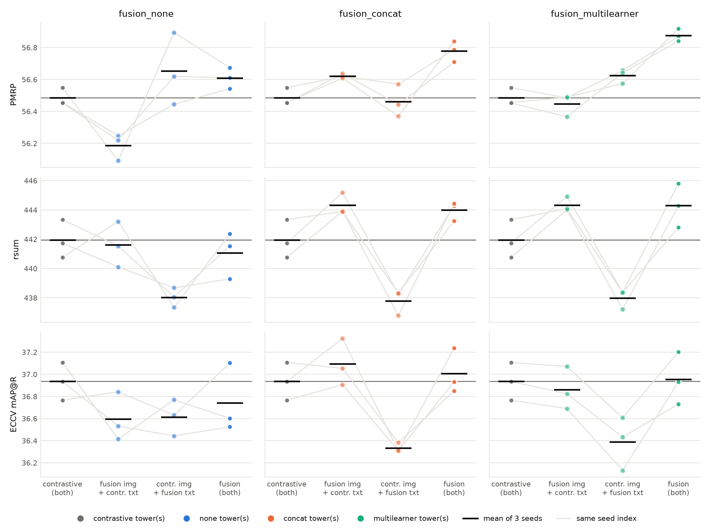
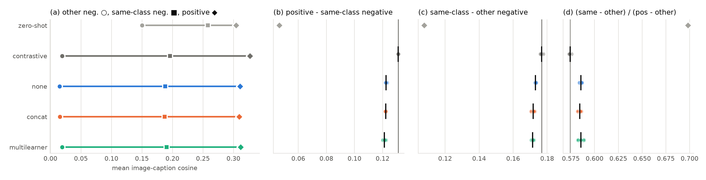
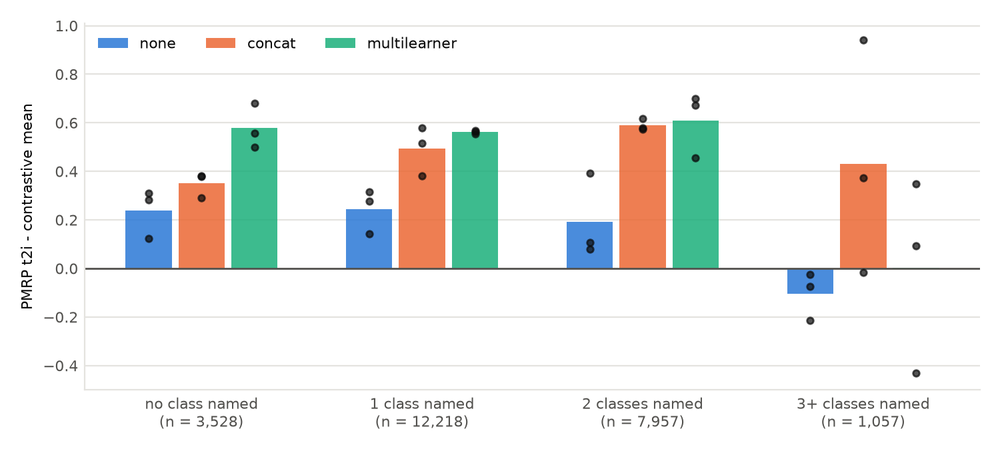

# Stage 0 diagnostics: where the fusion models' PMRP gain sits, and what it says about object grounding and softer similarity

Date: 2026-10-03. Branch `eval-baselines`, diagnostics at commit `9919d8d` (cluster job `20261003-204221-9919d8d`). Design: [the improve-multilearner spec](../../../superpowers/specs/2026-10-03-improve-multilearner-design.md), sections 4 and 5. Previous reports: [the baselines](2026-10-03_baselines.md) (same 12 checkpoints) and [the lever review](2026-10-03_lever_review.md). Every number below is printed by [`build_2026-10-03_stage0.py`](../../assets/build_2026-10-03_stage0.py), which also draws the figures.

## Summary

The 3-seed baselines left one effect to explain: against the contrastive baseline, `fusion_multilearner` raised PMRP by 0.39 (p = 0.0009) and `fusion_concat` by 0.29 (p = 0.004), while ECCV Caption mAP@R stayed flat (+0.02, +0.07). The spec named two explanations. Under H1 (object grounding), image-conditioned MLM teaches the towers which objects are present; under H2 (softer similarity), the auxiliary losses weaken the contrastive push that separates same-class items. We ran six evaluation-only diagnostics on the 12 baseline checkpoints and zero-shot CLIP ViT-B/32.

1. With `fusion_none` as the control, the fusion-specific PMRP gain sits in the image tower. Swapped towers fell short of the full model in every reconstruction model: full model minus both swaps was +0.26 PMRP in `fusion_none` (full +0.12; swaps −0.30 and +0.17) and +0.18 and +0.29 in the fusion models. That cost of mixing separately trained towers is why, against contrastive, no single tower carries the gain (fusion image towers +0.14 and −0.04, text towers −0.02 and +0.14). With the same contrastive text towers, the fusion image towers beat `fusion_none`'s by +0.44 (p = 0.010) and +0.26 (p = 0.015), matching or exceeding the full models' fusion-specific gains (+0.17, +0.27); the text towers differed by −0.19 (p = 0.28) and −0.03 (p = 0.85). The fusion image tower alone also matched the full models' recall gain: rsum +2.39 in both (p ≈ 0.07; the full models' +2.05 and +2.36 had p = 0.09 and 0.11).
2. H1's predictions were not confirmed. `fusion_multilearner`'s PMRP t2i gain was the same on captions naming no COCO class (+0.58) as on those naming one or two (+0.56, +0.61); `fusion_concat`'s was smaller there (+0.35 against +0.49 and +0.59), and three seeds resolve neither pattern (95% CI of the bin-0 difference about ±0.5 points). Image-image purity did not move (+0.20, +0.22, p > 0.2), and caption-caption purity rose most in `fusion_none` (+0.98, p = 0.0002), whose MLM never sees the image.
3. H2 held in relative form, in every reconstruction model. The margin between the positive pair's cosine and that of same-class negatives shrank by 6.5% to 7.5% (p ≤ 0.004), undoing 10% to 12% of what fine-tuning had built, although the logit scale rose (99.23 to 99.95 against 98.54). In absolute terms same-class negatives became less similar (−0.005 to −0.009), so the literal prediction failed. The effect was as large in `fusion_none`, so it cannot explain the fusion models' extra PMRP over `fusion_none` (+0.17, p = 0.033; +0.27, p = 0.007).
4. VWSD and the masked-caption probe showed no fusion effect. COCO fine-tuning lowered VWSD Hit@1 from 57.88 (zero-shot) to 55.00 ± 1.23 (contrastive), and no reconstruction model differed from contrastive (p ≥ 0.155). Deleting content words lowered the reconstruction models' caption-image cosine 17% to 23% less than the baseline's, with the same R@1 drop.

The common gain looks like a softening consistent with the masked text pass (H2 in relative form; MAE and MLM are not separated until M5). The fusion-specific part sits in the image tower, where H1's mechanism (the MLM gradient into the vision tower) would put it, but nothing ties it to objects: image purity did not separate the fusion models from `fusion_none` (+0.34 and +0.36, p = 0.22 and 0.21).

**Terms.** *Contrastive baseline*: CLIP B/32 fine-tuned on COCO with InfoNCE alone. *Reconstruction models*: `fusion_none`, `fusion_concat`, `fusion_multilearner`, which add a masked pass with MAE and MLM decoders that read each modality alone, a joint sequence, or image, text and joint learners. *PMRP*: R-Precision (R capped at 50) counting as positive every item whose image's 80-class COCO object vector is within two classes of the query image's (ζ ≤ 2). *ECCV mAP@R*: average precision over the top R ranks against human-verified positives. *rsum*: sum of the six COCO 5K recalls. *Class-set group*: test images with identical PM neighbourhoods, our stand-in for identical object-class sets.

## 1. What we asked

Our [baselines](2026-10-03_baselines.md) showed a class-level change (PMRP up) without an instance-level one (mAP@R flat). The [lever review](2026-10-03_lever_review.md) proposed two mechanisms, and the spec turned them into predictions:

- H1 (object grounding). Masked content words need the image, so image-conditioned MLM pushes the towers to encode which objects are present, which PMRP rewards. Predictions: gains concentrate on captions that name objects; class-set purity rises in the tower that carries the change; content-word masking (arm M2b) beats random masking on PMRP.
- H2 (softer similarity). The auxiliary losses lower the contrastive pressure that pushes same-class items apart (validation InfoNCE was lower in all three reconstruction models). Predictions: higher same-class negative similarity in every reconstruction model, `fusion_none` included, and no special role for object words.

We ran Stage 0 before reading any Stage 1 result because it needs no training and sets how each Stage 1 arm should be read. The Stage 1 arms were fixed before Stage 0 and were already running when it finished.

## 2. Method

### 2.1 Models, data and runs

We encoded the 12 baseline checkpoints (`contrastive` and the three reconstruction models, seeds 42, 43, 44; training as in the [baselines report](2026-10-03_baselines.md), section 2.2) and zero-shot CLIP B/32. The test data were the COCO 5k Karpathy test split (5,000 images, 25,000 captions) with ECCV Caption's plausible-match (PM) files, own pairs added back (24,760 t2i and 4,952 i2t PMRP queries). For VWSD we used the SemEval-2023 Task 1 English test set (463 items, 10 candidate images each). `scripts/diagnose.py` encoded every model once in fp32 on one A6000 of node403 (831 s for all 13) and computed all diagnostics from those embeddings, saving fp16 copies and per-query PMRP to `res/coco/diagnostics/stage0/`.

| ID | Diagnostic | What it measures |
|---|---|---|
| E0a | VWSD | Hit@1 and MRR: the target phrase ranks its 10 candidate images by cosine |
| E0b | Tower swap | all test metrics for a fusion model's image embeddings with the same-seed contrastive run's caption embeddings, and the reverse (18 swaps) |
| E0c | Class-set purity | share of each item's 10 nearest same-modality neighbours in its class-set group (images: image-image; captions: caption-caption, the other 4 captions of the same image excluded) |
| E0d | PMRP by classes named | per-query PMRP t2i, split by how many distinct COCO classes the caption names (a lexicon of class names, synonyms and plurals) |
| E0e | Similarity statistics | mean image-caption cosine over own pairs (positive), pairs whose images share a class-set group (same-class negative) and all others (other negative) |
| E0f | Masked-caption probe | delete 1 or 2 random content or stop words from each image's first caption: t2i R@1 among the 5,000 images, and the change in cosine to the own image |
| | Logit scale | the learned temperature, exp of the parameter, clamped at 100 in training |

The class-set groups needed for E0c and E0e come from the PM files: 2,160 groups over 4,952 images. Of these, 1,693 groups are singletons, so 3,259 images (and their captions) can serve as purity queries. 48 test images have no PM entry and no group.

### 2.2 Checks

The diagnostics reproduced each run's own test: rsum within 0.020 of `run.json`, and our per-query PMRP (ties broken by `torch.topk`) within −0.003 to +0.002 of the `eccv_caption` package on the 12 runs and +0.001 on zero-shot (55.317 against 55.316). A CPU dry run on zero-shot (`tests/20261003_ml_improve/runs.md`) gave PMRP 55.31 both ways and VWSD Hit@1 58.10, one item above the GPU job's 57.88.

### 2.3 Statistics

We report mean ± std over the 3 seeds. Each reconstruction model is compared with the contrastive baseline by a two-sided Welch t-test, 3 runs against 3, which gives little power: 80% power at p < 0.05 needs an effect of 3.07 pooled standard deviations. Across the 105 tests in the build script, 52 reached p < 0.05 (5.2 expected by chance) and 12 survive Holm correction. Many similarity tests are ratios and differences of the same three means and are not independent. Comparisons against `fusion_none` are also 3 against 3 and sit outside that family.

## 3. Results

### 3.1 VWSD (E0a)

*Table 1. VWSD English test, 463 items. Baseline: contrastive; zero-shot Hit@1 57.88, MRR 72.68.*

| Model | Hit@1 | MRR | Hit@1 vs contrastive (p) |
|---|---|---|---|
| `contrastive` | 55.00 ± 1.23 | 69.80 ± 1.14 | |
| `fusion_none` | 54.07 ± 0.54 | 69.58 ± 0.54 | −0.94 (0.32) |
| `fusion_concat` | 52.41 ± 2.10 | 68.60 ± 1.34 | −2.59 (0.16) |
| `fusion_multilearner` | 54.79 ± 1.41 | 69.71 ± 0.83 | −0.22 (0.85) |

All 12 fine-tuned runs scored below zero-shot: 232 to 261 correct items against 268. COCO fine-tuning cost the contrastive model 2.88 Hit@1 (one-sample t = −4.06 over its 3 seeds, p = 0.056; without per-item ranks we could not test it at the item level). Training on COCO captions, which describe scenes, did not help a short phrase pick out one sense of an ambiguous word. Masking did not change that detectably.

### 3.2 Tower swaps (E0b)



*Figure 1. Tower swaps per reconstruction model: the same-seed contrastive run (grey), the model's image tower with the contrastive text tower, the reverse, and the full model. Dots: seeds, joined by seed index; tick: mean; grey line: contrastive mean. The `fusion_none` panel is the control: its full model minus both swaps is +0.26 PMRP, against +0.18 and +0.29 for the fusion models, so the swap shortfall is a cost of mixing towers.*

*Table 2. Mean difference to the same-seed contrastive run (Welch p against the 3 contrastive runs). Contrastive means: PMRP 56.49, rsum 441.94, mAP@R 36.94.*

| Model | Metric | fusion img + contr. txt | contr. img + fusion txt | full model |
|---|---|---|---|---|
| `fusion_none` | PMRP | −0.30 (0.010) | +0.17 (0.33) | +0.12 (0.069) |
| | rsum | −0.33 (0.79) | −3.92 (0.019) | −0.88 (0.50) |
| | mAP@R | −0.34 (0.11) | −0.32 (0.078) | −0.19 (0.42) |
| `fusion_concat` | PMRP | +0.14 (0.042) | −0.02 (0.74) | +0.29 (0.0044) |
| | rsum | +2.39 (0.066) | −4.16 (0.014) | +2.05 (0.094) |
| | mAP@R | +0.16 (0.37) | −0.60 (0.021) | +0.07 (0.67) |
| `fusion_multilearner` | PMRP | −0.04 (0.49) | +0.14 (0.029) | +0.39 (0.0009) |
| | rsum | +2.39 (0.071) | −3.96 (0.019) | +2.36 (0.11) |
| | mAP@R | −0.07 (0.64) | −0.55 (0.038) | +0.02 (0.92) |

A fusion image tower with the contrastive text tower still formed a working joint space: rsum was 444.33 for both fusion models, level with the full models. The fusion models' recall gain therefore lives in the image tower, and it needs the cross-modal path, since the `fusion_none` image tower gave none of it (−0.33). Pairing the contrastive image tower with any reconstruction text tower, `fusion_none`'s included, cost about 4 rsum (−3.92 to −4.16, p ≤ 0.019) and 0.32 to 0.60 mAP@R.

Against contrastive, PMRP followed neither tower. In the two fusion models each swap kept at most 46% of the PMRP gain, and the two swaps summed to +0.11 and +0.10 against the full +0.29 and +0.39. The shortfall came mostly from i2t: in `fusion_multilearner` both swaps lost PMRP i2t (−0.20, −0.02) while the full model gained +0.23 (p = 0.003). The same shortfall appeared in `fusion_none`, whose full model minus both swaps was +0.26 PMRP against +0.18 and +0.29 in the fusion models. It measures the cost of mixing separately trained towers and says nothing about fusion.

*Table 3. Swaps with `fusion_none` as the control: each fusion model's swap minus `fusion_none`'s swap with the same contrastive partner towers, and full model minus full `fusion_none` (Welch p, 3 against 3).*

| Model | Metric | Image swap − `fusion_none` image swap | Text swap − `fusion_none` text swap | Full − full `fusion_none` |
|---|---|---|---|---|
| `fusion_concat` | PMRP | +0.44 (0.010) | −0.19 (0.28) | +0.17 (0.033) |
| | PMRP t2i | +0.52 (0.010) | −0.09 (0.65) | +0.29 (0.024) |
| | PMRP i2t | +0.35 (0.0006) | −0.30 (0.21) | +0.05 (0.58) |
| `fusion_multilearner` | PMRP | +0.26 (0.015) | −0.03 (0.85) | +0.27 (0.007) |
| | PMRP t2i | +0.47 (0.015) | +0.04 (0.84) | +0.34 (0.015) |
| | PMRP i2t | +0.05 (0.36) | −0.09 (0.64) | +0.19 (0.086) |

`fusion_none` is therefore the right control (Table 3). With the same contrastive text towers, the fusion image towers beat `fusion_none`'s by +0.44 and +0.26 PMRP, mostly in t2i (+0.52, +0.47), matching or exceeding the full models' fusion-specific gains (+0.17, +0.27); the text towers did not differ. The counterpart is `fusion_none`'s own image tower, the largest single swap effect (PMRP −0.30, p = 0.010; i2t −0.25, p = 0.002). One untested reading is that MAE costs the image side some class structure and the cross-modal path offsets it.

### 3.3 Class-set purity (E0c)

*Table 4. Percent of the 10 nearest same-modality neighbours in the query's class-set group. Zero-shot: 28.89 (image-image), 33.38 (caption-caption).*

| Model | Image-image | Caption-caption | Image-image vs contrastive (p) | Caption-caption vs contrastive (p) |
|---|---|---|---|---|
| `contrastive` | 32.02 ± 0.20 | 33.28 ± 0.09 | | |
| `fusion_none` | 31.88 ± 0.35 | 34.26 ± 0.09 | −0.14 (0.58) | +0.98 (0.0002) |
| `fusion_concat` | 32.22 ± 0.15 | 33.93 ± 0.06 | +0.20 (0.25) | +0.65 (0.0009) |
| `fusion_multilearner` | 32.24 ± 0.15 | 33.96 ± 0.14 | +0.22 (0.21) | +0.68 (0.0035) |

Contrastive fine-tuning raised image-image purity by 3.13 and left caption-caption purity unchanged (−0.10). Reconstruction did the opposite: image neighbourhoods stayed as they were, and caption neighbourhoods became more class-pure. The caption-side gain was largest without image conditioning; `fusion_concat` and `fusion_multilearner` sat 0.32 (p = 0.009) and 0.29 (p = 0.045) below `fusion_none`. On image-image purity the fusion models sat 0.34 and 0.36 above `fusion_none` (p = 0.22 and 0.21).

### 3.4 Similarity statistics (E0e)



*Figure 2. (a) Seed-mean cosine of other negatives (circle), same-class negatives (square) and positives (diamond). (b), (c) The two gaps and (d) the relative position (Table 5): seeds (dots), mean (tick) ± std (bar); vertical line: contrastive mean; diamond: zero-shot.*

*Table 5. Mean cosine and gaps, COCO 5k test. "Relative position" is (same − other) / (positive − other).*

| Model | Positive | Same-class neg. | Other neg. | Pos − same | Same − other | Relative position |
|---|---|---|---|---|---|---|
| zero-shot | 0.3045 | 0.2580 | 0.1503 | 0.0465 | 0.1077 | 0.6983 |
| `contrastive` | 0.3270 ± 0.0002 | 0.1959 ± 0.0002 | 0.0191 ± 0.0009 | 0.1311 ± 0.0001 | 0.1768 ± 0.0007 | 0.5743 ± 0.0011 |
| `fusion_none` | 0.3108 ± 0.0024 | 0.1882 ± 0.0021 | 0.0150 ± 0.0022 | 0.1226 ± 0.0005 | 0.1732 ± 0.0003 | 0.5856 ± 0.0012 |
| `fusion_concat` | 0.3096 ± 0.0016 | 0.1874 ± 0.0018 | 0.0156 ± 0.0009 | 0.1222 ± 0.0002 | 0.1718 ± 0.0011 | 0.5843 ± 0.0019 |
| `fusion_multilearner` | 0.3120 ± 0.0004 | 0.1907 ± 0.0013 | 0.0192 ± 0.0006 | 0.1213 ± 0.0010 | 0.1715 ± 0.0007 | 0.5857 ± 0.0030 |

Contrastive fine-tuning nearly tripled the margin between positives and same-class negatives (0.0465 to 0.1311), mainly by lowering negatives (same-class by 0.0621, others by 0.1312). All three reconstruction models compressed this geometry. Their positives were 0.0150 to 0.0174 lower (p < 0.008), and same-class negatives 0.0052 to 0.0085 lower (p ≤ 0.024). The positive to same-class margin shrank by 0.0085 to 0.0098 (6.5% to 7.5%, p ≤ 0.004), which reverses 10.1% to 11.6% of fine-tuning's gain on it. Same-class negatives moved towards the positives within the range from other negatives to positives (relative position +0.010 to +0.011, p ≤ 0.013). A temperature change does not explain this: multiplied by each model's logit scale, the margin was still 0.73 to 0.79 logits smaller than the baseline's 12.92 (p ≤ 0.005).

Neither the margin nor the relative position separated the fusion models from `fusion_none`: the margin differences were −0.0004 (p = 0.30) and −0.0012 (p = 0.17), and the relative-position differences −0.0012 and +0.0001. `fusion_multilearner` did compress the positive to other-negative range and the same-class to other gap further than `fusion_none` (−0.0029, p = 0.0013; −0.0017, p = 0.032); for `fusion_concat` the range difference was −0.0018 (p = 0.056).

### 3.5 PMRP by number of classes named (E0d)



*Figure 3. PMRP t2i of each reconstruction model minus the contrastive mean, by the number of COCO classes the query caption names. Bars: mean of 3 seeds; dots: seeds.*

*Table 6. PMRP t2i difference to contrastive (Welch p), and each bin's share of the total gain (queries × difference).*

| Classes named (queries) | 0 (3,528) | 1 (12,218) | 2 (7,957) | 3+ (1,057) | all t2i |
|---|---|---|---|---|---|
| `contrastive` (absolute) | 45.94 ± 0.26 | 55.60 ± 0.14 | 50.23 ± 0.07 | 38.53 ± 0.24 | 51.77 ± 0.11 |
| `fusion_none` | +0.24 (0.25) | +0.25 (0.072) | +0.19 (0.18) | −0.10 (0.55) | +0.21 (0.063) |
| `fusion_concat` | +0.35 (0.14) | +0.49 (0.010) | +0.59 (0.002) | +0.43 (0.26) | +0.50 (0.009) |
| `fusion_multilearner` | +0.58 (0.049) | +0.56 (0.020) | +0.61 (0.006) | +0.00 (0.99) | +0.56 (0.006) |
| share of gain, concat | 10.0% | 48.5% | 37.9% | 3.7% | |
| share of gain, multilearner | 14.8% | 49.9% | 35.2% | 0.0% | |
| share of queries | 14.2% | 49.3% | 32.1% | 4.3% | |

In `fusion_multilearner` each bin's share of the gain matched its share of the queries, captions naming no COCO class included (+0.58 against +0.56 and +0.61). In `fusion_concat` the no-class bin took 10.0% of the gain for 14.2% of the queries, and the gain rose with classes named (+0.35, +0.49, +0.59). Three seeds resolve neither pattern: the bin-0 gain minus the gain on bins 1 and 2 was 0.00 [−0.50, +0.50] for `fusion_multilearner` and −0.18 [−0.73, +0.37] for `fusion_concat` (Welch 95% CI). The advantage over `fusion_none` was as flat: `fusion_multilearner` led it by +0.34, +0.32 and +0.42 in bins 0 to 2 (p = 0.013 to 0.033).

### 3.6 Masked-caption probe (E0f)

*Table 7. First caption of each test image (5,000; stop-word conditions 4,996 and 4,962). R@1 drop and cosine change after deleting words.*

| Model | Full R@1 | Drop, −1 content | Drop, −2 content | Drop, −2 stop | Cosine change, −1 content | Cosine change, −2 content |
|---|---|---|---|---|---|---|
| zero-shot | 29.32 | 6.64 | 13.06 | 1.37 | −0.0115 | −0.0252 |
| `contrastive` | 44.41 ± 0.22 | 8.83 ± 0.20 | 19.22 ± 0.49 | 1.47 ± 0.45 | −0.0129 ± 0.0001 | −0.0294 ± 0.0003 |
| `fusion_none` | 44.23 ± 0.70 | 8.92 ± 0.59 | 19.29 ± 0.36 | 1.88 ± 0.09 | −0.0100 ± 0.0001 | −0.0234 ± 0.0005 |
| `fusion_concat` | 44.42 ± 0.41 | 9.03 ± 0.24 | 18.77 ± 0.44 | 1.95 ± 0.48 | −0.0105 ± 0.0004 | −0.0245 ± 0.0005 |
| `fusion_multilearner` | 44.79 ± 0.50 | 9.12 ± 0.66 | 19.55 ± 0.54 | 2.40 ± 0.20 | −0.0104 ± 0.0002 | −0.0243 ± 0.0008 |

Deleting one content word cost every model about a fifth of its R@1 (contrastive 19.9%), two about 43%, and stop words little; the largest stop-word difference to contrastive was `fusion_multilearner`'s +0.93 for two words (p = 0.053). The cosine to the own image did differ: for one deleted content word it fell 23% less for `fusion_none` (p < 0.0001) and 18% and 19% less for the fusion models (p ≤ 0.005), more than the 4% to 5% by which the whole positive to other-negative range shrank. The reconstruction text towers thus keep a caption that lost a content word closer to its image, consistent with training on captions with hidden words. R@1 did not change detectably (content-word drops: p ≥ 0.31), which suggests the other images' scores moved with it; we did not measure that. The two-stop-word drops are about 0.1 too high for every model: on the stored embeddings those 4,962 captions already scored 0.08 to 0.12 lower R@1 than all 5,000 (the 4,996-caption subset moved by 0.02 or less), which leaves comparisons between models unaffected.

### 3.7 Logit scale

The learned scale was 98.54 ± 0.11 for contrastive. It was higher for `fusion_none` (99.23 ± 0.09, p = 0.001), `fusion_concat` (99.73 ± 0.15, p = 0.0006) and `fusion_multilearner` (99.95 ± 0.01, p = 0.002, just below the clamp of 100 at 99.94 to 99.96). These follow the PMRP order of the [baselines](2026-10-03_baselines.md). Rankings ignore the scale, which acts only in training, where a higher scale pushes harder on close negatives; that would oppose the softening of section 3.4, which happened anyway.

## 4. What this says about H1 and H2

### 4.1 H1, object grounding

H1's two Stage 0 predictions were not confirmed in an H1-specific way; at three seeds these are non-detections, and the third (M2b) waits for Stage 1. No class-word bin stood out (section 3.5), image purity did not rise even against `fusion_none`, and caption purity rose most without the image (section 3.3). The swaps do not count against H1's mechanism. Against contrastive the fusion image towers carried the recall gain but not the PMRP gain (+0.14, −0.04); against `fusion_none`'s image tower they carried +0.44 and +0.26, the whole fusion-specific gain. That is where the MLM gradient into the vision tower would act, although nothing in Stage 0 ties the gain to objects.

### 4.2 H2, softer similarity

H2 held in relative form: in all three reconstruction models the positive pair's lead over same-class negatives shrank by 6.5% to 7.5% despite a sharper temperature, and the gain was spread over class-word bins. It failed in absolute form, since same-class negatives became less similar (−0.005 to −0.009) as the whole scale compressed. Caption purity, the probe's cosine and the text-swap cost moved the same way with or without fusion, consistent with the masked text pass (MAE and MLM are not separated until M5).

### 4.3 The fusion-specific gain

Because H2's signatures were equal in `fusion_none`, H2 can account at most for the gain common to all three models (`fusion_none`'s +0.12, p = 0.069). The fusion-specific +0.17 and +0.27 have no matching signature in purity or the probe. With `fusion_none` as the control they sit in the image tower (+0.44 and +0.26 with the same text towers; text towers −0.19 and −0.03), and the swap shortfall says nothing about fusion because `fusion_none` shows it too (+0.26, against +0.18 and +0.29). Whether it depends on how many objects a caption names is unresolved (bin-0 intervals of about ±0.5 points).

## 5. Implications for Stage 1

The arms and the advance rule are fixed (spec section 6); Stage 0 changes only how we read them.

- M2b (content-word masking) is the direct test of H1. After Stage 0 we expect no PMRP gain over random masking; a gain concentrated on captions that name classes would revive H1.
- M2a (text masking at 40%). If the common, text-side effects scale with the amount of MLM, M2a should strengthen them, with PMRP rising on captions that name no class as much as on the rest.
- M5 (MAE off, MLM kept). The common effects point to the text side, the fusion-specific effect (rsum, and PMRP against `fusion_none`) to the image side. M5 should keep the PMRP gain if MAE contributes little, and could raise it if MAE costs the image side class structure (section 3.2).
- M1 (MLM reads the full image, with and without stop-gradient into the vision tower). The fusion image tower alone carried the rsum gain and the fusion-specific PMRP. If MLM's gradient into the vision tower produces them, the detached variant should lose both and the attached variant may enlarge them.
- M3 and M6 route reconstruction into the pooled retrieval embedding. The reconstruction models already keep a shortened caption closer to its image (−0.0100 to −0.0105 against −0.0129) without a ranking change; M6 makes the masked caption an explicit, less specific positive, so it tests whether that tolerance can become one.
- R2, R3 and R5 target the recipe gap to PCME++'s InfoNCE fine-tune ([lever review](2026-10-03_lever_review.md), section 4), not H1 or H2.

## 6. Caveats

- Tower swaps mix separately trained models, whose joint space is misaligned, so a swap measures one tower's change plus a mismatch cost. Full model minus both swaps was +0.26 PMRP in `fusion_none` and +0.18 and +0.29 in the fusion models: the shortfall is that cost and cannot show that a gain needs both of a model's own towers. Image swaps cost no rsum (within 0.6 of the full model) while text swaps cost about 4 against contrastive (3.04 to 6.31 below their own full model), so image-swap comparisons are the cleaner ones. The `fusion_none` control assumes the mixing cost is equal across reconstruction models' image towers. Seeds do not pair runs across models (data order and masks differ), so same-seed pairs are nominal.
- VWSD is small: with 463 items the binomial standard error is 2.31 points at 55% accuracy. All models share it on the same items, but it bounds how far the result carries to other ambiguous words; one item is 0.216 points.
- PMRP positives are items within two classes (ζ ≤ 2) of the query's class set. Class-set groups approximate identical class sets; they disagree on 13 of 44,052 same-group pairs (2,160 groups against 2,173 class sets), and 48 images have no group.
- E0e reports means only. Distributions and tails, which decide a top-50 ranking, can be computed from the saved fp16 embeddings and were not.
- The class-word lexicon is approximate (it misses "persons", miscounts hyphens and possessives, and maps "bat" and "ball" to the sports classes), so a caption with no class named may still describe one. We read the spec's "object count" in E0d as the number of classes the caption names, not the objects in the image.
- The probe deletes words, while training replaced them with a learned mask embedding, so it is a proxy for a masked caption. It uses one caption per image and one random draw, and its two-stop-word subset starts about 0.1 lower in R@1 (section 3.6).
- Power is low (section 2.3). Of 105 tests, 12 survive Holm correction, all of them mean-cosine, similarity-gap, caption-purity or probe-cosine tests. No PMRP test survives in this larger family; the baselines report's PMRP result survived Holm over its own 33 tests.

## 7. Reproducing

```bash
# the diagnostics (cluster job 20261003-204221-9919d8d, commit 9919d8d; ~14 min on one A6000)
python scripts/diagnose.py data=coco_cluster +diag.runs_root=/local/wding/res/MultiMAE/coco/multimae/default \
    +diag.out=/local/wding/res/MultiMAE/coco/diagnostics/stage0 eval.vwsd_dir=/local/wding/Dataset/vwsd
# every table (stdout) and Figures 1 to 3, from res/coco/diagnostics/stage0/ and the run folders
/root/miniconda3/envs/MultiMAE/bin/python docs/reports/assets/build_2026-10-03_stage0.py
```

*Sources: the result, run and record files listed in the build script's docstring; definitions in `mmae/engine/diagnostics.py`, `mmae/engine/vwsd.py` and `scripts/diagnose.py`.*
