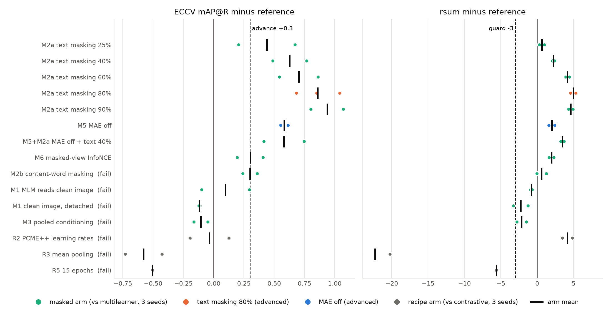
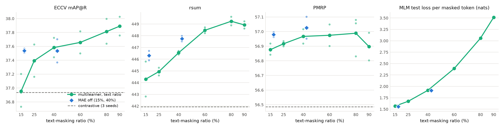
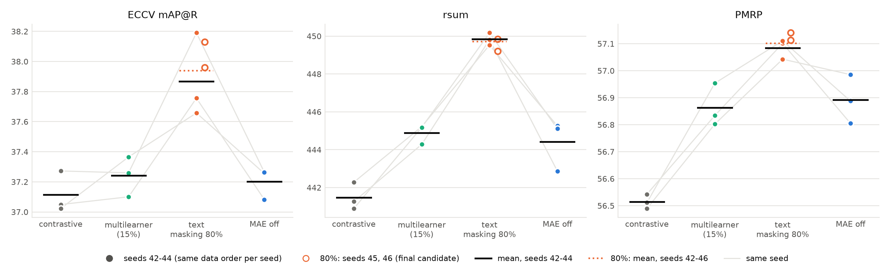
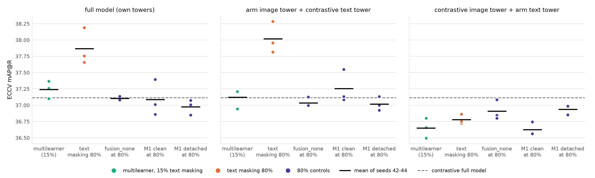
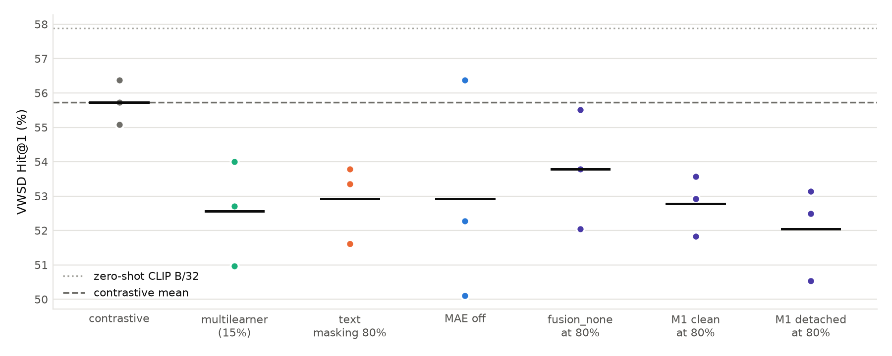
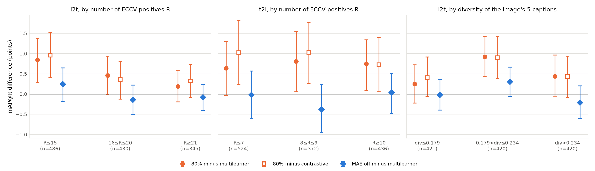

# Stages 1 and 2 of the improve-multilearner line: 80% text masking, its confirmation, and where its gain comes from

Date: 2026-10-06. Branch `main`. Stage 1 runs at commits `eb85340`, `9203048`, `0ca9b05`, `a0f946f`, `7a12d9f` and `1b23184`; every Stage 2 run at `9919d8d`; Stage 2 diagnostics as cluster job `20261006-141443-9919d8d`. Design and pre-registered rules: [the improve-multilearner spec](../../../superpowers/specs/2026-10-03-improve-multilearner-design.md), sections 3, 6 and 7. Previous reports: [the baselines](2026-10-03_baselines.md), [the lever review](2026-10-03_lever_review.md), [the Stage 0 diagnostics](2026-10-03_stage0_diagnostics.md) and the deep-think note [cross-masking and polysemy](2026-10-05_cross_masking_polysemy.md). Every number below is printed by [`build_2026-10-06_masking_stages_1_2.py`](../../assets/build_2026-10-06_masking_stages_1_2.py), which also draws the figures.

## Summary

We screened 15 arms on COCO (12 changes to `fusion_multilearner` and 3 recipe changes to the contrastive baseline; 30 completed runs), confirmed the best arm on a seeded sampler against retrained baselines, and then ran three controls to find out what its gain needs. The baselines throughout are the same-recipe `fusion_multilearner` (15% text masking) and the contrastive-only fine-tune of the same CLIP ViT-B/32.

1. Stage 1. ECCV Caption mAP@R rose steadily with the text-masking ratio of `fusion_multilearner`: 36.95 (15%, the baseline), 37.39 (25%), 37.58 (40%), 37.66 (60%), 37.81 (80%, 3 seeds) and 37.89 (90%). At 80% the gain over the baseline was +0.86 (p = 0.009), with rsum +4.93 (p = 0.024). Turning MAE off gave +0.58 (p = 0.045). The advance rule ranked 90% and 80% first; the user advanced 80% and MAE off. No recipe change met the adoption rule (+0.3 mAP@R). R2 (PCME++ learning rates) raised PMRP by 0.73 (p = 0.048) and rsum by 4.14 (p = 0.030) and left mAP@R at -0.04.
2. Stage 2. On the seeded sampler, 80% text masking reached 37.87 ± 0.28 on seeds 42 to 44, against 37.24 ± 0.13 for multilearner and 37.11 ± 0.14 for contrastive. On these three seeds it missed the success bar: Holm-corrected p = 0.055 against contrastive and 0.088 against multilearner. The spec, committed on 2026-10-03 at 18:26, tests the final candidate over five seeds. With seeds 45 and 46 added (37.94 ± 0.23), the gain was +0.70 [95% CI +0.38, +1.01] over multilearner and +0.82 [+0.51, +1.14] over contrastive, Holm p = 0.003 and 0.001, and both guard metrics passed (rsum +4.82, PMRP +0.24). 80% text masking meets the bar on this pre-registered five-seed test. MAE off did not replicate (37.20, -0.04 against multilearner, p = 0.696).
3. The gain sits in the image tower. The 80% image tower paired with the same-seed contrastive text tower scored 38.02 ± 0.24, against 37.12 for multilearner's image tower (-0.90, p = 0.009). Every arm's text tower paired with the contrastive image tower scored between 36.63 and 36.94, below the contrastive model's 37.11.
4. The gain needs high text masking and an MLM that reads the masked-pass image tokens. At 80% text masking the masked-language-model (MLM) loss per masked token roughly doubled (1.569 to 3.053 nats in Stage 2): the decoder was predicting most of the caption from a quarter of the image patches. Three controls at 80%, 3 seeds each, lost the gain: `fusion_none` (no fusion: the MLM reads text alone and the MAE decoder the image alone) 37.11, M1 clean (fusion kept, the MLM reads the full clean image) 37.09 and M1 detached (as M1 clean, with no MLM gradient into the vision tower) 36.98. That is -0.76 to -0.89 against the 80% arm (Welch p = 0.020 to 0.042; Holm over the three, 0.061). The one change all three share is that the MLM no longer reads the masked-pass image tokens; `fusion_none` alone cannot separate the image from the fusion learners, but the two M1 controls keep the learners and still lose the gain. Their image towers fell to the multilearner level (37.02 to 37.25).
5. Nothing ties the gain to polysemy on COCO. On VWSD (lexical ambiguity), COCO fine-tuning cost the contrastive model 2.16 Hit@1 against zero-shot CLIP (57.88), and every masked arm sat 1.94 to 3.67 below contrastive. 80% masking (52.92) did not differ from multilearner (+0.36, p = 0.760), and Stage 0 had found no masked effect at 15% (-0.22, p = 0.851). Stratified by the number of valid ECCV matches per query, the 80% gain did not grow: in i2t it fell from +0.85 to +0.19 across tertiles (high minus low -0.66 [-1.28, +0.02]), in t2i it stayed flat (+0.64, +0.80, +0.74), and caption diversity showed no trend. With high-minus-low interval half-widths of 0.65 to 0.91 points, modest growth is not excluded.

80% text masking gives a modest, consistent gain (+0.70 mAP@R over multilearner, 6.8% of what contrastive fine-tuning itself added) that passes the pre-registered test. On COCO the gain behaves like extra supervision of the vision tower from a hard, image-conditioned captioning task, and we found no sign of a polysemy mechanism. The evidence comes from one dataset, one backbone, one recipe and three to five seeds per arm.

**Terms.** *Contrastive baseline*: CLIP ViT-B/32 fine-tuned on COCO with InfoNCE alone. *Multilearner*: `fusion_multilearner`, which adds a masked pass (75% of image patches dropped, 15% of caption tokens replaced by a learned mask token) and two decoders that read image, text and joint learners: an MAE decoder that reconstructs the masked pixels and an MLM decoder that predicts the masked tokens. *`fusion_none`*: the same masked pass with each decoder reading only its own modality. *Text-masking ratio*: the share of caption tokens (never BOS, EOS or padding) masked in the masked pass. *ECCV Caption* (Chun et al., ECCV 2022): the COCO 5K test pairs plus human-verified extra positives, scored on a subset of the queries (1,261 images, 1,332 captions). *ECCV mAP@R*: average precision over the top R ranks, where R is the query's number of ECCV Caption positives. *R-Precision*: the share of positives among the top R. *PMRP*: R-Precision (R capped at 50) in which every item whose image's COCO object classes differ from the query's in at most two classes counts as positive. *rsum*: the sum of the six COCO 5K recalls (i2t and t2i R@1, R@5, R@10). *CxC R@1*: R@1 with CxC's human-rated extra positives. *COCO 1K R@1*: R@1 averaged over five 1,000-image folds. *VWSD*: SemEval-2023 Task 1, English test (463 items): a short phrase containing an ambiguous word ranks 10 candidate images; Hit@1 is the share ranked first correctly, MRR the mean reciprocal rank. *Tower swap*: one model's image embeddings scored against another model's caption embeddings. *Seeded sampler*: the training shuffle drawn from a generator seeded by the run seed alone, so seed k gives every arm the same data order. *Welch t-test*: a two-sample t-test that allows unequal variances. *Holm correction*: the step-down adjustment of p-values for a family of tests. *Deep-think note*: the [2026-10-05 note](2026-10-05_cross_masking_polysemy.md) from a separate, time-limited Claude session that reviewed Stage 1 and the first Stage 2 seeds and listed open questions.

## 1. What the two stages were for

### 1.1 The question and the arms

The [baselines](2026-10-03_baselines.md) left `fusion_multilearner` level with the contrastive baseline on ECCV mAP@R (+0.02, p = 0.917) while raising PMRP by 0.39 (p < 0.001). The user asked to widen multilearner's lead and to learn why masking moves the metrics it moves. The [spec](../../../superpowers/specs/2026-10-03-improve-multilearner-design.md) split the work into a screen (Stage 1), in which each arm tests one mechanism, and a confirmation (Stage 2) of at most two arms against retrained baselines. ECCV mAP@R was fixed as the primary metric, and every other metric was tracked.

*Table 1. Stage 1 arms. Masked arms change `fusion_multilearner`; recipe arms change the contrastive baseline.*

| ID | Arm | Change | What it tests |
|---|---|---|---|
| M2a | text-masking dose | text ratio 25%, 40%, 60%, 80%, 90% (baseline 15%) | whether more MLM signal helps |
| M2b | content-word masking | 15% of tokens drawn only from content words | object grounding (H1 of Stage 0) |
| M1 clean | MLM reads the clean image | the MLM decoder's image memory comes from all patches of the clean pass | whether the MLM needs the masked view |
| M1 detached | as M1 clean, with stop-gradient | no MLM gradient reaches the vision tower through the image tokens | whether the MLM gradient into the vision tower matters |
| M3 | pooled conditioning | each decoder also reads the other modality's clean pooled embedding | routing reconstruction into the retrieval embedding |
| M5 | MAE off | MAE loss weight 0, MLM kept | whether pixel reconstruction helps |
| M5 + M2a | MAE off + 40% | both | whether the two levers add |
| M6 | masked-view InfoNCE | extra InfoNCE between the masked caption and the clean images, weight 0.25 | the masked caption as a less specific positive |
| R2 | PCME++ learning rates | text tower 5e-05, vision tower 5e-06, layer decay 0.7, vision frozen 2 epochs | the recipe gap to PCME++ |
| R3 | mean pooling | mean-pooled tokens instead of CLIP's pooling | the recipe gap |
| R5 | 15 epochs | 15 instead of 10 epochs | the recipe gap |

We added the 25% and 60% dose points when 40% passed the advance rule (2026-10-04, about 02:26), 80% because the curve was still rising at 60% (09:53), and 90% to find the peak (21:14). MAE off + 40% was a Stage 1 extra from the spec's reserve, added when MAE off's seed 42 matched the 40% arm (02:35).

### 1.2 The pre-registered rules

All rules were in the spec before any Stage 1 result. The spec was committed as `dba32b0` on 2026-10-03 at 18:26 and has not changed since.

- Advance rule (Stage 1 to 2). With 2 seeds against the reference's 3-seed mean, a masked arm advances if its mean mAP@R is at least +0.3, or its PMRP at least +0.15 with mAP@R no more than 0.2 below; and its rsum is no more than 3 below. At most the two best advance, ranked by mAP@R and then PMRP. A recipe change is adopted if it raises contrastive's mAP@R by at least +0.3 without costing more than 3 rsum.
- Stage 2 success bar. On the Stage 2 recipe "over at least 3 seeds (5 for the final candidate if the budget allows)": mean mAP@R above both retrained baselines with two-sided Welch p < 0.05 for each, Holm-corrected over the variants; mean rsum no more than 1.5 below multilearner's; mean PMRP no more than 0.05 below. Section 7 of the spec adds that "the final candidate gets seeds 45 and 46 if the budget allows", with paired-by-seed tests as a secondary analysis.

### 1.3 Training and statistics

Every run fine-tuned `openai/clip-vit-base-patch32` on the COCO Karpathy train split for 10 epochs at batch 128 on one RTX A6000 (DAS6 nodes 403, 405 and 411): towers at learning rate 1e-05, everything else at 0.0001, 500 warmup steps, weight decay 0.05, and the checkpoint with the best validation rsum kept for the test on the 5k Karpathy test split. Stage 1 arms used seeds 42 and 43 (80% also 44) and were compared with the 3-seed Stage 0 baselines (seeds 42 to 44); none of these runs used the seeded sampler. Stage 2 retrained both baselines with the seeded sampler and ran each arm on seeds 42 to 44. A contrastive run took 4.21 h and a masked run 6.87 to 7.58 h. The 53 completed runs of Stages 1 and 2 used 361.3 GPU-hours (Stage 1 204.0, Stage 2 arms 91.4, controls 65.9). Five Stage 1 runs died when the user ended the node reservations on 2026-10-05 around 01:30; we reran them and exclude the dead folders.

We compare means with two-sided Welch t-tests (3 against 3, or 2 or 5 against 3), which have little power: the mean seed std of mAP@R in Stage 2 was 0.16. Under the seeded sampler seed k gives every Stage 2 arm the same data order, so we also report paired-by-seed t-tests; the masks still differ between arms. Apart from the success bar (Holm, as the spec prescribes) and the control comparisons of section 4.3, no test carries a multiple-test correction. The spec asks for Welch tests on every tracked metric, and we report those secondary tests uncorrected, as descriptive evidence.

*Sources: the spec (sections 3, 6, 7, 9); `tests/20261003_ml_improve/runs.md` (entries cited by time); `res/coco/multimae/{default,ml_improve}/*/{run.json,config.yaml}`; build script sections A, B and K.*

## 2. Stage 1: screening

### 2.1 Every arm against its reference

*Table 2. Stage 1, difference to the 3-seed reference (Welch p). References: multilearner mAP@R 36.95 ± 0.24, PMRP 56.88 ± 0.04, rsum 444.30 ± 1.49, CxC R@1 56.34 ± 0.27, COCO 1K R@1 73.65 ± 0.10; contrastive 36.94 ± 0.17, 56.49 ± 0.05, 441.94 ± 1.30, 55.66 ± 0.42, 73.35 ± 0.18.*

| Arm | n | mAP@R | ΔmAP@R | ΔPMRP | Δrsum | ΔCxC R@1 | Δ1K R@1 | Rule |
|---|---|---|---|---|---|---|---|---|
| M2a text 25% | 2 | 37.39 ± 0.33 | +0.44 (0.265) | +0.04 (0.254) | +0.64 (0.545) | -0.19 (0.350) | +0.19 (0.062) | pass |
| M2a text 40% | 2 | 37.58 ± 0.20 | +0.63 (0.059) | +0.09 (0.282) | +2.25 (0.116) | +0.33 (0.272) | +0.40 (0.303) | pass |
| M2a text 60% | 2 | 37.66 ± 0.22 | +0.70 (0.062) | +0.10 (0.397) | +4.16 (0.033) | +0.75 (0.245) | +0.64 (0.153) | pass |
| M2a text 80% | 3 | 37.81 ± 0.18 | +0.86 (0.009) | +0.11 (0.291) | +4.93 (0.024) | +0.91 (0.014) | +0.89 (0.001) | pass |
| M2a text 90% | 2 | 37.89 ± 0.19 | +0.94 (0.021) | +0.02 (0.863) | +4.62 (0.024) | +0.89 (0.017) | +0.84 (0.004) | pass |
| M5 MAE off | 2 | 37.54 ± 0.04 | +0.58 (0.045) | +0.10 (0.034) | +2.01 (0.135) | +0.41 (0.268) | +0.45 (0.007) | pass |
| M5 + text 40% | 2 | 37.53 ± 0.24 | +0.58 (0.100) | +0.15 (0.275) | +3.45 (0.049) | +0.51 (0.066) | +0.80 (0.005) | pass |
| M6 masked-view InfoNCE | 2 | 37.26 ± 0.15 | +0.30 (0.182) | -0.06 (0.328) | +1.96 (0.141) | +0.38 (0.122) | +0.44 (0.007) | pass |
| M2b content words | 2 | 37.25 ± 0.08 | +0.30 (0.150) | +0.04 (0.722) | +0.60 (0.620) | -0.07 (0.772) | +0.21 (0.401) | fail |
| M1 clean | 2 | 37.05 ± 0.28 | +0.10 (0.722) | -0.27 (0.101) | -0.80 (0.449) | -0.37 (0.190) | -0.09 (0.650) | fail |
| M1 detached | 2 | 36.84 ± 0.01 | -0.12 (0.480) | -0.29 (0.007) | -2.26 (0.211) | -0.50 (0.291) | -0.19 (0.315) | fail |
| M3 pooled conditioning | 2 | 36.85 ± 0.08 | -0.11 (0.532) | -0.24 (0.176) | -2.15 (0.143) | -0.54 (0.118) | -0.49 (0.013) | fail |
| R2 PCME++ learning rates | 2 | 36.90 ± 0.23 | -0.04 (0.869) | +0.73 (0.048) | +4.14 (0.030) | +0.90 (0.049) | +0.71 (0.030) | fail |
| R3 mean pooling | 2 | 36.36 ± 0.22 | -0.58 (0.095) | -0.10 (0.395) | -22.29 (0.035) | -5.03 (0.010) | -3.55 (0.006) | fail |
| R5 15 epochs | 1 | 36.43 | -0.51 | -0.50 | -5.62 | -1.19 | -0.87 | fail |



*Figure 1. Every Stage 1 arm: ECCV mAP@R (left) and rsum (right) minus the 3-seed mean of its reference (multilearner for masked arms, contrastive for recipe arms). Dots: seeds; bar: arm mean; dashed lines: the advance threshold (+0.3 mAP@R) and the rsum guard (-3).*

Eight of the 12 masked arms passed the rule, and none of the 3 recipe arms did. Re-deriving the means corrected one entry of the run log: M2b (content-word masking) gained +0.2996, just below the +0.3 line, where the log's entry of 2026-10-05 00:14 had recorded a formal pass. M6 gained +0.3008 and passes formally, as the log's 09:14 entry said. Neither came near the top two, so the advance decision is unchanged.

The arms that helped were those that raised the MLM's share of the masked objective, through more text masking or through switching the MAE off. The two levers did not add: MAE off gave 37.54, 40% alone 37.58 and both together 37.53. The arms that changed what the MLM decoder reads (M1, M3) or routed reconstruction into the pooled embedding (M3, M6) gave little or nothing. Giving the MLM the full clean image (M1 clean) lowered PMRP by 0.27 for +0.10 mAP@R, and also cutting its gradient into the vision tower (M1 detached) lowered rsum by 2.26. Both M1 arms ran at 15% masking, where multilearner had no mAP@R gain to remove, so they could not say what carries the gain that appeared at higher ratios; section 4.3 repeats them at 80%.

### 2.2 The dose curve



*Figure 2. Stage 1 multilearner by text-masking ratio (15% is the 3-seed Stage 0 baseline; 25%, 40%, 60% and 90% have 2 seeds, 80% has 3). Small dots: seeds; line: means; diamonds: MAE off at 15% and with 40% masking; dashed line: contrastive.*

*Table 3. The dose curve (Stage 1).*

| Text ratio | n | mAP@R | rsum | PMRP | CxC R@1 | MLM test loss |
|---|---|---|---|---|---|---|
| 15% (baseline) | 3 | 36.95 ± 0.24 | 444.30 ± 1.49 | 56.88 ± 0.04 | 56.34 ± 0.27 | 1.568 |
| 25% | 2 | 37.39 ± 0.33 | 444.94 ± 0.46 | 56.92 ± 0.03 | 56.15 ± 0.11 | 1.673 |
| 40% | 2 | 37.58 ± 0.20 | 446.55 ± 0.22 | 56.97 ± 0.07 | 56.68 ± 0.25 | 1.914 |
| 60% | 2 | 37.66 ± 0.22 | 448.46 ± 0.35 | 56.97 ± 0.10 | 57.09 ± 0.50 | 2.392 |
| 80% | 3 | 37.81 ± 0.18 | 449.23 ± 0.37 | 56.99 ± 0.14 | 57.25 ± 0.13 | 3.058 |
| 90% | 2 | 37.89 ± 0.19 | 448.92 ± 0.43 | 56.90 ± 0.13 | 57.23 ± 0.13 | 3.514 |

mAP@R rose monotonically with the ratio, fastest at the start: 25% already reached 0.44 of the 0.86 gained at 80% (51%). rsum kept rising up to 80% (+4.93 over 15%) and flattened at 90%. PMRP barely moved (56.88 to 56.99) and fell back at 90% (56.90). The MLM test loss per masked token rose with the ratio and was 1.95 times higher at 80% than at 15%, since the decoder had fewer caption tokens to condition on. In this sweep a harder MLM task went with a better retriever; section 4 shows that difficulty alone does not produce the gain.

### 2.3 Which arms advanced, and why

The rule's ranking put 90% (+0.94) and 80% (+0.86) first, two doses of one lever. At the 2-seed check 80% stood at 37.90 (seeds 42 and 44) and 90% at 37.89; the third 80% seed brought it to 37.81. We proposed 80% plus MAE off, the best arm with a different mechanism (+0.58): 80% kept a higher PMRP (56.99 against 56.90) and rsum (449.23 against 448.92) than 90%, and a second dose would have tested nothing new. 80% advanced under either reading, so we queued it for Stage 2 on 2026-10-05 at 09:16. At 10:53 the user chose MAE off over 90% as the second arm. This departs from the letter of the rule, which would have advanced 90%, and was decided before any Stage 2 result of either arm.

### 2.4 The recipe screens

No recipe change was adopted, so Stage 2 kept the current recipe. R3 (mean pooling) cost 22.29 rsum and 0.58 mAP@R; it starts the retrieval projection from scratch, so its early epochs are not comparable. R5 (15 epochs) was clearly worse at one seed (-0.51 mAP@R, -5.62 rsum), and we dropped its second seed (2026-10-04, 00:55), as the spec allows for a decisive arm. R2 (PCME++ learning rates) moved every tracked metric except the primary one: mAP@R -0.04 (p = 0.869), PMRP +0.73 (p = 0.048), rsum +4.14 (p = 0.030), CxC R@1 +0.90 (p = 0.049) and i2t R@1 +2.03 (p = 0.080). With a learning-rate change alone, the contrastive model's PMRP rose 0.34 above the multilearner baseline, more than any masked arm raised it. Under a different primary metric R2 would have been adopted; the spec keeps that option open, and we flagged it to the user on 2026-10-04 at 18:13. We never crossed R2 with masking.

*Sources: `res/coco/multimae/ml_improve/*_{multilearner,contrastive}_*/run.json` and the Stage 0 baselines in `res/coco/multimae/default/`; the advance rule in spec section 6; `tests/20261003_ml_improve/runs.md` entries of 2026-10-04 00:55, 02:26, 02:35, 09:53, 18:13 and 21:14 and of 2026-10-05 00:14, 08:54, 09:16 and 10:53; build script sections B, C and K. `tests/20261003_ml_improve/stage1_table.py` gives the same means.*

## 3. Stage 2: confirmation

### 3.1 Design, and whether the baselines moved

Stage 2 ran four arms (contrastive, multilearner, 80% text masking, MAE off) on seeds 42, 43 and 44 with the seeded sampler and the current recipe, and seeds 45 and 46 for the final candidate. The retrained baselines matched Stage 1 within seed noise (Table 4). Multilearner against contrastive repeated its Stage 1 pattern: mAP@R +0.13 (p = 0.314), PMRP +0.35 (p = 0.011), rsum +3.41 (p = 0.004).

*Table 4. Stage 1 against Stage 2 means, same recipe (Stage 2 minus Stage 1, Welch p).*

| Arm | n (S1, S2) | mAP@R S1 | mAP@R S2 | ΔmAP@R | ΔPMRP | Δrsum |
|---|---|---|---|---|---|---|
| contrastive | 3, 3 | 36.94 | 37.11 | +0.18 (0.232) | +0.03 (0.474) | -0.46 (0.626) |
| multilearner | 3, 3 | 36.95 | 37.24 | +0.29 (0.160) | -0.01 (0.816) | +0.59 (0.570) |
| text masking 80% | 3, 3 | 37.81 | 37.87 | +0.06 (0.791) | +0.10 (0.349) | +0.60 (0.100) |
| MAE off | 2, 3 | 37.54 | 37.20 | -0.34 (0.018) | -0.09 (0.236) | -1.89 (0.124) |

### 3.2 Results

*Table 5. Stage 2 test metrics, mean ± std over seeds 42 to 44 (80% also over seeds 42 to 46).*

| Arm | n | mAP@R | PMRP | rsum | CxC R@1 | 1K R@1 | ECCV R-P | mAP@R i2t | mAP@R t2i | t2i R@1 |
|---|---|---|---|---|---|---|---|---|---|---|
| contrastive | 3 | 37.11 ± 0.14 | 56.51 ± 0.03 | 441.48 ± 0.72 | 55.31 ± 0.11 | 73.23 ± 0.22 | 46.73 ± 0.17 | 30.35 ± 0.16 | 43.88 ± 0.11 | 46.37 ± 0.17 |
| multilearner | 3 | 37.24 ± 0.13 | 56.86 ± 0.08 | 444.89 ± 0.53 | 56.30 ± 0.20 | 73.76 ± 0.15 | 46.89 ± 0.10 | 30.40 ± 0.11 | 44.09 ± 0.29 | 46.79 ± 0.21 |
| text masking 80% | 3 | 37.87 ± 0.28 | 57.08 ± 0.04 | 449.84 ± 0.32 | 57.23 ± 0.44 | 74.61 ± 0.38 | 47.47 ± 0.23 | 30.93 ± 0.09 | 44.81 ± 0.49 | 48.05 ± 0.14 |
| text masking 80% | 5 | 37.94 ± 0.23 | 57.10 ± 0.04 | 449.71 ± 0.36 | 57.27 ± 0.32 | 74.65 ± 0.29 | 47.53 ± 0.19 | 30.95 ± 0.12 | 44.93 ± 0.39 | 48.05 ± 0.10 |
| MAE off | 3 | 37.20 ± 0.10 | 56.89 ± 0.09 | 444.41 ± 1.34 | 56.09 ± 0.40 | 73.63 ± 0.42 | 46.82 ± 0.02 | 30.42 ± 0.14 | 43.98 ± 0.14 | 46.86 ± 0.13 |



*Figure 3. Stage 2 per seed: ECCV mAP@R, rsum and PMRP. Filled dots: seeds 42 to 44, joined by seed (same data order); hollow dots: the final candidate's seeds 45 and 46; black bar: mean of seeds 42 to 44; dotted bar: 80% over seeds 42 to 46.*

On seeds 42 to 44, 80% masking led multilearner by +0.63 mAP@R (Welch p = 0.044, paired 0.077), +0.22 PMRP (p = 0.025), +4.94 rsum (p < 0.001), +0.93 CxC R@1 (p = 0.051), +0.85 COCO 1K R@1 (p = 0.047) and +0.58 ECCV R-Precision (p = 0.035). The gain appeared in both directions: mAP@R i2t +0.53 (p = 0.003), mAP@R t2i +0.72 (p = 0.109), t2i R@1 +1.26 (p = 0.002). Every seed of the 80% arm (37.66 to 38.19) scored above every seed of both baselines (37.02 to 37.37). Against contrastive the gains were larger (mAP@R +0.75, rsum +8.36, PMRP +0.57).

### 3.3 The success bar: three seeds and five seeds

*Table 6. The Stage 2 success bar on ECCV mAP@R: difference [95% Welch CI], raw p and Holm p over the two variants per baseline. MAE off keeps its 3 seeds in both families.*

| Test | 80% vs contrastive | 80% vs multilearner | MAE off vs contrastive | MAE off vs multilearner | Guards (80%) | Verdict (80%) |
|---|---|---|---|---|---|---|
| seeds 42 to 44 (n = 3) | +0.75 [+0.16, +1.34]; raw 0.027, Holm 0.055 | +0.63 [+0.03, +1.22]; raw 0.044, Holm 0.088 | +0.09; Holm 0.436 | -0.04; Holm 0.696 | rsum +4.94, PMRP +0.22 | not met |
| final candidate, seeds 42 to 46 (n = 5) | +0.82 [+0.51, +1.14]; raw 7.4e-04, Holm 0.001 | +0.70 [+0.38, +1.01]; raw 0.002, Holm 0.003 | as above | as above | rsum +4.82, PMRP +0.24 | met |

The three-seed test failed on the Holm correction. Both raw p-values were below 0.05, but with two variants Holm doubles the smaller p-value of each family, which was the 80% arm's, giving 0.055 and 0.088. The five-seed test passed with room to spare; seeds 45 and 46 scored 37.96 and 38.13, close to the three-seed mean. That test is unpaired: it compares the five 80% runs with the three runs of each baseline (Welch, 6.0 degrees of freedom against 2.8 to 2.9 for the three-seed test), because seeds 45 and 46 have no baseline runs, and the paired-by-seed analysis exists only for seeds 42 to 44. We read the spec's "Holm-corrected over the variants" as one family of two tests per baseline. Under the stricter reading, one family of four tests (two variants against two baselines), the three-seed Holm p-values become 0.110 and 0.132 and the five-seed ones 0.003 and 0.005, so neither verdict depends on how the family is defined.

The spec decides which test counts. Committed on 2026-10-03 at 18:26 and unchanged since, it sets the bar "over at least 3 seeds (5 for the final candidate if the budget allows)" and gives the final candidate seeds 45 and 46, so the five-seed test of the final candidate is the pre-registered one. Our run log read the spec differently for four hours. On 2026-10-05 at 16:30, when we queued seeds 45 and 46 with only seed 42 of the 80% arm finished, the log said the primary tests would stay on seeds 42 to 44. At 20:33 it returned to the spec's five-seed reading. By then the three 80% seeds were in and the comparison with multilearner was known to be borderline (raw p 0.044), while no MAE-off result existed yet and seeds 45 and 46 (running since 16:31 and 20:21) had not finished. Because we wrote that correction after seeing part of the data, we report both tests. On the spec's own terms, 80% text masking meets the Stage 2 success bar; on the three seeds every arm shares, it misses it.

### 3.4 MAE off did not replicate

MAE off scored 37.54 in Stage 1 (seeds 37.57 and 37.51) and 37.20 in Stage 2 (37.08, 37.26, 37.26), a drop of 0.34 (p = 0.018). About half of its Stage 1 margin came from a low baseline draw: Stage 2's multilearner was 0.29 higher than Stage 1's (p = 0.160), and against it the Stage 1 MAE-off mean would have led by +0.30. The other half disappeared between MAE off's own runs, which is what we would expect after screening 12 masked arms at 2 seeds and advancing the best: the selected arms' screening margins are biased upward. The 80% arm held its absolute level (37.81 in Stage 1, 37.87 in Stage 2, p = 0.791); its margin over multilearner shrank from +0.86 to +0.63 because the baseline rose.

### 3.5 How large the gain is

The five-seed gain over multilearner (+0.70) is 6.8% of the 10.22 mAP@R that contrastive fine-tuning added over zero-shot CLIP in the baselines report. The 80% arm (37.94) is still 1.06 below the 39.0 that PCME++ reports for an InfoNCE fine-tune of the same backbone with its own recipe ([lever review](2026-10-03_lever_review.md)), so the recipe gap that Stage 1's recipe screens targeted is still open.

*Sources: `res/coco/multimae/ml_improve/*_s2_{contrastive,multilearner,txt80,mae0}/run.json` (`created` and `ended` for run times); spec sections 3 and 7 (`git log` of the spec: `dba32b0`, 2026-10-03 18:26); `tests/20261003_ml_improve/runs.md` entries of 2026-10-05 16:30 and 20:33; zero-shot and PCME++ numbers from the [baselines](2026-10-03_baselines.md) and the [lever review](2026-10-03_lever_review.md); build script sections D, E and K. `tests/20261003_ml_improve/stage2_table.py` gives the same tests.*

## 4. Mechanism: what the 80% gain needs

### 4.1 At 80% the MLM becomes near-captioning

*Table 7. Stage 2 test losses (nats, mean ± std over seeds 42 to 44). MLM: cross-entropy per masked token; MAE: normalised-pixel error on masked patches; InfoNCE: the test contrastive loss. MAE off's MAE loss, in parentheses, comes from a decoder trained at weight 0 and is not comparable with the others.*

| Arm | MLM | MAE | InfoNCE |
|---|---|---|---|
| contrastive | | | 0.708 ± 0.009 |
| multilearner (15%) | 1.569 ± 0.013 | 0.710 ± 0.001 | 0.663 ± 0.005 |
| text masking 80% | 3.053 ± 0.009 | 0.719 ± 0.000 | 0.647 ± 0.005 |
| MAE off | 1.568 ± 0.013 | (1.274 ± 0.004) | 0.657 ± 0.007 |
| `fusion_none` at 80% | 3.661 ± 0.003 | 0.657 ± 0.001 | 0.688 ± 0.003 |
| M1 clean at 80% | 2.898 ± 0.009 | 0.664 ± 0.001 | 0.660 ± 0.014 |
| M1 detached at 80% | 2.885 ± 0.011 | 0.661 ± 0.000 | 0.692 ± 0.002 |

At 15% the MLM fills a few gaps in an otherwise visible caption (perplexity 4.8 per masked token). At 80% it must predict four of every five caption tokens, and the loss rose 1.95-fold (perplexity 21.2). The objective at 80% is close to image captioning from the 25% of patches that survive image masking. Without the fusion (`fusion_none`, whose MLM reads the masked caption alone, with no learner layers) the loss was 0.61 nats higher (perplexity 38.9). That gap mixes the missing image with the missing fusion learners, which this control cannot separate. More image information does lower the loss: with the fusion kept and the full clean image in the MLM's memory (M1), the loss fell a further 0.16 nats below the 80% arm (perplexity 18.1). Section 4.3 shows that this removed the retrieval gain, so a better MLM was not a better retriever.

The MAE loss shows which models share the masked view between the two decoders. It was 0.710 and 0.719 when the MLM read the masked pass (multilearner, 80%), and 0.657 to 0.664 when it did not (`fusion_none` and both M1 variants), whatever the masking ratio. In M1 the image decoder still reads the masked text through the same fusion learners as in the 80% arm, so neither the caption nor the learners raise the MAE loss; what M1 removes is the MLM's use of the 25%-patch features. The baselines report had read multilearner's higher MAE loss as the caption costing the image decoder a little; this comparison points at the MLM.

### 4.2 Tower swaps: the gain is in the image tower



*Figure 4. ECCV mAP@R of the full models (left), of each arm's image tower with the same-seed contrastive text tower (middle), and of the contrastive image tower with each arm's text tower (right). Dots: seeds 42 to 44; bar: mean; dashed line: the contrastive full model (37.11).*

*Table 8. Tower swaps, ECCV mAP@R (mean ± std, seeds 42 to 44). Each swap pairs the arm's tower with the s2_contrastive run of the same seed. Last two columns: difference (Welch p).*

| Arm | Full model | Arm image + contr. text | Contr. image + arm text | Image swap vs 80% image swap | Image swap vs contrastive full |
|---|---|---|---|---|---|
| multilearner (15%) | 37.24 ± 0.13 | 37.12 ± 0.15 | 36.65 ± 0.15 | -0.90 (0.009) | +0.01 (0.961) |
| text masking 80% | 37.87 ± 0.28 | 38.02 ± 0.24 | 36.78 ± 0.07 | | +0.90 (0.009) |
| MAE off | 37.20 ± 0.10 | 37.22 ± 0.09 | 36.69 ± 0.17 | -0.80 (0.018) | +0.10 (0.362) |
| `fusion_none` at 80% | 37.11 ± 0.03 | 37.04 ± 0.08 | 36.91 ± 0.15 | -0.98 (0.013) | -0.08 (0.446) |
| M1 clean at 80% | 37.09 ± 0.28 | 37.25 ± 0.25 | 36.63 ± 0.10 | -0.76 (0.019) | +0.14 (0.461) |
| M1 detached at 80% | 36.98 ± 0.11 | 37.02 ± 0.10 | 36.94 ± 0.07 | -1.00 (0.009) | -0.10 (0.389) |

The 80% image tower with the contrastive text tower scored 38.02: +0.90 over the contrastive model (p = 0.009), +0.90 over multilearner's image tower, and 0.15 above its own full model. It also carried the recall and class-level gains, with rsum 449.30 (+7.82 over contrastive, p < 0.001) and PMRP 56.83 (+0.32, p < 0.001). Multilearner's image tower matched contrastive on mAP@R (+0.01) and kept a smaller rsum gain (+3.60, p = 0.007), as in Stage 0.

The text towers showed nothing comparable. Every arm's text tower with the contrastive image tower scored 36.63 to 36.94, below the contrastive model, and the 80% text tower did not differ from multilearner's (+0.13, p = 0.283). That shortfall is the cost of mixing separately trained towers, which Stage 0 measured and which appears for every arm here, so the swaps cannot show whether the 80% text tower carries a gain of its own. They do show that the 80% image tower, paired with an ordinary contrastive text tower, carries all of the measured gain.

### 4.3 The 80% controls

The deep-think note pointed out that the Stage 1 mechanism arms ran at 15%, where there was no gain to remove. On 2026-10-06 at 00:52 the user approved controls at 80%, 3 seeds each on the seeded sampler: `fusion_none` (no fusion: the MLM reads the masked caption alone and the MAE decoder the masked image alone) and M1 detached (fusion kept, the MLM reads the clean image, with no MLM gradient into the vision tower). We added M1 clean (clean image, gradient kept), because M1 detached against the 80% arm changes two things at once, the image source and the gradient, while detached against clean isolates the gradient.

*Table 9. The 80% controls (seeds 42 to 44). Differences with Welch p; paired-by-seed p second where given.*

| Arm | mAP@R | vs 80% | vs multilearner | PMRP vs 80% | rsum vs 80% | rsum vs multilearner |
|---|---|---|---|---|---|---|
| text masking 80% | 37.87 ± 0.28 | | +0.63 (0.044) | | | +4.94 (< 0.001) |
| `fusion_none` at 80% | 37.11 ± 0.03 | -0.76 (0.042; 0.051) | -0.14 (0.214) | -0.46 (< 0.001) | -7.07 (< 0.001) | -2.13 (0.013) |
| M1 clean at 80% | 37.09 ± 0.28 | -0.78 (0.027; 0.127) | -0.15 (0.451) | -0.54 (< 0.001) | -7.07 (0.002) | -2.13 (0.035) |
| M1 detached at 80% | 36.98 ± 0.11 | -0.89 (0.020; 0.036) | -0.27 (0.060) | -0.56 (0.002) | -8.55 (0.002) | -3.61 (0.011) |

All three controls lost the gain. Each fell to the multilearner level on mAP@R (-0.14 to -0.27, p ≥ 0.060) and slightly below it on rsum (-2.13 to -3.61) and PMRP (-0.24 to -0.34). Holm over the three mAP@R tests against the 80% arm gives 0.061 for each, so the conclusion rests on three controls agreeing, on PMRP and rsum differences with p ≤ 0.002 (all six stay below 0.05 after Holm over the 15 tests of the three controls against the 80% arm on five metrics, adjusted 0.002 to 0.027), and on the image towers: every control's image swap sat 0.76 to 1.00 below the 80% arm's (p = 0.009 to 0.019) and level with contrastive (Table 8).

The three controls differ from the 80% arm in different ways and share one change: the MLM's memory is no longer built from the masked-pass image tokens. `fusion_none` at 80% removes the fusion altogether (no learners; the MLM reads text alone and the MAE decoder the image alone) and gained nothing (37.11). On its own it cannot separate the missing image from the missing fusion learners. M1 clean keeps the fusion and the MAE decoder's access to the caption, gives the MLM the full clean image, keeps the MLM gradient into the vision tower and makes the MLM better (2.898 against 3.053), and it also lost the gain (37.09). Together the controls say that the gain needs the masked-pass image tokens in the MLM's memory. The gradient question stays open at 80%: M1 detached scored a little below M1 clean (mAP@R -0.11, p = 0.568; rsum -1.48, p = 0.131), but M1 clean had already lost the gain, so this comparison cannot show whether the MLM gradient through the masked view carries it. High masking is needed as well, since the 15% multilearner also reads the masked view and had no mAP@R gain over contrastive in Stage 2 (+0.13, p = 0.314).

The simplest account consistent with these results is that a hard, image-conditioned captioning task computed on a partial view of the image trains the vision tower in a way that helps retrieval. Three readings fit the M1 clean result, and we cannot separate them. The partial view may force each surviving patch to carry more of the caption (an information bottleneck at the decoder's input). The vision tower may benefit from MLM gradient that arrives through a forward pass on 25% of the patches, a partial-input forward as in MAE encoder training, whatever the caption task. Or the MLM gradient may conflict with InfoNCE when it arrives through the same clean forward pass that produces the retrieval embedding. M1 clean also ran the fusion twice and drew different dropout masks, and its validation rsum peaked earlier (best epochs 7, 8 and 8, against 9 or 10 for the other Stage 2 runs). Whether the MAE matters at 80% is untested, because MAE off ran only at 15%; an 80% run with MAE off would answer that, but it would not separate the three readings.

*Sources: `res/coco/multimae/ml_improve/*_s2_*/run.json` (`test/loss_mlm`, `test/loss_mae`, `test/loss_contrastive`); `res/coco/diagnostics/stage2_controls/diagnostics.json` (`swaps`; the 21 runs' rsum reproduce `run.json` within 0.020, and the 12 runs and zero-shot it shares with `res/coco/diagnostics/stage2/` agree exactly); the model code in `mmae/models/model.py` (`mlm_image_source`) and `mmae/models/fusion.py`; `tests/20261003_ml_improve/runs.md` entry of 2026-10-06 00:52; build script sections A, F, G and H.*

## 5. Polysemy

### 5.1 VWSD



*Figure 5. VWSD Hit@1 of every Stage 2 model (seeds 42 to 44). Dotted line: zero-shot CLIP B/32 (57.88); dashed line: contrastive mean (55.72).*

*Table 10. VWSD, English test (463 items). Differences with Welch p. Zero-shot is the GPU diagnostics value (57.88); the Stage 0 CPU dry run gave 58.10, one item more, as the Stage 0 report documents.*

| Model | Hit@1 | MRR | Hit@1 vs contrastive | Hit@1 vs multilearner |
|---|---|---|---|---|
| zero-shot | 57.88 | 72.68 | | |
| contrastive | 55.72 ± 0.65 | 70.52 ± 0.24 | | |
| multilearner (15%) | 52.56 ± 1.52 | 68.63 ± 0.89 | -3.17 (0.052) | |
| text masking 80% | 52.92 ± 1.14 | 68.89 ± 0.64 | -2.81 (0.031) | +0.36 (0.760) |
| MAE off | 52.92 ± 3.18 | 68.70 ± 2.04 | -2.81 (0.264) | +0.36 (0.871) |
| `fusion_none` at 80% | 53.78 ± 1.73 | 69.37 ± 1.00 | -1.94 (0.182) | +1.22 (0.410) |
| M1 clean at 80% | 52.77 ± 0.87 | 68.99 ± 0.48 | -2.95 (0.011) | +0.22 (0.844) |
| M1 detached at 80% | 52.05 ± 1.35 | 68.18 ± 0.42 | -3.67 (0.026) | -0.50 (0.690) |

COCO fine-tuning cost the contrastive model 2.16 Hit@1 against zero-shot. Every masked arm sat lower still, 1.94 to 3.67 below contrastive, and 16 of the 18 masked runs scored below the lowest contrastive run. The 80% arm did not differ from multilearner (+0.36, p = 0.760): the extra masking that raised ECCV mAP@R did nothing for lexical ambiguity.

The gap between masked arms and contrastive is less stable than Table 10 suggests. In Stage 0, on the same recipe without the seeded sampler, multilearner and contrastive did not differ (54.79 against 55.00, -0.22, p = 0.851), and Stage 2's multilearner scored 2.23 below Stage 0's (p = 0.135). Pooling the six runs of each model over both stages gives -1.69 (p = 0.077). One VWSD item is 0.216 points and the binomial standard error of a single run is 2.32 points, so seed-to-seed swings of 2 to 3 points are expected. Both stages agree that masked training did not help VWSD and that 80% masking did not beat 15%.

### 5.2 Does the gain grow with the number of valid matches?

The deep-think note named the quantity that would decide it: if high-ratio MLM helps one-to-many matching, its gain should grow with the number of valid matches per query. `tests/20261003_ml_improve/stratified_eccv.py` recomputed per-query ECCV AP@R from the Stage 2 embeddings of seeds 42 to 44 (its per-query means reproduce each run's `run.json` within 0.019). It split the queries into tertiles of R, the number of ECCV positives, and, for i2t, of the diversity of the query image's five captions (1 minus their mean pairwise cosine under zero-shot CLIP). Confidence intervals come from 2000 bootstrap resamples of queries on seed-averaged differences.



*Figure 6. Seed-matched ECCV mAP@R differences by stratum, with 95% bootstrap intervals over queries: 80% minus multilearner (filled circles), 80% minus contrastive (hollow squares), MAE off minus multilearner (diamonds).*

*Table 11. 80% text masking minus multilearner, mAP@R points by stratum [95% CI].*

| Split | Low tertile | Middle | High tertile | High minus low |
|---|---|---|---|---|
| i2t by R (n 486, 430, 345) | +0.85 [+0.28, +1.37] | +0.46 [-0.01, +0.94] | +0.19 [-0.20, +0.59] | -0.66 [-1.28, +0.02] |
| t2i by R (n 524, 372, 436) | +0.64 [-0.04, +1.29] | +0.80 [+0.05, +1.54] | +0.74 [+0.09, +1.33] | +0.11 [-0.80, +1.01] |
| i2t by caption diversity (n 421, 420, 420) | +0.25 [-0.22, +0.72] | +0.92 [+0.43, +1.42] | +0.44 [-0.07, +0.96] | +0.19 [-0.51, +0.91] |

The gain did not grow with R. In i2t it shrank from +0.85 to +0.19, in each of the three seeds (high minus low -0.80, -0.36 and -0.82), and the relative gain shrank as well (+2.3%, +1.6% and +0.8% of multilearner's stratum mean), so lower headroom at high R does not explain the trend. In t2i it stayed flat (+0.64, +0.80, +0.74). Caption diversity showed no monotone relation. MAE off sat near zero in every stratum (overall +0.02 in i2t, -0.10 in t2i), in line with its null in Table 5.

### 5.3 Reading and limits

On COCO the 80% gain behaves like generic supervision of the vision tower. It appears on human-verified matches, on recalls and on class-level PMRP alike, it does not concentrate on queries with many valid matches, and it does nothing for VWSD. This favours the deep-think note's direction C (a controlled account of masked objectives as vision supervision) over direction A (a caption-likelihood loss that helps where matches are many). The analysis has limits. With three seeds, the high-minus-low intervals of 80% against multilearner have half-widths of 0.65 to 0.91 points (0.55 to 1.00 over all three comparisons), so modest growth with R is not excluded: the t2i interval [-0.80, +1.01] admits growth of a full point. The bootstrap intervals cover query sampling only, with the seeds fixed. And COCO captions rarely use one word in two senses, so a polysemy effect would need data built to show it, on more than one backbone and recipe.

*Sources: `res/coco/diagnostics/stage2_controls/diagnostics.json` (`runs[*].vwsd`); `res/coco/diagnostics/stage0/diagnostics.json` (Stage 0 VWSD); `tests/20261003_ml_improve/stratified_eccv.py` and `stratified_eccv_results.json`; build script sections I and J.*

## 6. The deep-think note's open questions

Section 1 of the [deep-think note](2026-10-05_cross_masking_polysemy.md) listed what Stage 1 and the first Stage 2 seeds had not shown, and its section 5 proposed a plan for the week. Where each item stands:

| Open item (note, 2026-10-05) | Status (2026-10-06) |
|---|---|
| Whether the vision-tower gradient carries the 80% gain (the detach test existed only at 15%) | Partly answered. The gain sits in the image tower (38.02 against 37.12). M1 detached at 80% lost it (36.98), and so did M1 clean with the gradient kept (37.09), so the detach test cannot isolate the gradient. The MLM must read the masked-pass image tokens. |
| Whether the image matters at 80% (`fusion_none` at 80% never run) | Partly answered. `fusion_none` at 80% gave 37.11 (-0.76, p = 0.042), with an MLM loss 0.61 nats higher, but it removes the fusion learners as well as the image. M1 clean and detached keep the learners and also lost the gain, so the gain needs the masked-pass image tokens in the MLM's memory. |
| Any tie to polysemy; VWSD not read at 80% | Answered for COCO, negatively. VWSD at 80% was 52.92, no better than multilearner, and the stratified analysis shows no growth with R. |
| Robustness: 3 seeds, Holm borderline once MAE off joins | Partly answered. The pre-registered five-seed test passes (Holm 0.001 and 0.003). Still one recipe, one backbone and one dataset, and R2 was never crossed with masking. |
| The deciding interaction: does the gain grow with valid matches? | Measured: no (i2t shrinks, t2i flat), with interval half-widths of 0.65 to 0.91 points, so modest growth is not excluded. |
| The note's claim that pixel MAE contributed nothing at 80% | Untested. MAE off ran only at 15%, where it had no effect in Stage 2 (-0.04). |
| mAP@R split into original and added ECCV positives | Not done. |
| Plan, week 1: finish Stage 2 with VWSD and diagnostics; stratified analysis; the two 80% controls; 80% on the R2 recipe | Done except the last: 80% on the R2 recipe has not run. M1 clean at 80% joined the controls. |
| Plan, week 2: an ArtELingo pilot | On hold pending the user's decision. |

*Sources: the [deep-think note](2026-10-05_cross_masking_polysemy.md), sections 1, 2 and 5; sections 3 to 5 above.*

## 7. Caveats

- Seeds. Three seeds per Stage 2 arm and control, five for the final candidate. The success-bar verdict rests on the five-seed test, which is unpaired (seeds 45 and 46 have no baseline runs), and the run log settled on that reading after the three-seed result was known (section 3.3).
- Stage 1 margins are optimistic. The arms ran at 2 seeds against a 3-seed baseline that turned out to be a low draw (36.95 against Stage 2's 37.24), and the best arms were selected. MAE off's +0.58 became -0.04 in Stage 2.
- Rule deviations. The user advanced MAE off instead of 90% (section 2.3). M2b sat 0.0004 below the advance line.
- Tower swaps mix separately trained towers and carry a mixing cost (every text swap fell below contrastive). Image swaps cost little and are the cleaner comparison. Same-seed pairs share data order but not masks.
- `fusion_none` at 80% removes the fusion learners and the MAE decoder's access to the caption as well as the MLM's image, so on its own it does not isolate the image.
- The M1 controls run the fusion twice and draw different dropout masks, so they pair with the other arms by data order only, and M1 clean peaked earlier in training.
- VWSD has 463 items (binomial standard error 2.32 points per run), and the gap between masked arms and contrastive was not stable between Stage 0 and Stage 2.
- The stratified analysis covers Stage 2 seeds 42 to 44 of the four arms only (not the controls), uses query-only bootstrap intervals, and its R tertiles differ in baseline AP@R (36.78 to 23.65 for multilearner in i2t).
- Scope. COCO only, CLIP B/32 only, the current recipe only (10 epochs, batch 128). The 80% arm remains 1.06 below PCME++'s published InfoNCE fine-tune of the same backbone.
- Compute is not matched against the contrastive baseline: an 80% run took 1.70 times as long as a contrastive run (7.17 h against 4.21 h). Among the masked arms and the controls it is close to matched (6.87 to 7.58 h).

## 8. What this implies for the next step

On COCO the line has produced one variant that passes its pre-registered bar, with a modest gain and a mechanism that points at vision supervision from image-conditioned captioning on a partial view, and no evidence of a polysemy mechanism. Three experiments would sharpen the COCO account at modest cost: 80% masking on the R2 recipe (does the gain survive a stronger contrastive recipe, and does it add to R2's PMRP gain?), 80% masking with MAE off (does the pixel decoder do anything at 80%?), and the ECCV mAP@R split into original and added positives. Whether to test polysemy on data built for it, with ArtELingo as the candidate the deep-think note assessed, is the user's decision and is on hold; this report does not decide it.

## 9. Reproducing

```bash
# every table (stdout) and Figures 1 to 6, from the run folders, the Stage 2 diagnostics and the stratified results
OMP_NUM_THREADS=8 MKL_NUM_THREADS=8 /root/miniconda3/envs/MultiMAE/bin/python \
    docs/reports/assets/build_2026-10-06_masking_stages_1_2.py
# the stratified analysis itself (CPU, from res/coco/diagnostics/stage2/embeddings)
OMP_NUM_THREADS=8 MKL_NUM_THREADS=8 /root/miniconda3/envs/MultiMAE/bin/python tests/20261003_ml_improve/stratified_eccv.py
# the Stage 2 diagnostics (cluster job 20261006-141443-9919d8d, node405)
bash scripts/run_diagnostics.sh +diag.runs_root=/local/wding/Dataset/mmae_stage2_runs \
    +diag.out=/local/wding/res/MultiMAE/coco/diagnostics/stage2_controls eval.vwsd_dir=/local/wding/Dataset/vwsd
```

*Sources: the files listed in the build script's docstring.*
