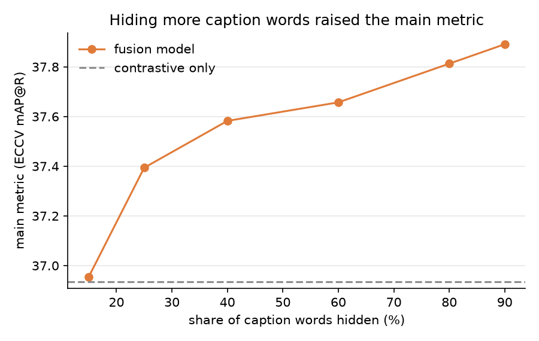
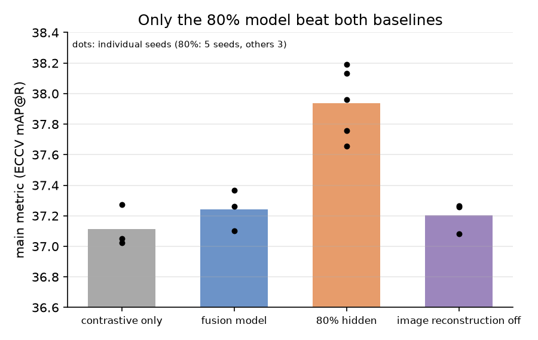
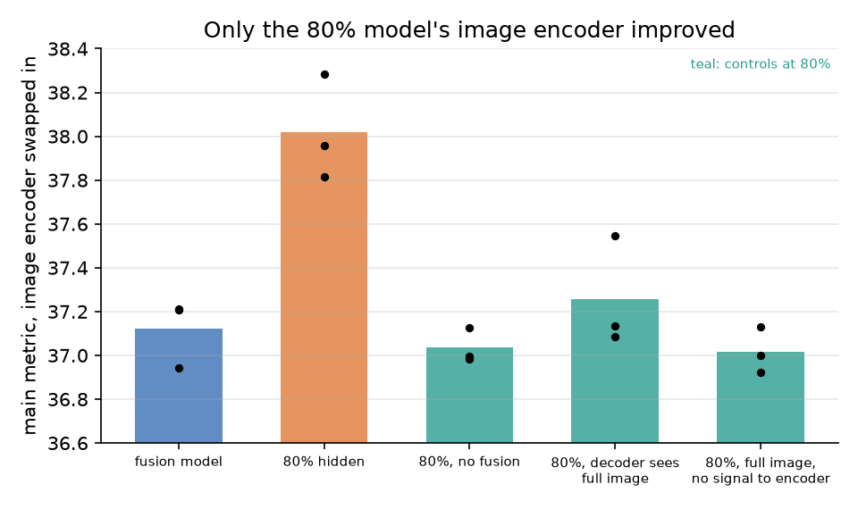
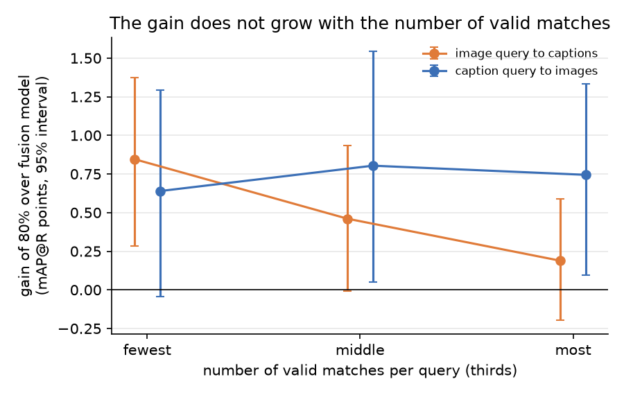

# Hiding most of the caption gives CLIP a slightly better image encoder, with no sign of a polysemy effect

> 2026-10-06. Full reports: [Stage 0 diagnostics](../reports/auto/v1/2026-10-03_stage0_diagnostics.md) and [Stages 1 and 2](../reports/auto/v1/2026-10-06_masking_stages_1_2.md).

## Summary

- We asked whether adding masked reconstruction to a CLIP fine-tune helps polysemy, meaning retrieval where an image or a word has several valid readings.
- A first look inside the existing models placed their small extra gain in the image encoder and found no effect on word-sense ambiguity.
- Of twelve changes we screened, one family kept working: hiding most of the caption, so the model must rebuild it from a partly hidden image.
- On a test fixed in advance, hiding 80% of the caption beat both baselines, by about 0.7 points on the main metric over the fusion model.
- That gain lives in the image encoder, and it disappears whenever the caption decoder stops reading the partly hidden image.
- It does not behave like a polysemy effect: no gain on word-sense ambiguity, and no larger gain for queries with many valid matches.

## How we got here

The project asks whether masked models can improve how retrieval handles polysemy. Our fusion model adds a masked pass to CLIP: hidden image patches are rebuilt by an image decoder and hidden caption words by a caption decoder, and a fusion module lets the two decoders read both modalities.

By 2026-10-03 the baselines showed the fusion model matched the contrastive-only model on the main metric (human-verified matches on COCO) and was slightly better on a class-level metric. A literature review found no study of masking on polysemy-aware retrieval. We agreed on a staged plan: diagnose the existing models, screen many changes cheaply, then confirm the best one with more seeds.

Midway, on 2026-10-05, a separate review session read the early results and wrote a note (the deep-think note) proposing directions for the line. This report covers all three stages, through 2026-10-06.

## 1. Looking inside the existing models

**Problem.** The fusion model's only gain was on the class-level metric, and we did not know where it came from or whether it reflected anything about polysemy.

**Idea.** We tested two explanations without training anything new:

- object grounding: the caption decoder teaches the encoders which objects are present;
- softer similarity: the extra losses ease how hard the model pushes similar items apart.

To locate the gain we swapped encoders between models: one model's image encoder scored against another model's text encoder shows which encoder carries a change. We also ran a word-sense test, where a short ambiguous phrase must pick the right image out of ten.

**Did it work.** Partly. The fusion-specific part of the gain sat in the image encoder. Softer similarity held in a relative sense; object grounding was not confirmed. No model differed from the contrastive-only model on the word-sense test.

**Key evidence.**

| Comparison (3 seeds each) | Class-level metric (PMRP) |
|---|---|
| fusion model vs contrastive-only model | +0.39 |
| fusion model's image encoder vs the no-fusion model's, both with the same contrastive text encoder | +0.26 |

> Full report: [Stage 0 diagnostics](../reports/auto/v1/2026-10-03_stage0_diagnostics.md), Summary and sections 3.2 to 3.5.

## 2. Screening twelve changes

**Problem.** Nothing yet moved the main metric. We needed to find which part of the masked training, if any, could.

**Idea.** Each change tested one mechanism, so a result would say why it worked:

- the caption decoder saw the full image instead of the partly hidden one;
- only content words were hidden;
- each decoder got a summary of the other modality;
- a contrastive loss was added on the masked caption;
- image reconstruction was switched off;
- the share of hidden caption words was raised step by step from the usual 15%.

Three training-recipe changes were tested on the contrastive-only model. Each change ran with two seeds against a bar fixed in advance (+0.3 points).

**Did it work.** Yes, for one family. The main metric rose steadily with the share of hidden caption words and levelled off at 80 to 90%. Switching image reconstruction off also passed the screen but did not hold up later. No recipe change passed; one raised the secondary metrics only.

**Key evidence.** Main metric against the share of caption words hidden, compared with the contrastive-only model.

*The fusion model at its usual 15% scored 36.95; at 80% it scored 37.81.*

> Full report: [Stages 1 and 2](../reports/auto/v1/2026-10-06_masking_stages_1_2.md), section 2.

## 3. Confirming the winner

**Problem.** A two-seed screen of twelve changes picks winners partly by luck, and the screen compared against baselines trained at a different time.

**Idea.** We retrained both baselines and the two finalists (80% hidden, and image reconstruction off) side by side, each with three seeds. A seeded sampler gave every model the same data order for a given seed, which removes one source of noise from comparisons (the random masks still differ). The bar was fixed before any result: beat both baselines after correcting for testing two finalists, with two extra seeds for the final candidate.

**Did it work.** Yes, on the pre-registered five-seed test, against both baselines. On the first three seeds alone it narrowly missed after the correction; the full report gives both results and when each was looked at. Image reconstruction off did not replicate. The gain is modest: about 7% of what plain contrastive fine-tuning itself adds.

**Key evidence.**

| Model | Seeds | Main metric (ECCV mAP@R) |
|---|---|---|
| contrastive only | 3 | 37.11 |
| fusion model | 3 | 37.24 |
| **80% hidden** | **5** | **37.94** |
| image reconstruction off | 3 | 37.20 |

> Full report: [Stages 1 and 2](../reports/auto/v1/2026-10-06_masking_stages_1_2.md), sections 3.1 to 3.3.

## 4. Finding out what the gain needs

**Problem.** A higher hiding share could help for two very different reasons: a harder text task on its own, or the image encoder learning to describe images. Only the second would make this a cross-modal effect.

**Idea.** At 80% we built three controls, each removing one ingredient:

- no fusion: the caption decoder reads only the caption;
- full image: the fusion stays, but the caption decoder reads the full, unhidden image;
- full image, no signal: as above, and the caption decoder's learning signal no longer reaches the image encoder.

Encoder swaps then show where any gain sits.

**Did it work.** Yes, for what the gain needs; not yet for why. All three controls fell back to the fusion model's level, and so did their image encoders. The gain appears only when the caption decoder, through the fusion, reads the partly hidden image. The no-fusion control alone cannot separate the image from the fusion module, but the two full-image controls keep the fusion and still lose the gain.

Why that matters is open: three explanations fit and these runs cannot separate them.

- The few visible patches must carry more of the caption's content.
- The image encoder benefits from learning through a partial view of the image, whatever the caption task.
- The caption signal arriving through the full image conflicts with the contrastive training.

**Key evidence.** Each model's image encoder scored with the same contrastive text encoder.

*The 80% model's image encoder scored 38.02 against 37.12 for the fusion model's; the controls scored 37.02 to 37.25.*

> Full report: [Stages 1 and 2](../reports/auto/v1/2026-10-06_masking_stages_1_2.md), sections 4.1 to 4.3.

## 5. Checking for a polysemy effect

**Problem.** A better image encoder is useful, but our question is polysemy. The gain could still come from handling images and captions that have several valid readings.

**Idea.** Two tests. First, the word-sense test from section 1. Second, if hiding words helps a model keep several readings, the gain should grow with the number of valid matches a query has. We split queries into thirds by that number and compared the gain across them.

**Did it work.** No sign of it. On the word-sense test the 80% model matched the fusion model, and all masked models sat at or below the contrastive-only model (a gap that was not stable between stages). The gain did not grow with the number of valid matches. The intervals are wide enough that modest growth cannot be ruled out, and this is COCO only.

**Key evidence.** Gain of the 80% model over the fusion model, by the number of valid matches per query.

> Full report: [Stages 1 and 2](../reports/auto/v1/2026-10-06_masking_stages_1_2.md), sections 5.1 to 5.3.

## Advice

*My view.* The 80% result is real and well controlled, but small, and on COCO it behaves like extra training signal for the image encoder. More tuning of masking on COCO is unlikely to answer the polysemy question, because COCO offers few clearly polysemous cases to measure.

The next experiment should put polysemy into the data. ArtELingo is a dataset of WikiArt paintings, each described by about five annotators who give an emotion and an explanation, and they often disagree. A painting that draws several different readings is polysemous in the sense we care about: one image, several valid meanings. So we can test whether the gain grows with annotator disagreement, with low-disagreement paintings as a built-in control.

If it does not grow, the honest paper is the controlled finding: hiding most of the caption is a cheap way to improve CLIP's image encoder, with no polysemy effect.

## Next

**Where things stand.** All three stages are done and the full report passed an independent review. Two reserved GPU nodes (six GPUs) are idle with about three and a half days left. Today's work is not yet committed.

**Your decision: the direction.**

| Option | What it means | Cost and risk |
|---|---|---|
| 1. ArtELingo pilot (my recommendation) | Train contrastive-only, fusion and 80% on ArtELingo, score the gain against annotator disagreement | A few days on the free GPUs; decides between 2 and 3 |
| 2. Pursue polysemy on COCO (the deep-think note's direction A) | Combine 80% hiding with a loss built for several valid matches and test where matches are many | More compute; similar published work exists |
| 3. Write up the controlled finding now (its direction C) | Report the image-encoder result with its controls and the polysemy null | Low risk, modest venue |

Smaller open questions, which fit into any option: whether the caption decoder's learning signal into the image encoder is needed on its own, whether image reconstruction matters at 80%, and whether 80% hiding adds to the better training recipe from the screen.

## Glossary

- **Contrastive-only model**: CLIP fine-tuned on COCO with the contrastive loss alone (full report: contrastive baseline, `s2_contrastive`).
- **Fusion model**: the contrastive model plus masked image and caption reconstruction through a fusion module (`fusion_multilearner`, `s2_multilearner`).
- **No-fusion model**: the same masked training, with each decoder reading only its own modality (`fusion_none`).
- **Share of caption words hidden**: the text-masking ratio; 15% by default (M2a; `model.masking.text_ratio`).
- **80% model**: the fusion model with 80% of caption words hidden (`s2_txt80`).
- **Image reconstruction off**: the image decoder's loss set to zero (M5, `s2_mae0`).
- **Caption decoder**: the masked-language-model decoder (MLM). **Image decoder**: the masked autoencoder (MAE).
- **Full-image controls**: the caption decoder reads the unhidden image, with or without a learning signal into the image encoder (M1 clean and M1 detached, `s2_m1clean_txt80`, `s2_m1detached_txt80`).
- **Encoder swap**: one model's image embeddings scored against another model's text embeddings (tower swap).
- **Main metric**: ECCV Caption mAP@R, ranking quality against human-verified matches.
- **Class-level metric**: PMRP (Plausible Match R-Precision), which counts items with nearly the same COCO objects as matches.
- **Word-sense test**: VWSD (SemEval-2023 Task 1), 463 ambiguous phrases, each choosing one of ten images.
- **Seeded sampler**: training data order set by the seed alone, shared across models.
- **Pre-registered test**: the success bar in the design spec, written before any result (Holm-corrected Welch tests).
- **Deep-think note**: a separate review session's note that proposed directions A (a mechanism for several valid matches) and C (write up the controlled finding).
- **Stages 0, 1, 2**: diagnostics of existing models, the two-seed screen, and the confirmation with retrained baselines.
